# AWS Amplifyベース Hedge System MVP システム設計書 v4.0

## 1. システム概要

### 1-1. システムの目的
本システムは、ボーナスアービトラージ業務向けの**戦略実行型自動取引管理システム**（Hedge System）です。複数のMT4/MT5口座を一元管理し、取引戦略を「実行計画」として都度作成・実行します。1ユーザー1PCの制約のもと、シンプルで確実な取引実行を実現します。

### 1-2. システム構成要素
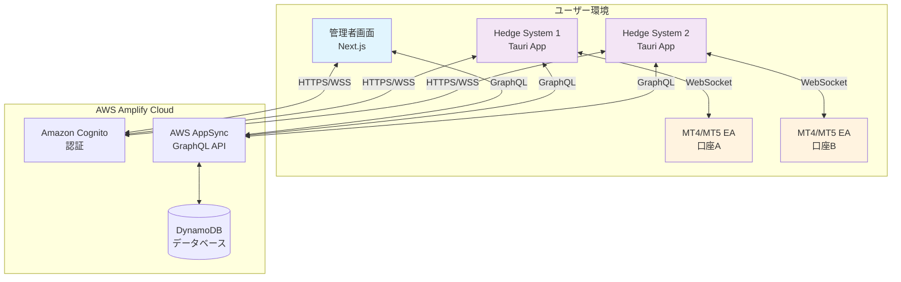

### 1-3. 主要機能（MVP範囲）
- **口座管理**: MT4/MT5の複数口座情報を一元管理
- **エントリー戦略**: 複数のPENDINGポジションとアクションを事前作成し、実行ボタンで一括発注
- **決済戦略**: 既存ポジションを選択して一括決済計画を作成・実行
- **トレーリングストップ**: ポジション単位で設定されたトレール幅に基づく動的ストップロス管理
- **ロスカット対応**: ポジションのトレール設定からトリガーされる自動アクション実行
- **リアルタイム監視**: 戦略実行状況とポジション状態のモニタリング
- **シンプルな実行判定**: 1ユーザー1PC制約による確実な処理

## 2. データベース設計

### 2-1. データモデル全体図
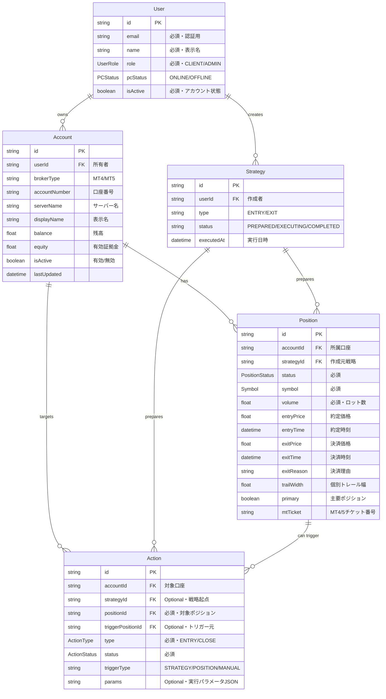

### 2-2. 列挙型（Enum）定義

| 列挙型名 | 値 | 説明 |
|---------|-----|------|
| **Symbol** | USDJPY, EURUSD, EURGBP, XAUUSD | 取引可能な銘柄 |
| **PositionStatus** | PENDING | 戦略作成済み・発注待機中 |
| | OPENING | 発注処理中（戦略実行後） |
| | OPEN | エントリー約定済み・ポジション保有中 |
| | CLOSING | 決済指令済みでクローズ処理中 |
| | CLOSED | ポジション決済済み |
| | STOPPED | ロスカット執行済み |
| | CANCELED | 発注失敗等でポジション不成立 |
| **ActionType** | ENTRY | 新規エントリー |
| | CLOSE | 通常クローズ |
| **ActionStatus** | PENDING | アクション待機中 |
| | EXECUTING | 実行中 |
| | EXECUTED | 実行完了 |
| | FAILED | 実行失敗 |
| **UserRole** | CLIENT | 一般ユーザー |
| | ADMIN | 管理者 |
| **PCStatus** | ONLINE | PC接続中 |
| | OFFLINE | PC未接続 |

### 2-3. 認証・権限設計

各モデルの権限設定：
- **User**: 本人は読み取り・更新可、ADMINロールは全操作可
- **Account**: 所有者とADMINは全操作可、口座情報は所有者のみ閲覧可
- **Strategy/Position/Action**: 所有者（作成者）とADMINグループは全操作可

## 3. 戦略実行パターン詳細

### 3-1. エントリー戦略パターン
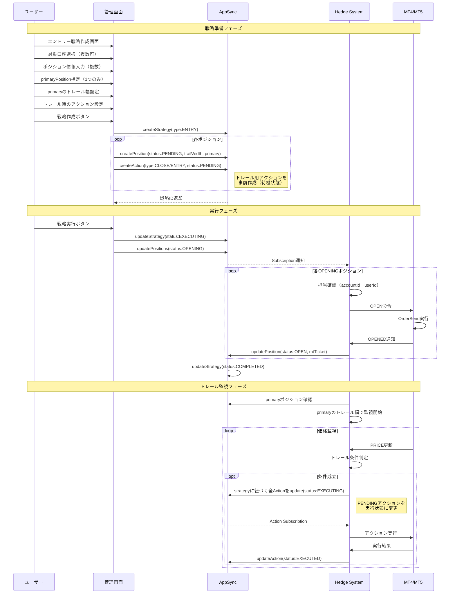

### 3-2. 決済戦略パターン
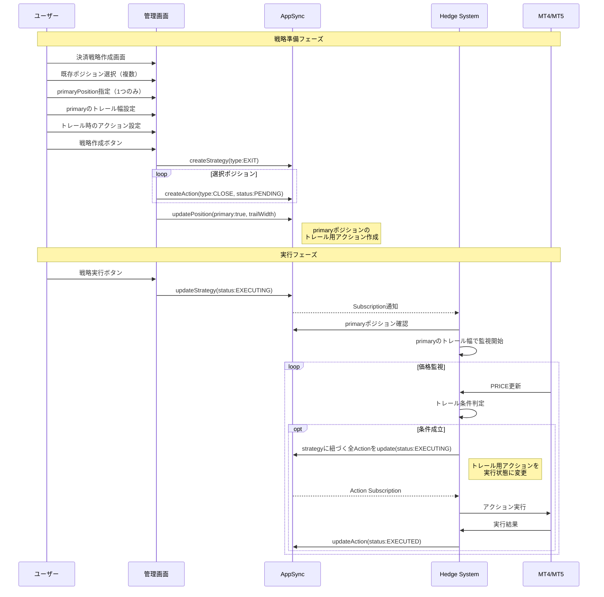

### 3-3. ロスカット対応パターン
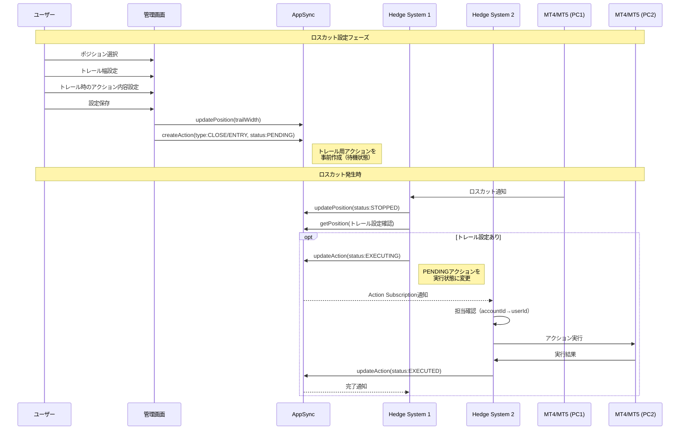

## 4. システムアーキテクチャ詳細

### 4-1. Hedge Systemクライアント（Tauriアプリ）

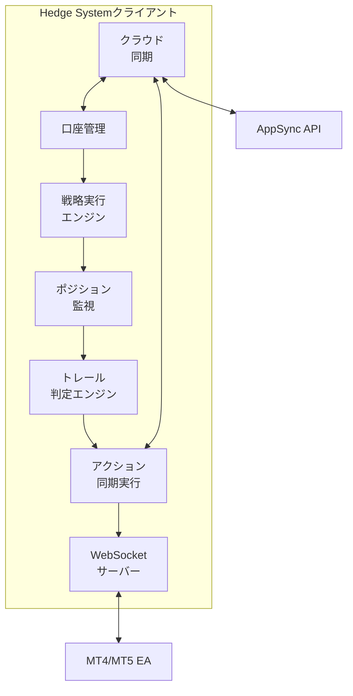

主要機能：
1. **口座管理**
   - 接続中の口座情報管理
   - 口座残高・証拠金の定期更新
   - 口座別のポジション管理
   - userIdによる所有者特定

2. **戦略実行エンジン**
   - 実行指示を受けた戦略の処理
   - ポジションステータスの遷移管理（PENDING→OPENING→OPEN）
   - userIdベースの実行判定

3. **アクション同期実行**
   - AppSyncのActionテーブルをSubscription（状態変更監視）
   - PENDING→EXECUTINGの変更を検知
   - accountId → userId → 1PCで実行判定
   - 実行結果のAppSync反映（EXECUTED/FAILED）

4. **トレール判定エンジン**
   - ポジションのトレール幅設定に基づく監視
   - 条件成立時のアクションステータス更新（PENDING→EXECUTING）
   - エントリー後のトレール処理
   - ロスカット後のトレール処理
   - 決済戦略のprimaryポジション監視

### 4-2. アクション同期実行メカニズム

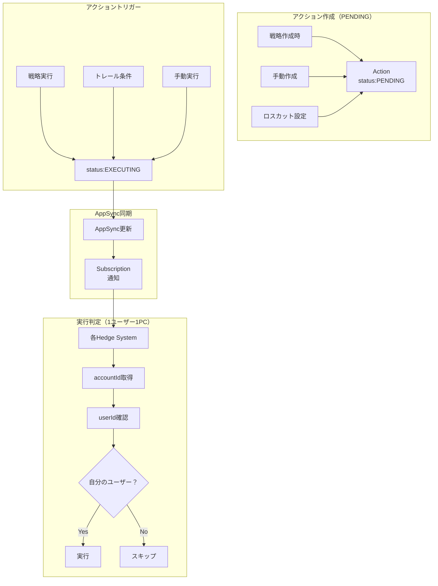

### 4-3. 管理者画面（Next.js）

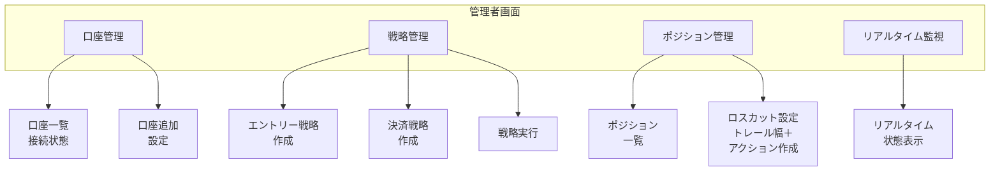

## 5. データフロー設計

### 5-1. 戦略実行トリガーフロー
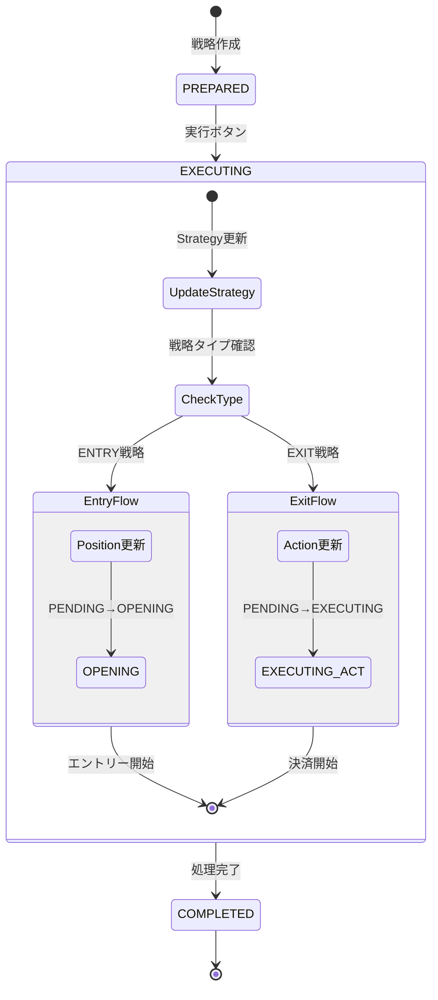

### 5-2. ポジションステータス遷移
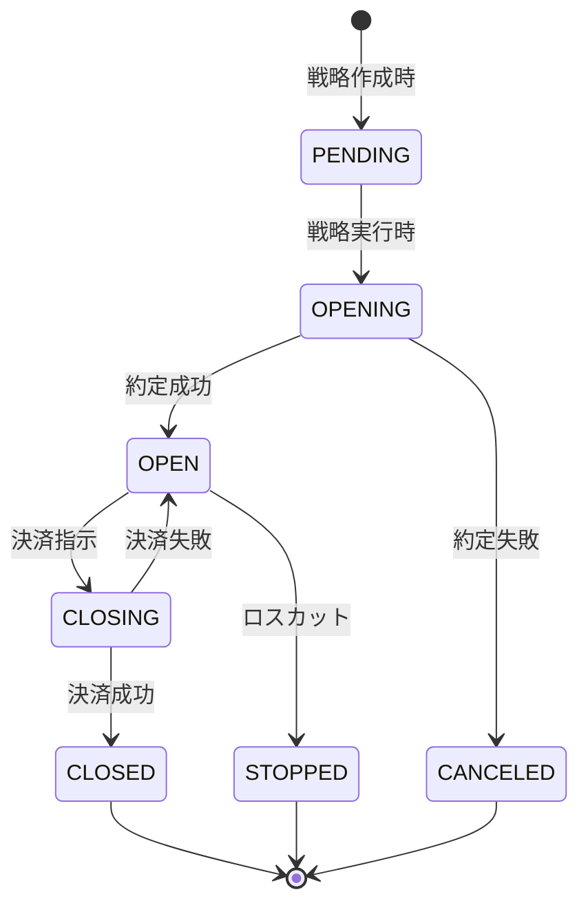

### 5-3. アクション実行同期フロー
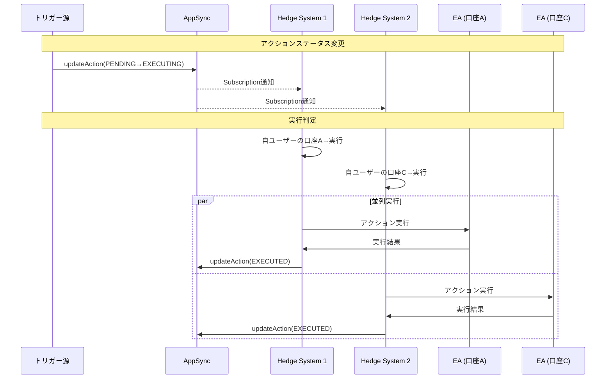

### 5-4. データ同期優先度

| データ種別 | 同期頻度 | 優先度 | 説明 |
|-----------|---------|--------|------|
| **戦略実行** | 即時 | 最高 | ステータス変更とトリガー発火 |
| **ポジション状態** | 即時 | 最高 | PENDING→OPENING→OPEN等の遷移 |
| **アクション状態変更** | 即時 | 最高 | PENDING→EXECUTING→EXECUTED |
| **Subscription通知** | 即時 | 最高 | 状態変更の全PC配信 |
| **トレール判定** | 定期 | 高 | 条件成立時のアクション起動 |
| **口座情報** | 30秒毎 | 中 | 残高、証拠金の定期更新 |

## 6. WebSocket通信設計

### 6-1. メッセージフォーマット

**Hedge System → EA（コマンド）**
```json
{
  "command": "OPEN",
  "accountId": "acc-123",
  "positionId": "pos-456",
  "symbol": "USDJPY",
  "side": "BUY",
  "volume": 1.0,
  "metadata": {
    "strategyId": "strat-001",
    "timestamp": "2025-06-22T10:00:00Z"
  }
}
```

**アクション実行時のコマンド**
```json
{
  "command": "EXECUTE_ACTION",
  "accountId": "acc-123",
  "actionId": "act-789",
  "type": "CLOSE",
  "positionId": "pos-999",
  "params": {
    "volume": 1.0,
    "symbol": "USDJPY"
  },
  "metadata": {
    "triggerPositionId": "pos-456",
    "triggerType": "POSITION"
  }
}
```

**EA → Hedge System（イベント）**
```json
{
  "event": "OPENED",
  "accountId": "acc-123",
  "positionId": "pos-456",
  "mtTicket": "12345678",
  "price": 150.50,
  "time": "2025-06-22T10:00:05Z",
  "status": "SUCCESS"
}
```

**アクション実行結果**
```json
{
  "event": "ACTION_EXECUTED",
  "accountId": "acc-123",
  "actionId": "act-789",
  "result": "SUCCESS",
  "details": {
    "mtTicket": "87654321",
    "price": 151.00
  }
}
```

### 6-2. 通信シーケンス
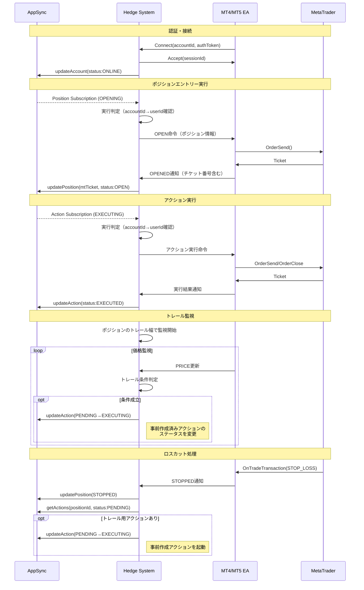

## 7. エラーハンドリング設計

### 7-1. エラー分類と対処
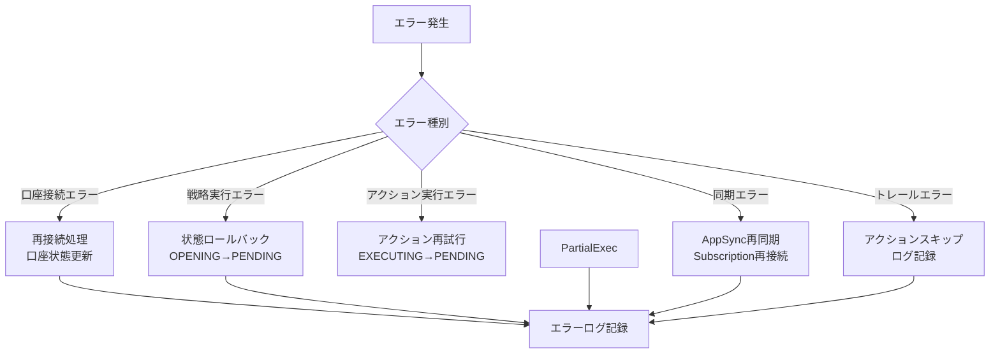

### 7-2. 状態整合性の保証
- トランザクション的な状態更新（Strategy→Position→Action）
- 重複実行防止（アクションの排他制御）
- タイムアウト処理（OPENING/CLOSINGの自動解除）
- 1ユーザー1PC制約による実行の単純化

## 8. セキュリティ設計

### 8-1. 多層防御アーキテクチャ
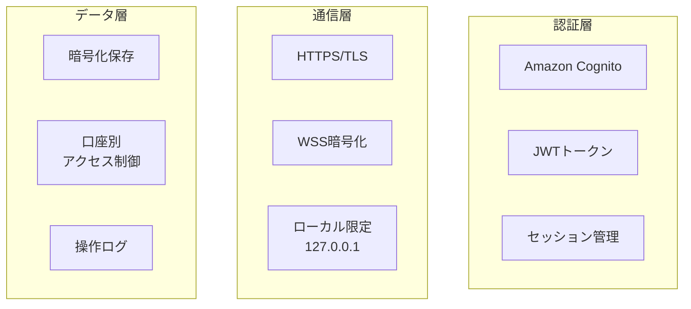

### 8-2. 口座情報の保護
- 口座認証情報はEA側で管理（Hedge Systemには保存しない）
- 口座番号の部分マスキング表示
- userIdベースのアクセス制御（他ユーザーの口座にアクセス不可）
- アクションの実行権限管理（作成者のみステータス変更可）

## 9. パフォーマンス最適化

### 9-1. 効率的な実行判定
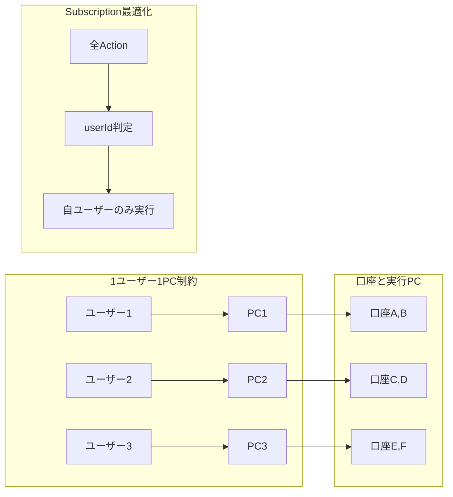

### 9-2. システム最適化手法
- **Subscription効率化**: userId判定による早期フィルタリング
- **バッチ処理**: 同一口座の複数アクションをまとめて実行
- **接続プーリング**: EA接続の再利用
- **非同期処理**: トレール判定とアクション実行の非同期化
- **事前作成**: アクションの事前作成により実行時の処理を最小化
- **シンプルな判定**: 1ユーザー1PC制約によるロジック簡素化

## まとめ

本設計書では、複数のMT4/MT5口座を統合管理し、戦略的な取引実行を可能にするシステムを定義しています。

**システムの核心要素：**
- **Account**: MT4/MT5口座情報の管理（userId経由でPC特定）
- **Strategy**: 使い捨ての実行計画（シンプルな状態管理のみ）
- **Position**: 口座に紐づく取引ポジション（トレール設定保持）
- **Action**: 事前作成されステータス変更でトリガーされる実行単位
- **1ユーザー1PC**: シンプルな実行判定ロジック

**実装の重要ポイント：**
1. 戦略実行時のポジションステータス遷移（PENDING→OPENING）がエントリートリガー
2. エントリー戦略ではポジションとトレール用アクションを事前作成（PENDING）
3. アクションはPENDINGで待機し、トレール条件成立時にEXECUTINGに変更
4. アクションのステータス変更がSubscription経由で全PCに通知
5. 実行判定は accountId → userId → 自PCかどうかの確認で決定（1ユーザー1PC）
6. 決済戦略のトレール幅はprimaryポジションから取得
7. 決済戦略では決済アクションとトレール用アクションを分けて管理

この設計により、複雑な取引シナリオにも対応できる柔軟性と、シンプルな実行判定による高い信頼性を実現します。特に、1ユーザー1PC制約を活用することで、データモデルと実行ロジックの両方が大幅に簡素化され、実装・保守が容易なシステムとなっています。