# AWS Amplifyベース Hedge System MVP システム設計書 v7.0

## 1. システム概要

### 1-1. システムの目的

本システムは、ボーナスアービトラージ業務向けの**ポジション管理型自動取引システム**（Hedge System）です。複数のMT4/MT5口座を一元管理し、両建てポジションを管理者画面から設定して、動的に組み替えながら、クレジット（ボーナス）を活用した取引を実行します。1ユーザー1PCの制約のもと、シンプルで確実な取引実行を実現します。

### 1-2. システム構成要素

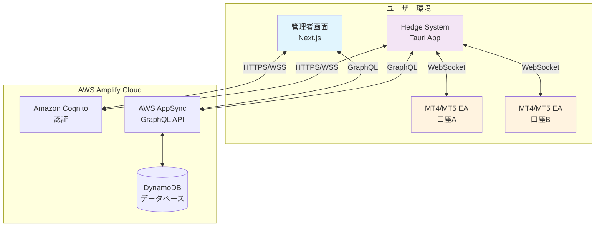

### 1-3. 主要機能（MVP範囲）

- **口座管理**: MT4/MT5の複数口座情報とクレジット（ボーナス）管理（管理画面から作成）
- **ポジション管理**: エントリー・決済・トレール設定を個別管理（全て管理画面から作成）
- **両建て管理**: 口座全体で両建てポジションを動的に組み替え
- **トレーリングストップ**: トレール設定を持つポジションが独立してアクション実行
- **ロスカット対応**: ポジションのトレール設定からトリガーされる自動アクション実行
- **リアルタイム監視**: ポジション状態とアクション実行状況のモニタリング
- **シンプルな実行判定**: 1ユーザー1PC制約による確実な処理

## 2. データベース設計

### 2-1. データモデル全体図（userId最適化版）

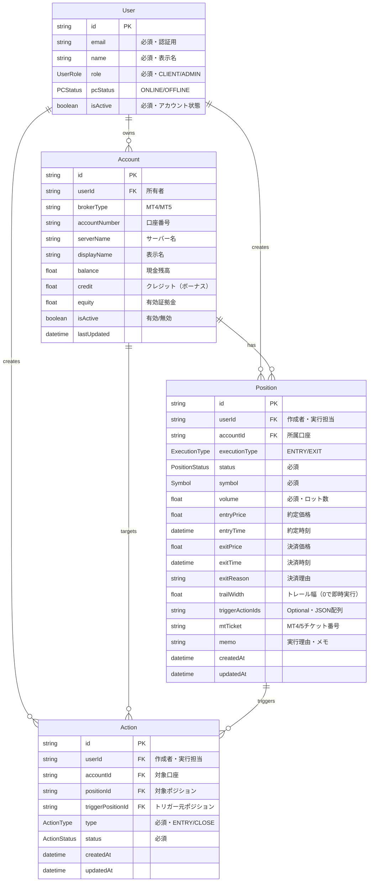

### 2-2. userId追加による最適化効果

| 改善項目                  | 説明                            | クエリ例（GSI使用）                                                       |
| ------------------------- | ------------------------------- | ------------------------------------------------------------------------- |
| **1. 高速な担当判定**     | userIdのGSIで直接検索           | `listPositionsByUserId(userId: "user-123", limit: 100)`                   |
| **2. 実行対象の即座判定** | Account経由せずに判定可能       | `listActionsByUserIdAndStatus(userId: $myUserId, statusEq: "EXECUTING")`  |
| **3. 監視対象の効率化**   | 自分のトレール対象のみ監視      | `listPositionsByUserId(userId: $myUserId, filter: {trailWidth: {gt: 0}})` |
| **4. ユーザー別集計**     | GSI使用でユーザー単位の高速集計 | `listPositionsByUserIdAndStatus(userId: $userId, statusEq: "OPEN")`       |

### 2-3. 列挙型（Enum）定義

| 列挙型名           | 値                             | 説明                                 |
| ------------------ | ------------------------------ | ------------------------------------ |
| **Symbol**         | USDJPY, EURUSD, EURGBP, XAUUSD | 取引可能な銘柄                       |
| **PositionStatus** | PENDING                        | 作成済み・発注待機中                 |
|                    | OPENING                        | 発注処理中（実行開始後）             |
|                    | OPEN                           | エントリー約定済み・ポジション保有中 |
|                    | CLOSING                        | 決済指令済みでクローズ処理中         |
|                    | CLOSED                         | ポジション決済済み                   |
|                    | STOPPED                        | ロスカット執行済み                   |
|                    | CANCELED                       | 発注失敗等でポジション不成立         |
| **ActionType**     | ENTRY                          | 新規エントリー                       |
|                    | CLOSE                          | 通常クローズ                         |
| **ExecutionType**  | ENTRY                          | エントリー実行                       |
|                    | EXIT                           | 決済実行                             |
| **TriggerType**    | POSITION_TRAIL                 | ポジションのトレール経由             |
| **ActionStatus**   | PENDING                        | アクション待機中                     |
|                    | EXECUTING                      | 実行中                               |
|                    | EXECUTED                       | 実行完了                             |
|                    | FAILED                         | 実行失敗                             |
| **UserRole**       | CLIENT                         | 一般ユーザー                         |
|                    | ADMIN                          | 管理者                               |
| **PCStatus**       | ONLINE                         | PC接続中                             |
|                    | OFFLINE                        | PC未接続                             |

### 2-4. 認証・権限設計

各モデルの権限設定：

- **User**: 本人は読み取り・更新可、ADMINロールは全操作可
- **Account**: 所有者とADMINは全操作可
- **Position/Action**: userIdベースでの所有者とADMINグループは全操作可

## 3. 複数Hedge System間の連携

### 3-1. トレール条件達成時の連携フロー

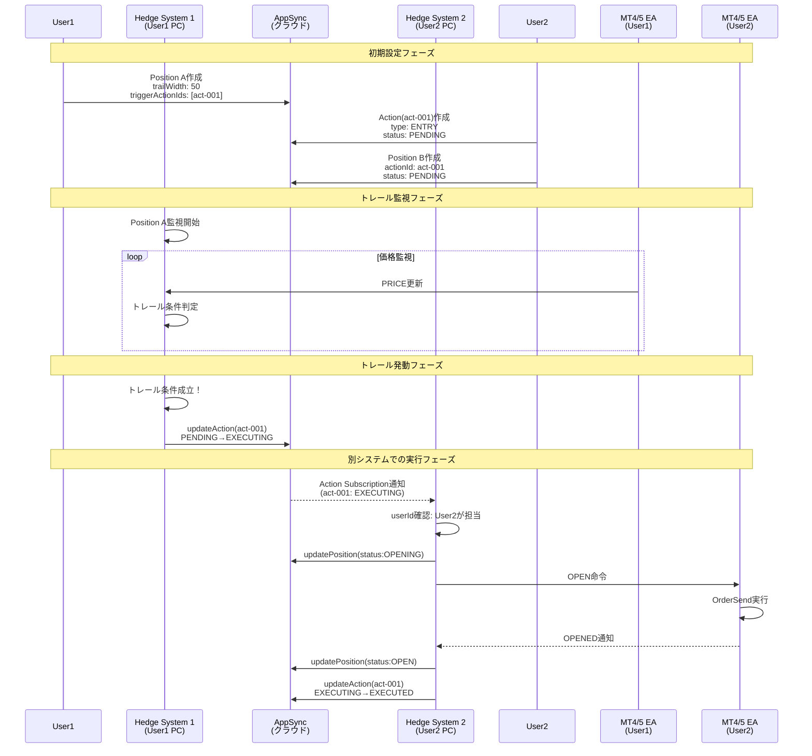

### 3-2. 複数システム連携の詳細

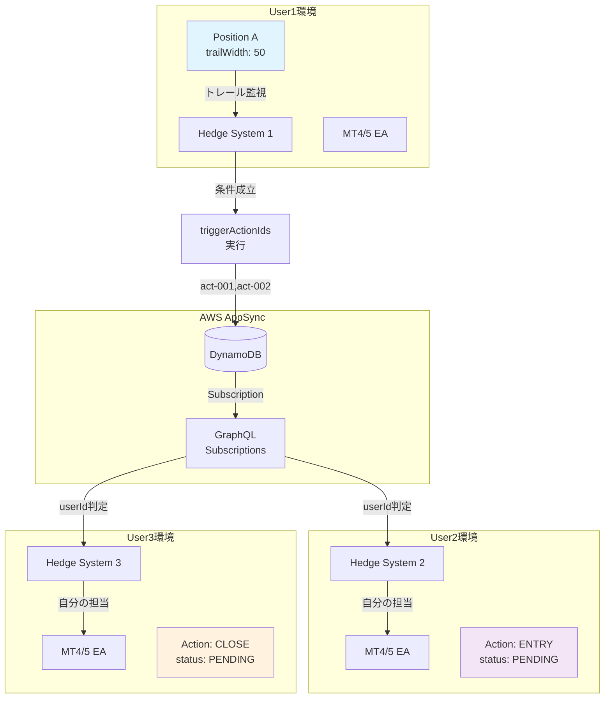

## 4. 実行パターン詳細

### 4-1. エントリー実行パターン

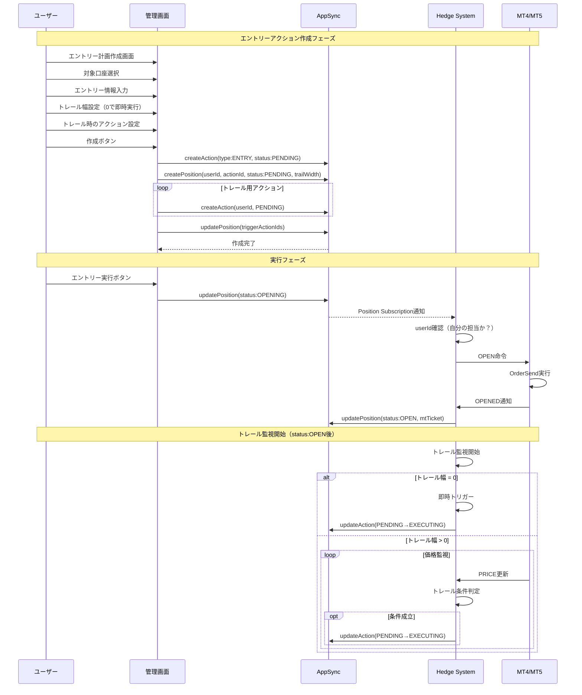

### 4-2. 決済実行パターン

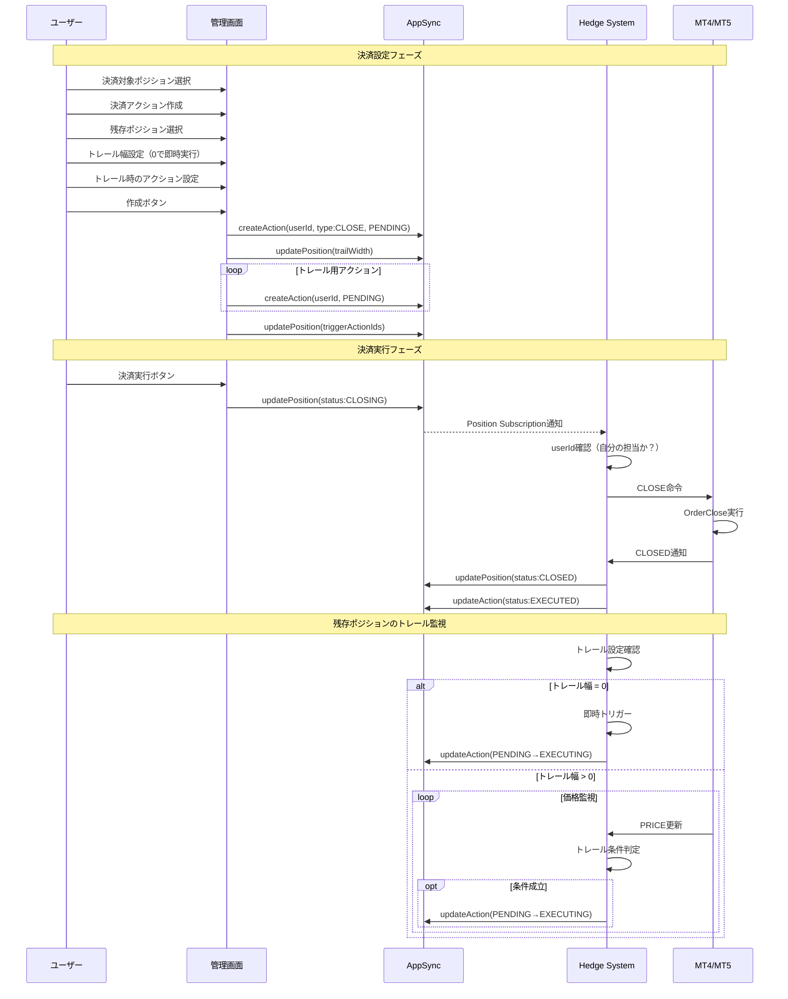

### 4-3. ロスカット対応パターン

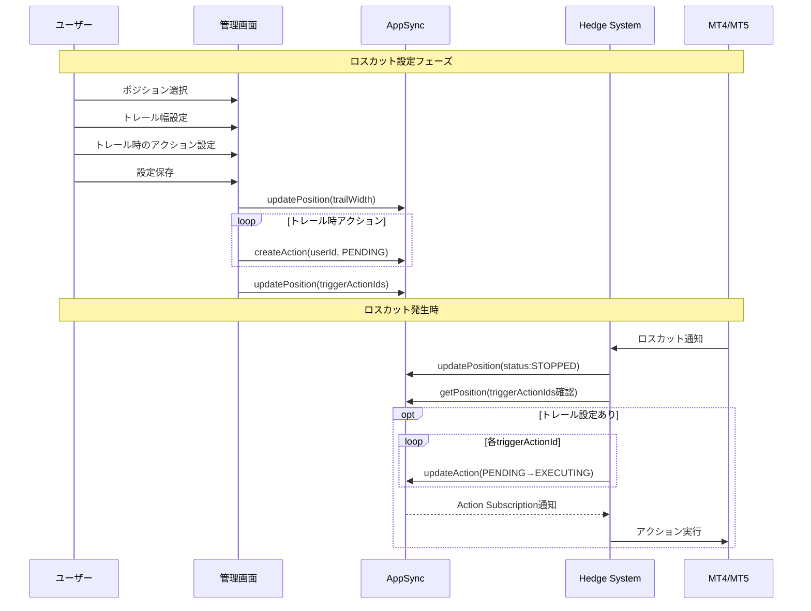

## 5. システムアーキテクチャ詳細

### 5-1. Hedge Systemクライアント（Tauriアプリ）

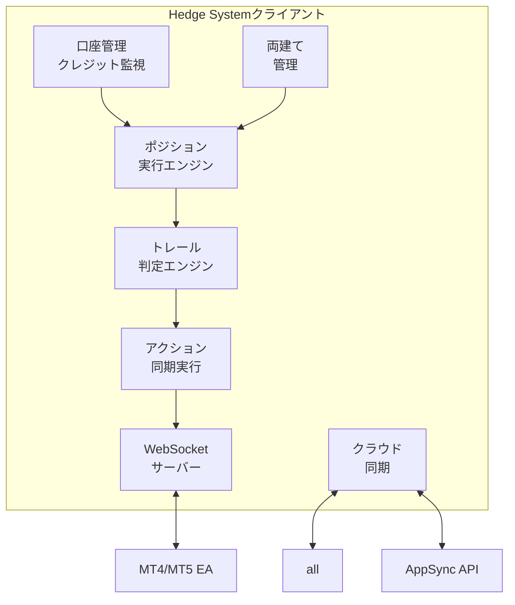

主要機能：

1. **口座管理**

   - 接続中の口座情報管理
   - 残高・クレジット・証拠金の定期更新
   - クレジット変動の監視
   - userIdによる所有者特定

2. **ポジション実行エンジン**

   - 個別ポジションの実行管理
   - ポジションステータスの遷移管理
   - userIdベースの実行判定

3. **両建て管理**

   - 口座全体のポジション監視
   - 両建ての動的な組み替え支援
   - ネットポジションの計算
   - クレジット活用状況の可視化

4. **トレール判定エンジン**
   - トレール設定を持つ全ポジションの監視
   - 各ポジション独立したトレール条件判定
   - triggerActionIdsの実行管理

### 5-2. ポジション実行フロー

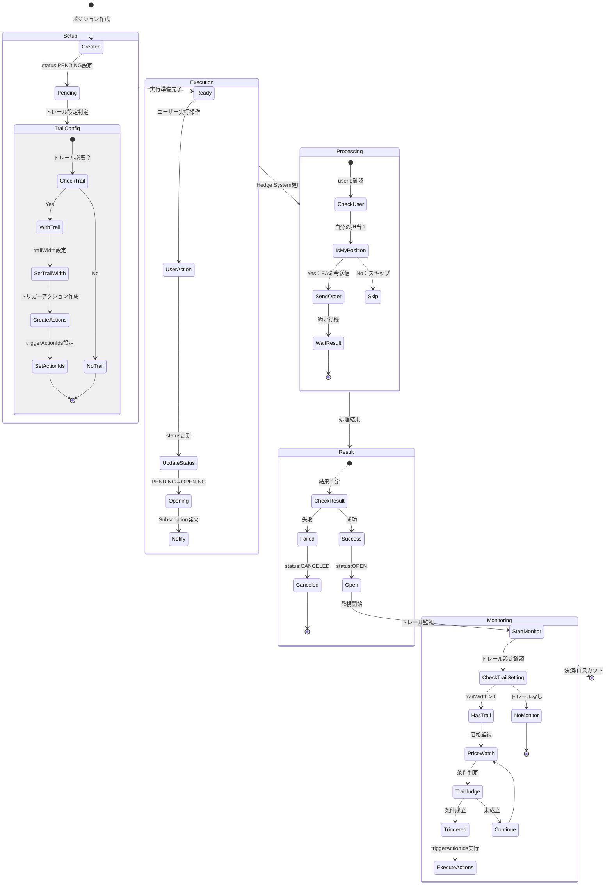

### 5-3. アクション実行の担当判定フロー

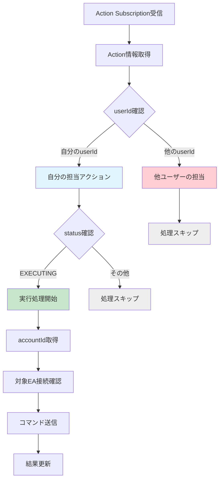

### 5-4. 管理者画面（Next.js）

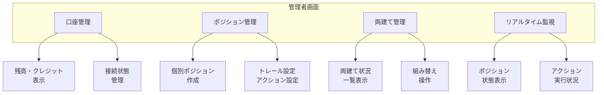

**主要機能：**

1. **口座管理**

   - 残高・クレジット・証拠金の表示
   - クレジット変動履歴
   - 口座接続状態

2. **ポジション管理**

   - 個別ポジション作成・実行
   - トレール設定（任意のポジションに設定可能）
   - アクション管理

3. **両建て管理**
   - 口座全体の俯瞰
   - ネットポジション表示
   - 動的な組み替え操作
   - クレジット活用の最適化

## 6. データフロー設計

### 6-1. トレール実行フロー

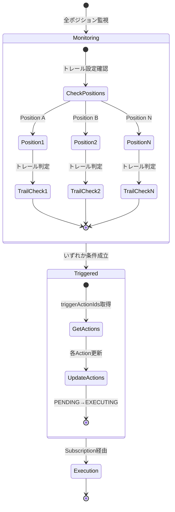

**設計のポイント：**

- すべてのトレール設定ありポジションを並列監視
- 各ポジションが独立してトリガー可能
- 複数ポジションが同時にトレール発動可能

### 6-2. データ同期優先度

| データ種別         | 同期頻度 | 優先度 | 説明                                 |
| ------------------ | -------- | ------ | ------------------------------------ |
| **ポジション状態** | 即時     | 最高   | PENDING→OPENING→OPEN等の遷移         |
| **アクション状態** | 即時     | 最高   | PENDING→EXECUTING→EXECUTED           |
| **トレール判定**   | 定期     | 高     | トレール設定ありポジションの条件監視 |
| **口座情報**       | 30秒毎   | 中     | 残高、クレジット、証拠金の定期更新   |
| **両建て状況**     | 変更時   | 中     | ポジション変更時の再計算             |

## 7. WebSocket通信設計

### 7-1. メッセージフォーマット

**Hedge System → EA（コマンド）**

```json
{
  "command": "OPEN",
  "accountId": "acc-123",
  "positionId": "pos-456",
  "symbol": "USDJPY",
  "side": "BUY",
  "volume": 1.0,
  "metadata": {
    "executionType": "ENTRY",
    "timestamp": "2025-06-22T10:00:00Z"
  }
}
```

**EA → Hedge System（イベント）**

```json
{
  "event": "OPENED",
  "accountId": "acc-123",
  "positionId": "pos-456",
  "mtTicket": "12345678",
  "price": 150.5,
  "time": "2025-06-22T10:00:05Z",
  "status": "SUCCESS"
}
```

**口座情報更新イベント**

```json
{
  "event": "ACCOUNT_UPDATE",
  "accountId": "acc-123",
  "balance": 100000.0,
  "credit": 50000.0,
  "equity": 148000.0,
  "time": "2025-06-22T10:00:30Z"
}
```

**トレール発動イベント**

```json
{
  "event": "TRAIL_TRIGGERED",
  "positionId": "pos-456",
  "currentPrice": 151.5,
  "trailWidth": 50,
  "triggerActionIds": ["act-001", "act-002"]
}
```

### 7-2. 通信シーケンス

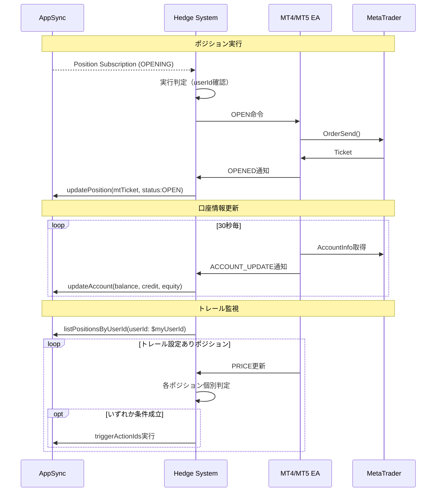

## 8. エラーハンドリング設計

### 8-1. エラー分類と対処

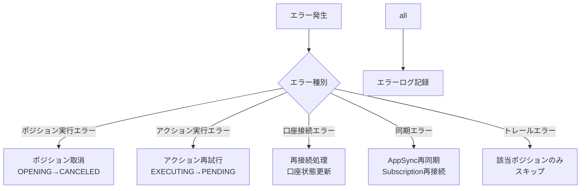

### 8-2. 状態整合性の保証

- 個別ポジションのトランザクション処理
- 重複実行防止（アクションの排他制御）
- タイムアウト処理（OPENING/CLOSINGの自動解除）
- 両建て状態の整合性確認
- 1ユーザー1PC制約による実行の単純化

## 9. セキュリティ設計

### 9-1. 多層防御アーキテクチャ

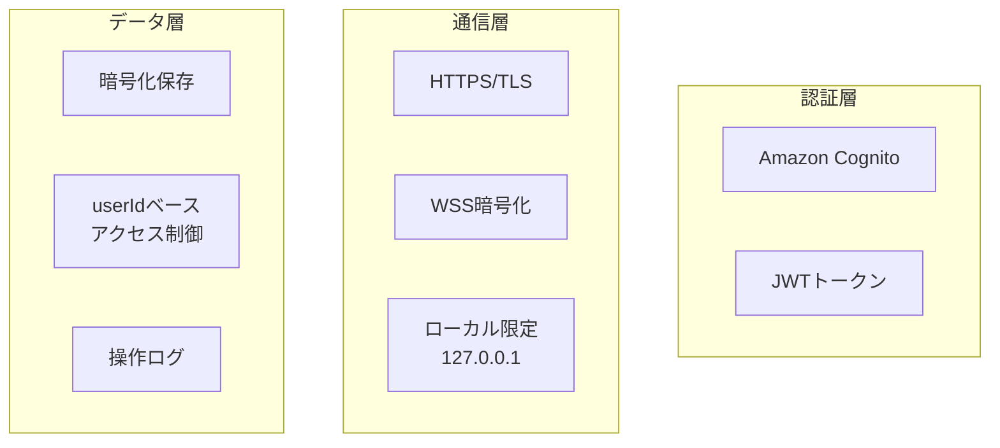

### 9-2. アクセス制御

- 口座情報はuserIdベースで制御
- 他ユーザーのポジション/アクションにアクセス不可
- トレール設定は作成者のみ変更可能
- クレジット情報の適切な管理

## 10. パフォーマンス最適化

### 10-1. 効率的な実行判定

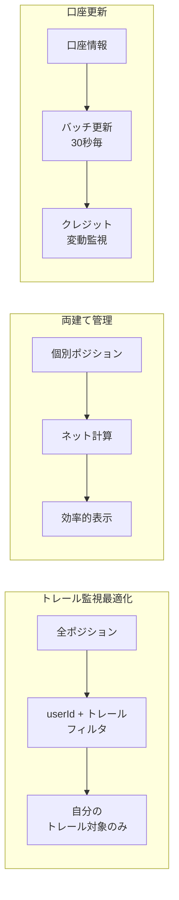

### 10-2. システム最適化手法

- **userIdによる高速フィルタリング**: GSI（Global Secondary Index）を使用した効率的なクエリ実行
- **トレール対象限定**: userId + trailWidth設定でダブルフィルタ
- **独立処理**: 各ポジションが独立して判定・実行
- **事前作成**: アクションの事前作成により実行時処理を軽減
- **バッチ更新**: 口座情報の定期バッチ更新
- **シンプルな判定**: 1ユーザー1PC制約によるロジック簡素化

## まとめ

本設計書では、Strategyテーブルを削除し、Positionを中心としたシンプルな設計を実現しています。さらにv7.0では、PositionとActionにuserIdを追加することで、大幅なパフォーマンス向上を実現しました。

**システムの核心要素：**

- **Position**: エントリー・決済・トレール管理を個別に実行
- **独立トレール**: トレール設定を持つ全ポジションが独立して機能
- **Action**: 事前作成されステータス変更でトリガーされる実行単位
- **Account**: クレジット（ボーナス）管理を含む口座情報
- **両建て管理**: 口座全体での動的なポジション組み替え

**v7.0での改善点：**

1. **userId追加によるDB最適化**: PositionとActionにuserIdを追加し、高速なフィルタリングを実現
2. **複数Hedge System連携の明確化**: トレール条件達成時の別PCでのアクション実行フローを可視化
3. **実行フローの修正**: ポジション実行フローのMermaid記法を正しく修正

**実装の重要ポイント：**

1. groupIdとprimaryフラグを削除し、よりシンプルな構造に
2. トレール設定（trailWidth + triggerActionIds）があるポジションが自動的にトレール機能を持つ
3. 複数ポジションが同時並行でトレール実行可能
4. クレジット管理によりボーナスアービトラージの本質に対応
5. 実行判定は userId による直接確認で高速化
6. ActionのParamsをJSON型から削除し、型安全性を向上

この設計により、不要な抽象化を排除し、より直感的で実装しやすいシステムが実現できます。両建ての動的な組み替えにも柔軟に対応可能で、複数ユーザー間の協調動作もスムーズに実現できます。
