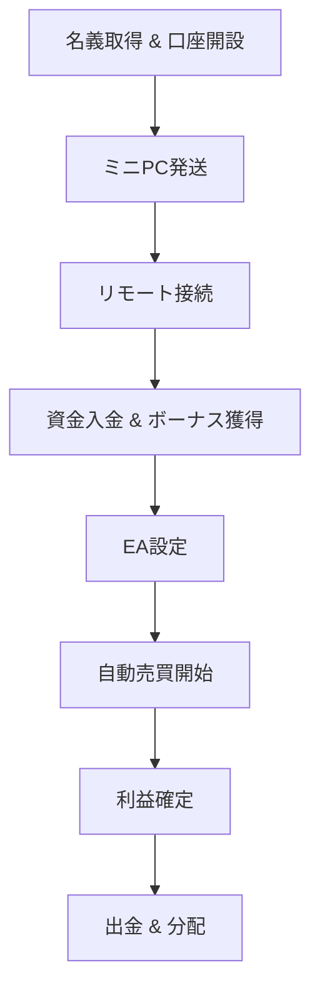

# 海外FXボーナスアービトラージ業務フロー

> **目的**: 海外FX口座の入金ボーナスを活用し、システムトレードで利益を最大化する。その後、名義人との報酬分配を行う。

---

## 1. 使用証券会社

| ブローカー     | 取引プラットフォーム |
| -------------- | -------------------- |
| XM             | MT5                  |
| BigBoss        | MT4                  |
| FXGT           | MT5                  |
| iFOREX         | Web                  |
| Milton Markets | MT5                  |
| Vantage        | MT5                  |

---

## 2. 名義取得 & 口座開設フロー

1. **名義人募集** — 必要書類 (身分証・住所証明) を回収。
2. **専用 Gmail 作成** — 口座開設・証券会社連絡用。
3. **各証券会社で口座開設**

   - プラットフォーム種別を指定 (上表参照)。
   - KYC（本人確認）を完了させる。

4. **情報回収** — 口座番号・ログインパスワード・サーバー名をフォームで提出。

---

## 3. ハードウェア準備 (ミニ PC 発送)

- AnyDesk / Parsec をあらかじめインストール。
- BIOS 設定で ⾃動起動を有効化。
- LAN ケーブルを接続し、電源投入 ⇒ 自動起動。

---

## 4. リモート接続 & Web ログイン

1. こちらの PC からリモート接続。
2. Gmail アカウントで Chrome にログイン。
3. 各証券会社のマイページへアクセスし、アカウントを確認。

---

## 5. 資金移動 & 入金

1. **資金振込** — 名義人の銀行口座へ必要資金を振込。
2. **入金指示** — 名義人が証券会社口座へ入金。
3. ボーナス付与を確認し、残高を記録。

---

## 6. トレード環境構築

1. MT4 / MT5 をインストール。
2. 口座情報でログイン。
3. 当社開発の EA / システムを配置。
4. **パラメータ設定** のみ実施（エントリー・決済操作は行わない）。

---

## 7. 運用 & モニタリング

- システムが自動でエントリー／決済。
- 取引履歴・残高を定期確認。

---

## 8. 出金 & 収益分配

1. 利益確定後、証券会社から名義人の銀行口座へ出金。
2. 名義人報酬を差し引いた金額を当社口座へ返金してもらう。
3. 精算内容をシート等で共有。

---

## 9. 法的・コンプライアンス留意点

- 当社は **売買執行を行わず、システム設定のみ**。
- 名義人が自らの意思で取引する形を維持。
- 各国の金融ライセンス & 規制を随時確認。

---

## 10. セキュリティ & リスク管理

- AnyDesk / Parsec の 2FA とアクセスログ管理。
- 資金移動前後のスクリーンショット保存。
- 口座・Gmail パスワードは名義人と当社のみ保持。
- IP 追跡・多重ログインによる口座凍結リスクを最小化（異なる回線/IP を使用、VPN 利用可）。

---

## 11. 運用フロー図 (概要)

---

## 12. 連絡 & サポート

- LINE@: https://lin.ee/UmzNSfj

---

### 更新履歴

| 日付       | 変更内容 |
| ---------- | -------- |
| 2025-06-24 | 初版作成 |

---

© 2025 ArbitrageAssistant All rights reserved.
