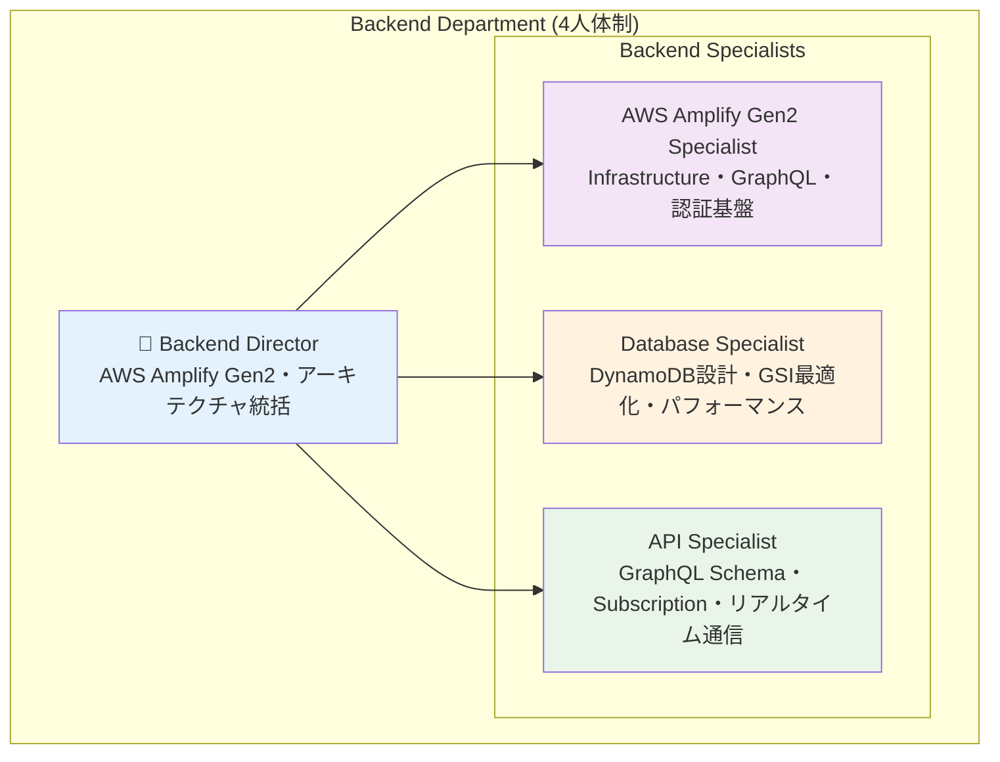
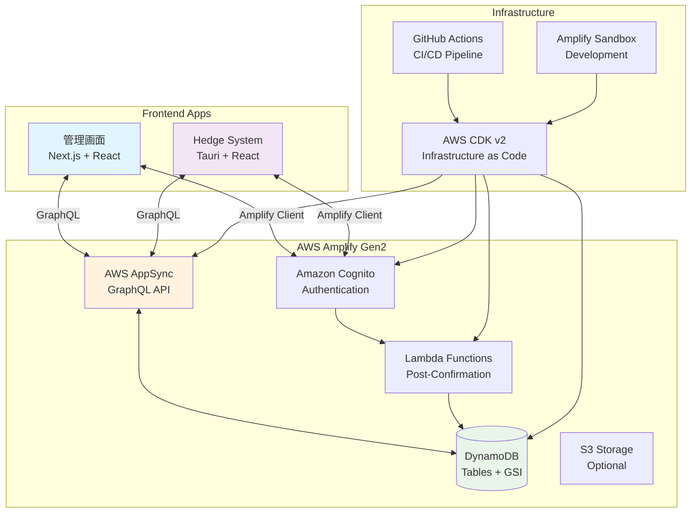
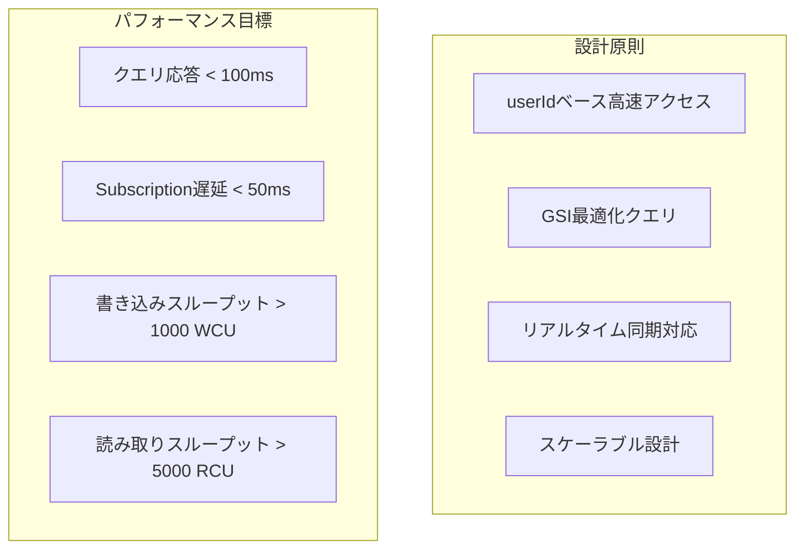

# Backend Department Complete Architecture Documentation

## 1. Department Overview & Organization

### 1.1 Backend Department Structure



### 1.2 技術責任分担

| 役割 | 技術領域 | 主要責任 | パフォーマンス目標 |
|------|----------|----------|-------------------|
| **Backend Director** | システム全体設計 | AWS Amplify Gen2基盤構築・部門統括・他部門連携 | システム全体調整 |
| **AWS Amplify Gen2 Specialist** | Infrastructure as Code | Amplify設定・Cognito認証・Lambda関数・CDK管理 | デプロイ <5分 |
| **Database Specialist** | DynamoDB最適化 | GSI設計・クエリ最適化・パフォーマンスチューニング | クエリ <100ms |
| **API Specialist** | GraphQL API設計 | Schema設計・Subscription・リアルタイム通信・型安全性 | Subscription <50ms |

### 1.3 Backend技術スタック

```typescript
interface BackendTechStack {
  // Core Infrastructure
  infrastructure: {
    framework: 'AWS Amplify Gen2';
    language: 'TypeScript 5.5.4';
    cdk: 'AWS CDK v2';
    deployment: 'Infrastructure as Code';
  };
  
  // Authentication & Authorization
  authentication: {
    provider: 'Amazon Cognito';
    userPool: 'JWT + Custom Attributes';
    authorization: 'Owner + Group-based Rules';
    triggers: 'Post-Confirmation Lambda';
  };
  
  // API Layer
  api: {
    type: 'GraphQL API';
    provider: 'AWS AppSync';
    realtime: 'GraphQL Subscriptions';
    caching: 'Field-level Cache + Apollo Client';
  };
  
  // Database
  database: {
    provider: 'Amazon DynamoDB';
    design: 'Single Table + GSI Optimization';
    indexing: 'userId-based Fast Access';
    consistency: 'Eventually Consistent + Transactions';
  };
  
  // Functions
  serverless: {
    functions: 'AWS Lambda (Node.js 18)';
    triggers: 'Post-Confirmation Processing';
    monitoring: 'CloudWatch + Custom Metrics';
  };
}
```

## 2. AWS Amplify Gen2 Architecture

### 2.1 システム構成



### 2.2 Backend Configuration

```typescript
// packages/shared-backend/amplify/backend.ts
import { defineBackend } from '@aws-amplify/backend';
import { auth } from './auth/resource';
import { data } from './data/resource';
import { storage } from './storage/resource';

export const backend = defineBackend({
  auth,
  data,
  storage, // Optional
});

// Environment-specific configuration
const isProduction = process.env.NODE_ENV === 'production';

backend.addOutput({
  custom: {
    region: 'us-east-1',
    environment: isProduction ? 'production' : 'development',
    features: {
      realtime: true,
      subscription: true,
      batch: true
    }
  }
});
```

### 2.3 ディレクトリ構造

```
packages/shared-backend/
├── amplify/
│   ├── auth/
│   │   ├── resource.ts                 # Cognito設定
│   │   └── post-confirmation/
│   │       ├── handler.ts              # Post-confirmation Lambda
│   │       ├── package.json
│   │       └── tsconfig.json
│   ├── data/
│   │   ├── resource.ts                 # DynamoDB + GraphQL Schema
│   │   └── README.md
│   ├── storage/
│   │   └── resource.ts                 # S3設定（Optional）
│   └── backend.ts                      # Main Amplify配置
├── src/
│   ├── graphql/
│   │   ├── mutations.ts                # GraphQL Mutations
│   │   ├── queries.ts                  # GraphQL Queries
│   │   ├── subscriptions.ts            # GraphQL Subscriptions
│   │   └── types.ts                    # TypeScript Types
│   ├── auth/
│   │   ├── config.ts                   # Auth設定
│   │   └── hooks.ts                    # Auth Hooks
│   └── utils/
│       ├── amplify-utils.ts            # Amplify Utilities
│       └── error-handling.ts           # Error Handling
├── package.json
├── tsconfig.json
└── amplify_outputs.json               # Generated config
```

## 3. Authentication & Authorization System

### 3.1 Cognito Configuration

```typescript
// packages/shared-backend/amplify/auth/resource.ts
import { defineAuth } from '@aws-amplify/backend';
import { postConfirmation } from './post-confirmation/resource';

export const auth = defineAuth({
  loginWith: {
    email: true,
  },
  userAttributes: {
    email: {
      required: true,
      mutable: false,
    },
    name: {
      required: true,
      mutable: true,
    },
    'custom:role': {
      dataType: 'String',
      mutable: true,
    },
    'custom:pcStatus': {
      dataType: 'String',
      mutable: true,
    },
  },
  triggers: {
    postConfirmation,
  },
  groups: ['ADMIN', 'CLIENT'],
  access: (allow) => [
    allow.resource(postConfirmation).to(['invoke']),
  ],
});
```

### 3.2 Post-Confirmation Lambda

```typescript
// packages/shared-backend/amplify/auth/post-confirmation/handler.ts
import type { PostConfirmationTriggerHandler } from 'aws-lambda';
import { DynamoDBClient } from '@aws-sdk/client-dynamodb';
import { DynamoDBDocumentClient, PutCommand } from '@aws-sdk/lib-dynamodb';

const dynamoClient = new DynamoDBClient({});
const docClient = DynamoDBDocumentClient.from(dynamoClient);

export const handler: PostConfirmationTriggerHandler = async (event) => {
  const { userSub, userAttributes } = event.request;
  
  try {
    // Create User record in DynamoDB
    await docClient.send(new PutCommand({
      TableName: process.env.USER_TABLE_NAME,
      Item: {
        id: userSub,
        email: userAttributes.email,
        name: userAttributes.name || userAttributes.email,
        role: 'CLIENT', // Default role
        pcStatus: 'OFFLINE',
        isActive: true,
        createdAt: new Date().toISOString(),
        updatedAt: new Date().toISOString(),
      }
    }));

    console.log(`User ${userSub} created successfully`);
  } catch (error) {
    console.error('Error creating user:', error);
    throw error;
  }

  return event;
};
```

### 3.3 Authorization Patterns

#### Owner Based Authorization
```graphql
@auth(rules: [
  { allow: owner, ownerField: "userId" }
])
```
- User本人のみがデータにアクセス可能
- Position、Action、Accountに適用

#### Group Based Authorization
```graphql
@auth(rules: [
  { allow: groups, groups: ["ADMIN"] }
])
```
- ADMIN グループは全データにアクセス可能
- 管理機能・監視機能に適用

#### Combined Authorization
```graphql
@auth(rules: [
  { allow: owner, ownerField: "userId" }
  { allow: groups, groups: ["ADMIN"] }
])
```
- Owner または ADMIN がアクセス可能
- 全モデルに適用

### 3.4 JWT Token Utilization

```typescript
// ユーザー情報取得
const { tokens } = await fetchAuthSession();
const payload = parseJWTPayload(tokens.idToken);
const userId = payload.sub;
const userRole = payload['custom:role'];

// userIdベース実行判定
const isMyResponsibility = (actionUserId: string) => {
  return actionUserId === userId;
};
```

## 4. GraphQL API Complete Specification

### 4.1 Core Data Models

#### User Model
```typescript
type User 
@model 
@auth(rules: [
  { allow: owner, ownerField: "id" }
  { allow: groups, groups: ["ADMIN"] }
]) {
  id: ID!
  email: String! @index(name: "byEmail", queryField: "getUserByEmail")
  name: String!
  role: UserRole!
  pcStatus: PCStatus!
  isActive: Boolean!
  
  # Relationships
  accounts: [Account] @hasMany(indexName: "byUserId", fields: ["id"])
  positions: [Position] @hasMany(indexName: "byUserId", fields: ["id"])
  actions: [Action] @hasMany(indexName: "byUserId", fields: ["id"])
  
  # Metadata
  createdAt: AWSDateTime!
  updatedAt: AWSDateTime!
}

enum UserRole {
  CLIENT
  ADMIN
}

enum PCStatus {
  ONLINE
  OFFLINE
}
```

#### Account Model
```typescript
type Account 
@model 
@auth(rules: [
  { allow: owner, ownerField: "userId" }
  { allow: groups, groups: ["ADMIN"] }
]) {
  id: ID!
  userId: ID! @index(name: "byUserId", queryField: "getAccountsByUser")
  
  # Broker Information
  brokerType: String!
  accountNumber: String!
  serverName: String!
  displayName: String!
  
  # Financial Data
  balance: Float!
  credit: Float!
  equity: Float!
  
  # Status
  isActive: Boolean!
  lastUpdated: AWSDateTime!
  
  # Relationships
  user: User @belongsTo(fields: ["userId"])
  positions: [Position] @hasMany(indexName: "byAccountId", fields: ["id"])
  actions: [Action] @hasMany(indexName: "byAccountId", fields: ["id"])
  
  # Metadata
  createdAt: AWSDateTime!
  updatedAt: AWSDateTime!
}
```

#### Position Model (MVP Core)
```typescript
type Position 
@model 
@auth(rules: [
  { allow: owner, ownerField: "userId" }
  { allow: groups, groups: ["ADMIN"] }
]) {
  id: ID!
  userId: ID! @index(name: "byUserId", queryField: "getPositionsByUser")
  accountId: ID! @index(name: "byAccountId", queryField: "getPositionsByAccount")
  
  # Position Core Data
  executionType: ExecutionType!
  status: PositionStatus! 
    @index(name: "byUserIdAndStatus", queryField: "getPositionsByUserAndStatus", sortKeyFields: ["updatedAt"])
  symbol: Symbol!
  volume: Float!
  
  # Execution Data
  entryPrice: Float
  entryTime: AWSDateTime
  exitPrice: Float
  exitTime: AWSDateTime
  exitReason: String
  
  # Trail System - MVP Core Feature
  trailWidth: Float! 
    @index(name: "byUserIdAndTrail", queryField: "getPositionsByUserAndTrail", sortKeyFields: ["updatedAt"])
  triggerActionIds: String  # JSON array string
  
  # MT4/MT5 Integration
  mtTicket: String
  memo: String
  
  # Relationships
  user: User @belongsTo(fields: ["userId"])
  account: Account @belongsTo(fields: ["accountId"])
  triggeredActions: [Action] @hasMany(indexName: "byPositionId", fields: ["id"])
  triggerActions: [Action] @hasMany(indexName: "byTriggerPositionId", fields: ["id"])
  
  # Metadata
  createdAt: AWSDateTime!
  updatedAt: AWSDateTime!
}

enum ExecutionType {
  ENTRY
  EXIT
}

enum PositionStatus {
  PENDING
  OPENING
  OPEN
  CLOSING
  CLOSED
  STOPPED
  CANCELED
}

enum Symbol {
  USDJPY
  EURUSD
  EURGBP
  XAUUSD
}
```

#### Action Model
```typescript
type Action 
@model 
@auth(rules: [
  { allow: owner, ownerField: "userId" }
  { allow: groups, groups: ["ADMIN"] }
]) {
  id: ID!
  userId: ID! @index(name: "byUserId", queryField: "getActionsByUser")
  accountId: ID! @index(name: "byAccountId", queryField: "getActionsByAccount")
  positionId: ID @index(name: "byPositionId", queryField: "getActionsByPosition")
  triggerPositionId: ID @index(name: "byTriggerPositionId", queryField: "getActionsByTriggerPosition")
  
  # Action Data
  type: ActionType!
  status: ActionStatus! 
    @index(name: "byUserIdAndStatus", queryField: "getActionsByUserAndStatus", sortKeyFields: ["updatedAt"])
  
  # Relationships
  user: User @belongsTo(fields: ["userId"])
  account: Account @belongsTo(fields: ["accountId"])
  position: Position @belongsTo(fields: ["positionId"])
  triggerPosition: Position @belongsTo(fields: ["triggerPositionId"])
  
  # Metadata
  createdAt: AWSDateTime!
  updatedAt: AWSDateTime!
}

enum ActionType {
  ENTRY
  CLOSE
}

enum ActionStatus {
  PENDING
  EXECUTING
  EXECUTED
  FAILED
}
```

### 4.2 High-Performance Queries

#### Core Queries
```typescript
// User Queries
query GetUser($id: ID!) {
  getUser(id: $id) {
    id
    email
    name
    role
    pcStatus
    isActive
    createdAt
    updatedAt
  }
}

// Position Queries (High-Performance)
query GetPositionsByUser($userId: ID!, $limit: Int, $nextToken: String) {
  getPositionsByUser(
    userId: $userId
    limit: $limit
    nextToken: $nextToken
    sortDirection: DESC
  ) {
    items {
      id
      accountId
      executionType
      status
      symbol
      volume
      entryPrice
      entryTime
      trailWidth
      triggerActionIds
      updatedAt
    }
    nextToken
  }
}

// Trail Positions Query (MVP Core)
query GetTrailPositionsByUser($userId: ID!) {
  getPositionsByUserAndTrail(
    userId: $userId
    trailWidth: { gt: 0 }
    sortDirection: DESC
  ) {
    items {
      id
      trailWidth
      triggerActionIds
      status
      symbol
      volume
      updatedAt
    }
  }
}

// Executing Actions Query (Responsibility Check)
query GetExecutingActionsByUser($userId: ID!) {
  getActionsByUserAndStatus(
    userId: $userId
    status: EXECUTING
    sortDirection: DESC
  ) {
    items {
      id
      accountId
      positionId
      type
      status
      updatedAt
      account {
        displayName
      }
      position {
        symbol
        volume
      }
    }
  }
}
```

### 4.3 Mutations

#### Position Mutations (MVP Core Operations)
```typescript
# Position Creation
mutation CreatePosition($input: CreatePositionInput!) {
  createPosition(input: $input) {
    id
    userId
    accountId
    executionType
    status
    symbol
    volume
    trailWidth
    triggerActionIds
    memo
    createdAt
  }
}

# Position Status Update (Execution Start)
mutation UpdatePositionStatus($input: UpdatePositionInput!) {
  updatePosition(input: $input) {
    id
    status
    entryPrice
    entryTime
    mtTicket
    updatedAt
  }
}

# Trail Configuration Update
mutation UpdatePositionTrail($input: UpdatePositionInput!) {
  updatePosition(input: $input) {
    id
    trailWidth
    triggerActionIds
    updatedAt
  }
}
```

#### Action Mutations
```typescript
# Action Creation
mutation CreateAction($input: CreateActionInput!) {
  createAction(input: $input) {
    id
    userId
    accountId
    positionId
    triggerPositionId
    type
    status
    createdAt
  }
}

# Action Execution
mutation ExecuteAction($input: UpdateActionInput!) {
  updateAction(input: $input) {
    id
    status
    updatedAt
  }
}
```

### 4.4 Real-time Subscriptions

#### Position Subscriptions
```typescript
# Position State Change Monitoring
subscription OnPositionUpdate($userId: ID!) {
  onUpdatePosition(filter: { userId: { eq: $userId } }) {
    id
    status
    entryPrice
    entryTime
    exitPrice
    exitTime
    trailWidth
    triggerActionIds
    updatedAt
  }
}

# New Position Creation Monitoring
subscription OnPositionCreate($userId: ID!) {
  onCreatePosition(filter: { userId: { eq: $userId } }) {
    id
    accountId
    executionType
    status
    symbol
    volume
    trailWidth
    createdAt
  }
}
```

#### Action Subscriptions (Cross-PC Coordination)
```typescript
# Action State Change Monitoring (Responsibility Check)
subscription OnActionUpdate($userId: ID!) {
  onUpdateAction(filter: { userId: { eq: $userId } }) {
    id
    status
    type
    positionId
    triggerPositionId
    updatedAt
    account {
      id
      displayName
    }
    position {
      symbol
      volume
    }
  }
}
```

## 5. DynamoDB Design & Optimization

### 5.1 Database Design Principles



### 5.2 Table Structure

| テーブル名 | 主要用途 | パーティションキー | ソートキー |
|---|---|---|---|
| **User** | ユーザー管理・認証 | id | - |
| **Account** | MT4/MT5口座情報 | id | - |
| **Position** | ポジション管理 | id | - |
| **Action** | アクション実行 | id | - |

### 5.3 GSI (Global Secondary Index) Design

#### Position Table GSI (High-Performance Core)

| GSI名 | Partition Key | Sort Key | 用途 | 投影属性 |
|---|---|---|---|---|
| **byUserId** | userId | updatedAt | ユーザー別Position一覧 | ALL |
| **byUserIdAndStatus** | userId#status | updatedAt | ステータス別フィルタ | ALL |
| **byUserIdAndTrail** | userId#trailWidth | updatedAt | トレール監視対象 | id, trailWidth, triggerActionIds |
| **byAccountId** | accountId | updatedAt | 口座別Position | ALL |

#### High-Speed Query Patterns

```typescript
// 1. Trail対象Position取得 (MVP Core)
const getTrailPositions = async (userId: string) => {
  return await dynamodb.query({
    IndexName: 'byUserIdAndTrail',
    KeyConditionExpression: 'userId = :userId AND trailWidth > :zero',
    ExpressionAttributeValues: { 
      ':userId': userId,
      ':zero': 0
    }
  });
};

// 2. 実行中Position取得
const getExecutingPositions = async (userId: string) => {
  return await dynamodb.query({
    IndexName: 'byUserIdAndStatus',
    KeyConditionExpression: 'userId = :userId AND begins_with(#status, :status)',
    ExpressionAttributeNames: { '#status': 'status' },
    ExpressionAttributeValues: { 
      ':userId': userId,
      ':status': 'OPENING'
    }
  });
};

// 3. 口座別オープンPosition
const getOpenPositionsByAccount = async (accountId: string) => {
  return await dynamodb.query({
    IndexName: 'byAccountId',
    KeyConditionExpression: 'accountId = :accountId',
    FilterExpression: '#status = :status',
    ExpressionAttributeNames: { '#status': 'status' },
    ExpressionAttributeValues: { 
      ':accountId': accountId,
      ':status': 'OPEN'
    }
  });
};
```

#### Action Table GSI

| GSI名 | Partition Key | Sort Key | 用途 | 投影属性 |
|---|---|---|---|---|
| **byUserId** | userId | updatedAt | ユーザー別Action一覧 | ALL |
| **byUserIdAndStatus** | userId#status | updatedAt | ステータス別Action | ALL |
| **byAccountId** | accountId | updatedAt | 口座別Action | ALL |
| **byPositionId** | positionId | updatedAt | Position関連Action | ALL |
| **byTriggerPositionId** | triggerPositionId | updatedAt | トリガー関連Action | ALL |

```typescript
// Action高速クエリ例

// 1. 実行待ちAction取得
const getPendingActions = async (userId: string) => {
  return await dynamodb.query({
    IndexName: 'byUserIdAndStatus',
    KeyConditionExpression: 'userId = :userId AND #status = :status',
    ExpressionAttributeNames: { '#status': 'status' },
    ExpressionAttributeValues: { 
      ':userId': userId,
      ':status': 'PENDING'
    }
  });
};

// 2. 実行中Action取得（担当判定用）
const getExecutingActions = async (userId: string) => {
  return await dynamodb.query({
    IndexName: 'byUserIdAndStatus',
    KeyConditionExpression: 'userId = :userId AND #status = :status',
    ExpressionAttributeNames: { '#status': 'status' },
    ExpressionAttributeValues: { 
      ':userId': userId,
      ':status': 'EXECUTING'
    }
  });
};
```

### 5.4 Performance Optimization

#### Composite Key Design
```typescript
// Partition Key: userId#status
const createStatusCompositeKey = (userId: string, status: string) => {
  return `${userId}#${status}`;
};

// Trail Composite Key  
const createTrailCompositeKey = (userId: string, trailWidth: number) => {
  return trailWidth > 0 ? `${userId}#${trailWidth}` : `${userId}#0`;
};
```

#### Batch Operations
```typescript
// 1. Batch Get Operations
const batchGetPositions = async (positionIds: string[]) => {
  const chunks = chunk(positionIds, 100);  // DynamoDB制限
  const results = await Promise.all(
    chunks.map(chunk => 
      dynamodb.batchGet({
        RequestItems: {
          Position: {
            Keys: chunk.map(id => ({ id }))
          }
        }
      })
    )
  );
  return results.flatMap(r => r.Responses?.Position || []);
};

// 2. Parallel Queries
const getUserDashboardData = async (userId: string) => {
  const [accounts, positions, actions] = await Promise.all([
    getAccountsByUser(userId),
    getPositionsByUser(userId),
    getActionsByUser(userId)
  ]);
  
  return { accounts, positions, actions };
};
```

### 5.5 Data Consistency & Transactions

#### Position + Action Update Transaction
```typescript
const updatePositionWithAction = async (
  positionId: string,
  actionId: string,
  newStatus: PositionStatus
) => {
  await dynamodb.transactWrite({
    TransactItems: [
      {
        Update: {
          TableName: 'Position',
          Key: { id: positionId },
          UpdateExpression: 'SET #status = :status, updatedAt = :now',
          ConditionExpression: '#status <> :status',  // 重複防止
          ExpressionAttributeNames: { '#status': 'status' },
          ExpressionAttributeValues: { 
            ':status': newStatus,
            ':now': new Date().toISOString()
          }
        }
      },
      {
        Update: {
          TableName: 'Action',
          Key: { id: actionId },
          UpdateExpression: 'SET #status = :status, updatedAt = :now',
          ExpressionAttributeNames: { '#status': 'status' },
          ExpressionAttributeValues: { 
            ':status': 'EXECUTED',
            ':now': new Date().toISOString()
          }
        }
      }
    ]
  });
};
```

#### Optimistic Locking
```typescript
const updatePositionWithOptimisticLock = async (
  position: Position,
  updates: Partial<Position>
) => {
  try {
    await dynamodb.update({
      TableName: 'Position',
      Key: { id: position.id },
      UpdateExpression: 'SET ...',
      ConditionExpression: '#version = :version',
      ExpressionAttributeNames: { '#version': 'version' },
      ExpressionAttributeValues: { ':version': position.version }
    });
  } catch (error) {
    if (error.code === 'ConditionalCheckFailedException') {
      throw new OptimisticLockError('Position was modified by another process');
    }
    throw error;
  }
};
```

## 6. Frontend Integration

### 6.1 Amplify Client Configuration

```typescript
// packages/shared-backend/src/auth/config.ts
import { Amplify } from 'aws-amplify';
import outputs from '../../amplify_outputs.json';

// Amplify configuration
Amplify.configure(outputs);

export const amplifyConfig = {
  Auth: {
    Cognito: {
      userPoolId: outputs.auth.user_pool_id,
      userPoolClientId: outputs.auth.user_pool_client_id,
      identityPoolId: outputs.auth.identity_pool_id,
      signUpVerificationMethod: 'code',
      loginWith: {
        email: true,
      },
    }
  },
  API: {
    GraphQL: {
      endpoint: outputs.data.url,
      region: outputs.data.aws_region,
      defaultAuthMode: 'userPool',
    }
  }
};
```

### 6.2 GraphQL Operations Implementation

```typescript
// packages/shared-backend/src/graphql/queries.ts
import { generateClient } from 'aws-amplify/data';
import type { Schema } from './types';

const client = generateClient<Schema>();

// Position Queries
export const getPositionsByUser = async (userId: string, limit = 20) => {
  return await client.models.Position.list({
    filter: { userId: { eq: userId } },
    limit,
    sortDirection: 'DESC'
  });
};

export const getTrailPositions = async (userId: string) => {
  return await client.models.Position.list({
    filter: {
      userId: { eq: userId },
      trailWidth: { gt: 0 }
    }
  });
};

export const getExecutingActions = async (userId: string) => {
  return await client.models.Action.list({
    filter: {
      userId: { eq: userId },
      status: { eq: 'EXECUTING' }
    }
  });
};
```

### 6.3 Real-time Subscriptions

```typescript
// packages/shared-backend/src/graphql/subscriptions.ts
import { generateClient } from 'aws-amplify/data';
import type { Schema } from './types';

const client = generateClient<Schema>();

// Position Subscriptions
export const subscribeToPositionUpdates = (userId: string) => {
  return client.models.Position.onUpdate({
    filter: { userId: { eq: userId } }
  });
};

// Action Subscriptions (Cross-PC Coordination)
export const subscribeToActionUpdates = (userId: string) => {
  return client.models.Action.onUpdate({
    filter: { userId: { eq: userId } }
  });
};
```

## 7. Error Handling & Monitoring

### 7.1 Error Classification

```typescript
// packages/shared-backend/src/utils/error-handling.ts
export class AmplifyError extends Error {
  constructor(
    message: string,
    public code: string,
    public operation: string,
    public details?: any
  ) {
    super(message);
    this.name = 'AmplifyError';
  }
}

export const handleGraphQLError = (error: any) => {
  if (error.errors) {
    for (const gqlError of error.errors) {
      switch (gqlError.errorType) {
        case 'Unauthorized':
          throw new AmplifyError('Unauthorized access', 'AUTH_ERROR', 'GraphQL');
        case 'DynamoDB:ConditionalCheckFailedException':
          throw new AmplifyError('Optimistic lock failed', 'CONFLICT_ERROR', 'DynamoDB');
        default:
          throw new AmplifyError(gqlError.message, 'GRAPHQL_ERROR', 'GraphQL', gqlError);
      }
    }
  }
  throw error;
};
```

### 7.2 Performance Monitoring

```typescript
// Performance tracking
export const trackOperation = async <T>(
  operationName: string,
  operation: () => Promise<T>
): Promise<T> => {
  const startTime = Date.now();
  
  try {
    const result = await operation();
    const duration = Date.now() - startTime;
    
    // Log performance metrics
    console.log(`Operation ${operationName} completed in ${duration}ms`);
    
    return result;
  } catch (error) {
    const duration = Date.now() - startTime;
    console.error(`Operation ${operationName} failed after ${duration}ms:`, error);
    throw error;
  }
};
```

### 7.3 Health Monitoring

```typescript
// System health check
const healthCheck = async () => {
  const checks = await Promise.allSettled([
    testDynamoDBConnection(),
    testCognitoAuth(),
    testAppSyncAPI(),
    checkSubscriptionLatency()
  ]);
  
  return {
    status: checks.every(c => c.status === 'fulfilled') ? 'healthy' : 'degraded',
    checks
  };
};
```

## 8. Security Considerations

### 8.1 Data Encryption

- **転送時暗号化**: HTTPS/TLS 1.3
- **保存時暗号化**: DynamoDB 自動暗号化
- **JWT署名**: RS256 アルゴリズム

### 8.2 Input Validation

```typescript
// Input validation schemas
import { z } from 'zod';

export const createPositionSchema = z.object({
  userId: z.string().uuid(),
  accountId: z.string().uuid(),
  executionType: z.enum(['ENTRY', 'EXIT']),
  symbol: z.enum(['USDJPY', 'EURUSD', 'EURGBP', 'XAUUSD']),
  volume: z.number().min(0.01).max(100),
  trailWidth: z.number().min(0).max(1000).optional(),
  memo: z.string().max(500).optional()
});

export const validateInput = <T>(schema: z.ZodSchema<T>, input: unknown): T => {
  const result = schema.safeParse(input);
  if (!result.success) {
    throw new AmplifyError(
      'Validation failed',
      'VALIDATION_ERROR',
      'Input',
      result.error.errors
    );
  }
  return result.data;
};
```

### 8.3 Audit Logging

```typescript
// 全操作の監査ログ記録
const auditLog = {
  userId,
  action: 'UPDATE_POSITION',
  resourceId: positionId,
  timestamp: new Date().toISOString(),
  clientIP: event.requestContext.identity.sourceIp,
  userAgent: event.requestContext.identity.userAgent
};
```

## 9. Development Workflow

### 9.1 Sandbox Development

```bash
# Local development setup
cd packages/shared-backend
npm install

# Start Amplify sandbox
npx amplify sandbox

# Generate types (in another terminal)
npx amplify generate graphql-client-code

# Deploy to sandbox
npx amplify sandbox deploy
```

### 9.2 Environment Management

```typescript
// Environment-specific configuration
const environments = {
  development: {
    region: 'us-east-1',
    userPoolId: 'us-east-1_xxxxxxxxx',
    apiUrl: 'https://xxxxxxxxxxxxxxxxxx.appsync-api.us-east-1.amazonaws.com/graphql'
  },
  production: {
    region: 'us-east-1',
    userPoolId: 'us-east-1_yyyyyyyyy',
    apiUrl: 'https://yyyyyyyyyyyyyyyyyy.appsync-api.us-east-1.amazonaws.com/graphql'
  }
};

export const getEnvironmentConfig = () => {
  const env = process.env.NODE_ENV || 'development';
  return environments[env as keyof typeof environments];
};
```

### 9.3 CI/CD Pipeline

```yaml
# .github/workflows/amplify-deploy.yml
name: Deploy Amplify Backend

on:
  push:
    branches: [main, dev]
    paths: ['packages/shared-backend/**']

jobs:
  deploy:
    runs-on: ubuntu-latest
    
    steps:
    - uses: actions/checkout@v3
    
    - name: Setup Node.js
      uses: actions/setup-node@v3
      with:
        node-version: '18'
        cache: 'npm'
    
    - name: Install dependencies
      run: |
        cd packages/shared-backend
        npm ci
    
    - name: Configure AWS credentials
      uses: aws-actions/configure-aws-credentials@v2
      with:
        aws-access-key-id: ${{ secrets.AWS_ACCESS_KEY_ID }}
        aws-secret-access-key: ${{ secrets.AWS_SECRET_ACCESS_KEY }}
        aws-region: us-east-1
    
    - name: Deploy to Development
      if: github.ref == 'refs/heads/dev'
      run: |
        cd packages/shared-backend
        npx amplify deploy --branch dev
    
    - name: Deploy to Production
      if: github.ref == 'refs/heads/main'
      run: |
        cd packages/shared-backend
        npx amplify deploy --branch main
```

## 10. Production Operations

### 10.1 Capacity Planning

#### Auto Scaling Configuration
```typescript
const tableConfig = {
  BillingMode: 'PROVISIONED',
  ProvisionedThroughput: {
    ReadCapacityUnits: 100,    // 基本設定
    WriteCapacityUnits: 50     // 基本設定
  },
  GlobalSecondaryIndexes: [
    {
      IndexName: 'byUserId',
      ProvisionedThroughput: {
        ReadCapacityUnits: 200,  // 高頻度アクセス
        WriteCapacityUnits: 50
      }
    }
  ],
  AutoScaling: {
    TargetUtilization: 70,     // 70%でスケール
    MinCapacity: 5,
    MaxCapacity: 1000
  }
};
```

#### Cost Optimization
| アクセスパターン | RCU/WCU | 想定コスト | 最適化手法 |
|---|---|---|---|
| **ユーザー認証** | 10/5 | 低 | キャッシュ活用 |
| **Position監視** | 200/50 | 中 | GSI最適化 |
| **リアルタイム更新** | 50/100 | 中 | バッチ処理 |
| **レポート生成** | 500/10 | 高 | 定期実行 |

### 10.2 Performance Metrics

#### CloudWatch Metrics
```typescript
const performanceMetrics = {
  // テーブルレベル
  'ConsumedReadCapacityUnits': 'Sum',
  'ConsumedWriteCapacityUnits': 'Sum', 
  'ThrottledRequests': 'Sum',
  'SuccessfulRequestLatency': 'Average',
  
  // GSIレベル
  'GSI.ConsumedReadCapacityUnits': 'Sum',
  'GSI.ConsumedWriteCapacityUnits': 'Sum',
  
  // エラー監視
  'UserErrors': 'Sum',
  'SystemErrors': 'Sum'
};
```

#### Custom Metrics
```typescript
const trackQueryPerformance = async (operation: string, fn: () => Promise<any>) => {
  const startTime = Date.now();
  try {
    const result = await fn();
    const duration = Date.now() - startTime;
    
    // CloudWatch Custom Metrics
    await cloudwatch.putMetricData({
      Namespace: 'ArbitrageAssistant/DynamoDB',
      MetricData: [{
        MetricName: 'QueryDuration',
        Dimensions: [{ Name: 'Operation', Value: operation }],
        Value: duration,
        Unit: 'Milliseconds'
      }]
    });
    
    return result;
  } catch (error) {
    // エラーメトリクス記録
    await cloudwatch.putMetricData({
      Namespace: 'ArbitrageAssistant/DynamoDB',
      MetricData: [{
        MetricName: 'QueryErrors',
        Dimensions: [{ Name: 'Operation', Value: operation }],
        Value: 1,
        Unit: 'Count'
      }]
    });
    throw error;
  }
};
```

### 10.3 Alert Configuration

| メトリクス | 閾値 | アクション |
|---|---|---|
| **ThrottledRequests** | > 0 | 即座にアラート・Auto Scaling確認 |
| **SuccessfulRequestLatency** | > 100ms | パフォーマンス調査 |
| **ConsumedCapacity** | > 80% | キャパシティ増加検討 |
| **SystemErrors** | > 1% | システム健全性確認 |

## 11. Backup & Disaster Recovery

### 11.1 Backup Strategy

#### Point-in-Time Recovery
```typescript
const backupConfig = {
  PointInTimeRecoveryEnabled: true,
  BackupPolicy: {
    Retention: '35d',        // 35日間保持
    ScheduledBackup: '0 2 * * *'  // 毎日2時
  }
};
```

#### Export Function
```typescript
const exportTableData = async (tableName: string, s3Bucket: string) => {
  return await dynamodb.exportTableToPointInTime({
    TableArn: `arn:aws:dynamodb:region:account:table/${tableName}`,
    S3Bucket: s3Bucket,
    S3Prefix: `exports/${tableName}/${new Date().toISOString().split('T')[0]}`,
    ExportFormat: 'DYNAMODB_JSON'
  });
};
```

### 11.2 Cross-Region Replication

```typescript
const globalTableConfig = {
  GlobalTableName: 'ArbitrageAssistant-Production',
  ReplicationGroup: [
    { RegionName: 'us-east-1' },    // Primary
    { RegionName: 'ap-northeast-1' } // Secondary
  ],
  BillingMode: 'PAY_PER_REQUEST',   // グローバルテーブル推奨
  StreamSpecification: {
    StreamEnabled: true,
    StreamViewType: 'NEW_AND_OLD_IMAGES'
  }
};
```

---

このBackend Department Complete Architecture DocumentationにてArbitrageAssistantのMVP要件を満たすAWS Amplify Gen2基盤の包括的設計が完了しました。userIdベース高速アクセス、GraphQL Subscriptionsによるリアルタイム通信、DynamoDB GSI最適化により、複数PC環境での高性能・高可用性なBackendシステムが実現されます。