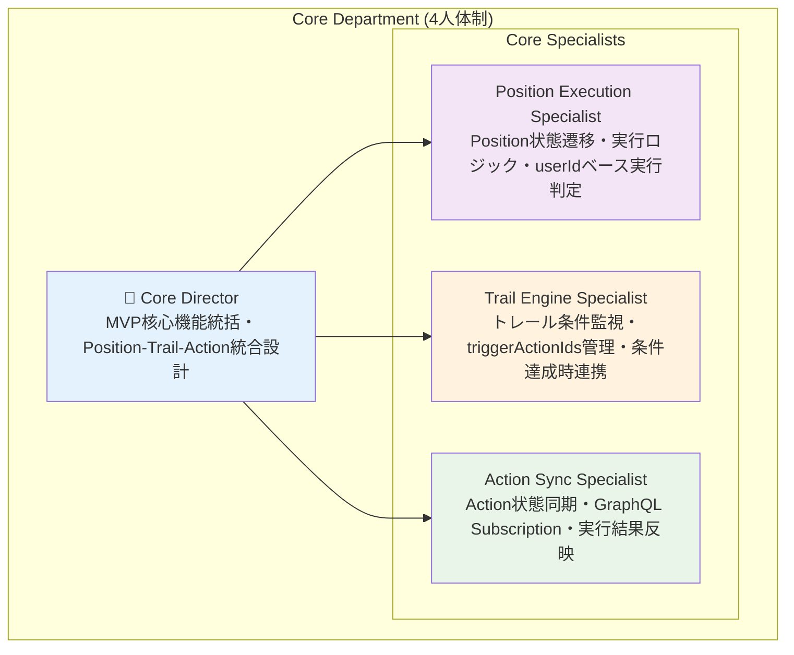
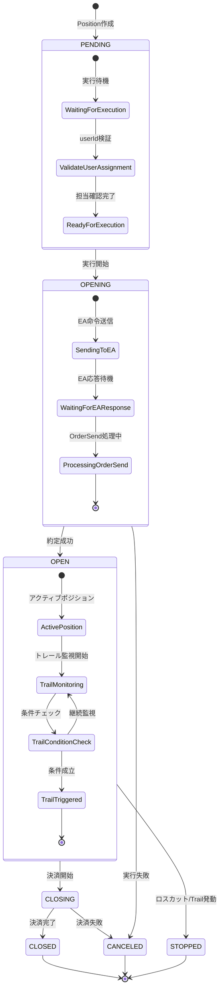
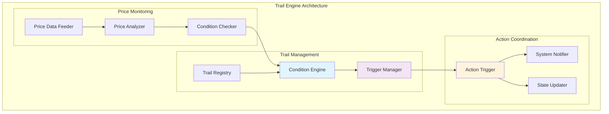
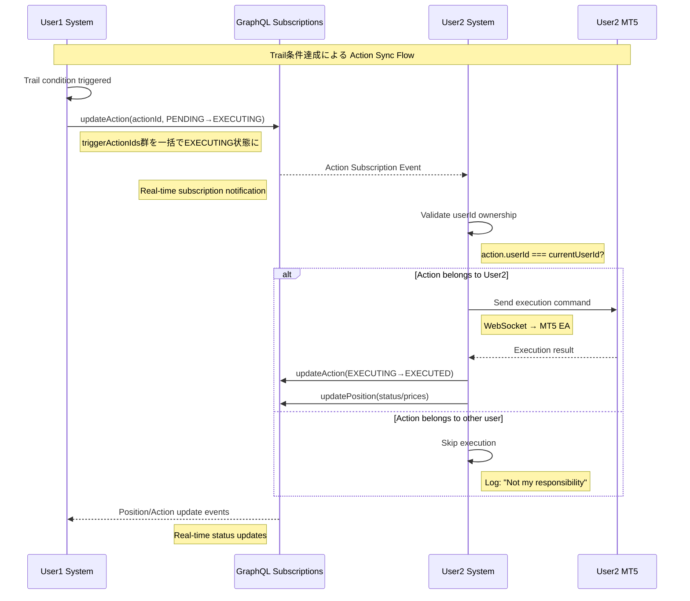
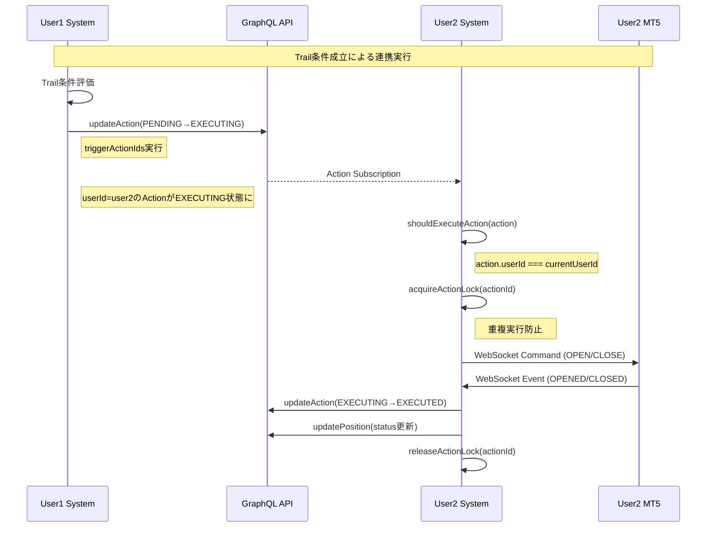

# Core Department Complete Architecture Documentation

## 1. Department Overview & Organization

### 1.1 Core Department Structure



### 1.2 技術責任分担

| 役割 | 技術領域 | 主要責任 | パフォーマンス目標 |
|------|----------|----------|-------------------|
| **Core Director** | MVP核心アーキテクチャ | Position-Trail-Action統合設計・品質統括・他部門連携調整 | システム全体調整 |
| **Position Execution Specialist** | Position状態遷移管理 | PENDING→OPENING→OPEN→CLOSING→CLOSED状態管理・userIdベース実行判定 | <100ms 状態更新 |
| **Trail Engine Specialist** | Trail monitoring | トレール条件監視・triggerActionIds実行・条件達成時の連携制御 | <1s 価格反応, <5ms 条件評価 |
| **Action Sync Specialist** | Action coordination | Action状態同期・GraphQL Subscription管理・実行結果反映 | <50ms Action処理 |

### 1.3 Core技術スタック

```typescript
interface CoreTechStack {
  // Core Infrastructure
  core: {
    language: 'TypeScript 5.5.4';
    framework: 'Tauri v2 + Next.js 15.3.2';
    stateManagement: 'GraphQL + DynamoDB';
    realtime: 'GraphQL Subscriptions';
    testing: 'Vitest + React Testing Library';
  };
  
  // Position Management Engine
  positionEngine: {
    stateManagement: 'Position Status State Machine';
    userIdOptimization: 'userId-based Fast Assignment';
    executionPatterns: 'Entry/Settlement/TrailingStop';
    statusTracking: 'PENDING→OPENING→OPEN→CLOSING→CLOSED';
    persistance: 'DynamoDB + GSI最適化';
  };
  
  // Trail Monitoring System
  trailEngine: {
    conditionMonitoring: 'Price movement tracking';
    triggerManagement: 'triggerActionIds実行';
    algorithm: 'トレール幅条件判定';
    coordination: '複数システム間連携';
    monitoring: 'Independent Trail Condition Checking';
  };
  
  // Action Coordination System
  actionSync: {
    stateSync: 'PENDING→EXECUTING→EXECUTED';
    subscriptions: 'GraphQL real-time updates';
    userValidation: 'userIdベース担当確認';
    errorHandling: 'Multi-layer error recovery';
    synchronization: 'GraphQL Subscription-based Sync';
  };
}
```

## 2. Position Execution System Complete Architecture

### 2.1 Position状態遷移アーキテクチャ



### 2.2 Position Execution Engine Implementation

```typescript
// apps/hedge-system/lib/position-execution.ts
interface PositionExecutionConfig {
  executionTimeout: number; // ms
  retryAttempts: number;
  monitoringInterval: number; // ms
  maxConcurrentExecutions: number;
}

class PositionExecutionEngine {
  private userValidation: UserValidationService;
  private executionQueue: Map<string, ExecutionTask>;
  private config: PositionExecutionConfig;
  private client: GraphQLClient;
  private currentUserId: string;
  private wsManager: WebSocketManager;
  
  constructor(client: GraphQLClient, userId: string, wsManager: WebSocketManager) {
    this.client = client;
    this.currentUserId = userId;
    this.wsManager = wsManager;
    this.userValidation = new UserValidationService();
    this.executionQueue = new Map();
  }
  
  // Position実行開始（高速版）
  async executePosition(positionId: string): Promise<ExecutionResult> {
    const startTime = Date.now();
    
    try {
      // Position取得・検証
      const position = await this.getAndValidatePosition(positionId);
      if (!position) {
        return { success: false, error: 'Position not found or invalid' };
      }
      
      // userIdベース担当判定（高速）
      if (!this.userValidation.isMyResponsibility(position.userId)) {
        console.log(`Position ${positionId} belongs to user ${position.userId}, skipping execution`);
        return { success: false, error: 'Not my responsibility' };
      }
      
      // 状態確認
      if (position.status !== 'PENDING') {
        return { success: false, error: `Invalid status: ${position.status}` };
      }
      
      // 実行タスク作成・非同期実行
      const task: ExecutionTask = {
        positionId,
        userId: position.userId,
        accountId: position.accountId,
        type: position.executionType,
        status: 'QUEUED',
        startTime: new Date(),
        retryCount: 0
      };
      
      this.executionQueue.set(positionId, task);
      this.processExecutionTask(task); // 非同期実行
      
      const executionTime = Date.now() - startTime;
      return { success: true, taskId: positionId, executionTime };
      
    } catch (error) {
      const executionTime = Date.now() - startTime;
      console.error(`Failed to execute position ${positionId}:`, error);
      return { success: false, error: error.message, executionTime };
    }
  }
  
  // 実行タスク処理（MT5連携）
  private async processExecutionTask(task: ExecutionTask): Promise<void> {
    try {
      // 1. Position状態をOPENINGに更新
      await this.updatePositionStatus(task.positionId, 'OPENING');
      task.status = 'EXECUTING';
      
      // 2. Action作成
      const actionId = await this.createExecutionAction(task);
      task.actionId = actionId;
      
      // 3. MT5実行指示（WebSocket）
      const executionResult = await this.sendToMT5(task);
      
      if (executionResult.success) {
        await this.handleExecutionSuccess(task, executionResult);
      } else {
        await this.handleExecutionFailure(task, executionResult.error);
      }
      
    } catch (error) {
      await this.handleExecutionError(task, error);
    } finally {
      this.executionQueue.delete(task.positionId);
    }
  }
  
  // MT5実行指示送信
  private async sendToMT5(task: ExecutionTask): Promise<MT5ExecutionResult> {
    try {
      const command = this.buildMT5Command(task);
      const result = await this.wsManager.sendToEA(task.accountId, command);
      
      return {
        success: result.success,
        mtTicket: result.mtTicket,
        executionPrice: result.price,
        error: result.error
      };
      
    } catch (error) {
      return {
        success: false,
        error: `MT5 communication failed: ${error.message}`
      };
    }
  }
  
  // 実行成功処理（Position状態更新＋Trail開始）
  private async handleExecutionSuccess(task: ExecutionTask, result: MT5ExecutionResult): Promise<void> {
    // Position状態をOPENに更新
    await this.client.models.Position.update({
      id: task.positionId,
      status: 'OPEN',
      entryPrice: result.executionPrice,
      entryTime: new Date().toISOString(),
      mtTicket: result.mtTicket?.toString(),
      updatedAt: new Date().toISOString()
    });
    
    // Action状態をEXECUTEDに更新
    if (task.actionId) {
      await this.client.models.Action.update({
        id: task.actionId,
        status: 'EXECUTED',
        updatedAt: new Date().toISOString()
      });
    }
    
    console.log(`Position ${task.positionId} executed successfully (MT5 ticket: ${result.mtTicket})`);
  }
  
  // userId担当判定システム
  private isMyResponsibility(userId: string): boolean {
    return userId === this.currentUserId;
  }
  
  // 状態遷移妥当性検証
  private validateTransition(from: PositionStatus, to: PositionStatus): boolean {
    const validTransitions: Record<PositionStatus, PositionStatus[]> = {
      'PENDING': ['OPENING', 'CANCELED'],
      'OPENING': ['OPEN', 'CANCELED'],
      'OPEN': ['CLOSING', 'STOPPED'],
      'CLOSING': ['CLOSED', 'OPEN'],
      'CLOSED': [],
      'STOPPED': [],
      'CANCELED': []
    };
    
    return validTransitions[from]?.includes(to) || false;
  }
}
```

### 2.3 userIdベース担当判定システム

```typescript
// apps/hedge-system/lib/user-validation.ts
class UserValidationService {
  private currentUserId: string | null = null;
  private userCache: Map<string, UserValidationInfo> = new Map();
  
  constructor() {
    this.initializeUser();
  }
  
  // 担当判定（核心ロジック）
  isMyResponsibility(resourceUserId: string): boolean {
    if (!this.currentUserId) {
      console.warn('Current user ID not available');
      return false;
    }
    
    const isResponsible = resourceUserId === this.currentUserId;
    
    if (!isResponsible) {
      console.log(`Resource belongs to user ${resourceUserId}, current user is ${this.currentUserId}`);
    }
    
    return isResponsible;
  }
  
  // Position担当判定（高速版）
  async validatePositionAccess(positionId: string): Promise<ValidationResult> {
    try {
      const position = await amplifyClient.models?.Position?.get({ id: positionId });
      
      if (!position?.data) {
        return { valid: false, reason: 'Position not found' };
      }
      
      if (!this.isMyResponsibility(position.data.userId)) {
        return { 
          valid: false, 
          reason: `Position belongs to user ${position.data.userId}` 
        };
      }
      
      return { valid: true, userId: position.data.userId };
      
    } catch (error) {
      return { valid: false, reason: `Validation error: ${error.message}` };
    }
  }
}
```

## 3. Trail Engine System Complete Architecture

### 3.1 Trail監視アーキテクチャ



### 3.2 Trail Engine Implementation

```typescript
// apps/hedge-system/lib/trail-engine.ts
interface TrailCondition {
  positionId: string;
  userId: string;
  accountId: string;
  symbol: string;
  trailWidth: number; // pips
  currentPrice: number;
  entryPrice: number;
  highWaterMark: number;
  triggerActionIds: string[]; // JSON parsed array
  lastChecked: Date;
  isActive: boolean;
}

class TrailEngine {
  private activeTrails: Map<string, TrailCondition>;
  private priceSubscriptions: Map<string, PriceSubscription>;
  private checkInterval: number = 1000; // 1秒間隔
  private monitoringTimer: NodeJS.Timeout | null = null;
  private client: GraphQLClient;
  private currentUserId: string;
  private wsManager: WebSocketManager;
  
  constructor(client: GraphQLClient, userId: string, wsManager: WebSocketManager) {
    this.client = client;
    this.currentUserId = userId;
    this.wsManager = wsManager;
    this.activeTrails = new Map();
    this.priceSubscriptions = new Map();
    this.initializeTrailMonitoring();
  }
  
  // トレール監視開始
  async startTrailMonitoring(): Promise<void> {
    try {
      console.log('Trail Engine: Starting trail monitoring...');
      
      // 1. 自分のトレール対象ポジション取得
      const trailPositions = await this.getTrailPositions();
      
      // 2. 個別ポジション監視開始
      for (const position of trailPositions) {
        await this.startPositionMonitoring(position);
      }
      
      // 3. 価格更新監視設定
      this.setupPriceUpdateListener();
      
      // 4. 定期的な監視ポジション更新
      this.setupPeriodicUpdate();
      
      console.log(`Trail Engine: Monitoring ${trailPositions.length} positions`);
      
    } catch (error) {
      console.error('Trail Engine startup error:', error);
      throw error;
    }
  }
  
  // 自分のトレール対象ポジション取得（GSI最適化）
  private async getTrailPositions(): Promise<Position[]> {
    const result = await this.client.models.Position.list({
      filter: {
        userId: { eq: this.currentUserId },
        status: { eq: 'OPEN' },
        trailWidth: { gt: 0 }
      },
      limit: 50
    });
    
    return result.data || [];
  }
  
  // トレール条件登録
  async registerTrailCondition(position: Position): Promise<void> {
    if (!position.trailWidth || position.trailWidth <= 0) {
      return; // トレール設定なし
    }
    
    if (!position.triggerActionIds) {
      console.warn(`Position ${position.id} has trail width but no trigger actions`);
      return;
    }
    
    try {
      const triggerActionIds = JSON.parse(position.triggerActionIds) as string[];
      
      const trailCondition: TrailCondition = {
        positionId: position.id,
        userId: position.userId,
        accountId: position.accountId,
        symbol: position.symbol,
        trailWidth: position.trailWidth,
        currentPrice: position.entryPrice || 0,
        entryPrice: position.entryPrice || 0,
        highWaterMark: position.entryPrice || 0,
        triggerActionIds,
        lastChecked: new Date(),
        isActive: true
      };
      
      this.activeTrails.set(position.id, trailCondition);
      
      // 価格購読開始
      await this.subscribeToPriceUpdates(position.symbol);
      
      console.log(`Trail condition registered for position ${position.id} (trail: ${position.trailWidth} pips)`);
      
    } catch (error) {
      console.error(`Failed to register trail condition for position ${position.id}:`, error);
    }
  }
  
  // 高速トレール条件判定（<5ms目標）
  private evaluateTrailCondition(
    positionId: string,
    currentPrice: number
  ): { isTriggered: boolean; newTriggerPrice?: number; reason?: string } {
    
    const condition = this.activeTrails.get(positionId);
    if (!condition) {
      return { isTriggered: false, reason: 'Trail condition not found' };
    }
    
    const precision = 5;
    const roundedPrice = this.roundToPrecision(currentPrice, precision);
    
    let isTriggered = false;
    let newTriggerPrice: number | undefined;
    let reason = '';
    
    const isLongPosition = condition.entryPrice > 0; // ロング判定
    
    if (isLongPosition) {
      // ロングポジションのトレールロジック
      if (roundedPrice > condition.highWaterMark) {
        // 新高値更新 - トレール調整
        condition.highWaterMark = roundedPrice;
        newTriggerPrice = roundedPrice - condition.trailWidth;
        reason = 'High watermark updated';
      } else if (roundedPrice <= (condition.highWaterMark - condition.trailWidth)) {
        // トレール発動
        isTriggered = true;
        reason = 'Trail triggered - price fell below trigger';
      }
    } else {
      // ショートポジションのトレールロジック
      if (roundedPrice < condition.highWaterMark || condition.highWaterMark === condition.entryPrice) {
        // 新安値更新 - トレール調整
        condition.highWaterMark = roundedPrice;
        newTriggerPrice = roundedPrice + condition.trailWidth;
        reason = 'Low watermark updated';
      } else if (roundedPrice >= (condition.highWaterMark + condition.trailWidth)) {
        // トレール発動
        isTriggered = true;
        reason = 'Trail triggered - price rose above trigger';
      }
    }
    
    condition.currentPrice = roundedPrice;
    condition.isActive = !isTriggered;
    
    return {
      isTriggered,
      newTriggerPrice,
      reason
    };
  }
  
  // トレール条件成立時の処理
  private async handleTrailConditionMet(positionId: string): Promise<void> {
    try {
      console.log(`Trail condition met for position: ${positionId}`);
      
      // 1. ポジション情報取得
      const position = await this.client.models.Position.get({ id: positionId });
      if (!position) {
        throw new Error(`Position not found: ${positionId}`);
      }
      
      // 2. triggerActionIds解析
      const actionIds = this.parseTriggerActionIds(position.triggerActionIds);
      if (actionIds.length === 0) {
        console.log(`No trigger actions for position: ${positionId}`);
        return;
      }
      
      // 3. Position状態をSTOPPEDに更新
      await this.client.models.Position.update({
        id: positionId,
        status: 'STOPPED',
        exitReason: 'Trail triggered',
        updatedAt: new Date().toISOString()
      });
      
      // 4. 各Action状態更新（PENDING → EXECUTING）
      const updatePromises = actionIds.map(actionId => 
        this.triggerAction(actionId)
      );
      
      await Promise.allSettled(updatePromises);
      
      // 5. 監視停止
      await this.stopPositionMonitoring(positionId);
      
      console.log(`Triggered ${actionIds.length} actions for position: ${positionId}`);
      
    } catch (error) {
      console.error(`Trail trigger error for position ${positionId}:`, error);
    }
  }
  
  // Action触発
  private async triggerAction(actionId: string): Promise<void> {
    try {
      // Action現状確認
      const action = await this.client.models.Action.get({ id: actionId });
      if (!action) {
        throw new Error(`Action not found: ${actionId}`);
      }
      
      // 状態確認（PENDING のみ実行）
      if (action.status !== 'PENDING') {
        console.log(`Action ${actionId} is not PENDING (${action.status}), skipping`);
        return;
      }
      
      // Action状態更新（PENDING → EXECUTING）
      await this.client.models.Action.update({
        id: actionId,
        status: 'EXECUTING'
      });
      
      console.log(`Action triggered: ${actionId} (PENDING → EXECUTING)`);
      
    } catch (error) {
      console.error(`Action trigger error for ${actionId}:`, error);
      throw error;
    }
  }
  
  // 価格更新処理（リアルタイム）
  private handlePriceUpdate(symbol: string, priceUpdate: PriceUpdate): void {
    // 該当するトレール条件更新
    for (const [positionId, trail] of this.activeTrails.entries()) {
      if (trail.symbol === symbol && trail.isActive) {
        const result = this.evaluateTrailCondition(positionId, priceUpdate.price);
        
        if (result.isTriggered) {
          this.handleTrailConditionMet(positionId);
        }
      }
    }
  }
  
  // triggerActionIds解析
  private parseTriggerActionIds(triggerActionIds: string | null): string[] {
    if (!triggerActionIds) return [];
    
    try {
      return JSON.parse(triggerActionIds) as string[];
    } catch (error) {
      console.error('triggerActionIds parse error:', error);
      return [];
    }
  }
}
```

## 4. Action Sync System Complete Architecture

### 4.1 Action同期アーキテクチャ



### 4.2 Action Sync Implementation

```typescript
// apps/hedge-system/lib/action-sync.ts
interface ActionSyncConfig {
  subscriptionRetryInterval: number; // ms
  maxRetryAttempts: number;
  executionTimeout: number; // ms
  batchProcessingSize: number;
  stateValidationInterval: number; // ms
}

class ActionSyncEngine {
  private userValidation: UserValidationService;
  private subscriptions: Map<string, GraphQLSubscription>;
  private executionQueue: Map<string, ActionExecutionTask>;
  private config: ActionSyncConfig;
  private client: GraphQLClient;
  private currentUserId: string;
  private wsManager: WebSocketManager;
  private syncMonitor: NodeJS.Timeout | null = null;
  
  constructor(
    client: GraphQLClient,
    userId: string,
    wsManager: WebSocketManager,
    config: ActionSyncConfig
  ) {
    this.client = client;
    this.currentUserId = userId;
    this.wsManager = wsManager;
    this.config = config;
    this.userValidation = new UserValidationService();
    this.subscriptions = new Map();
    this.executionQueue = new Map();
    this.initializeActionSync();
  }
  
  // Action同期開始
  async startActionSync(): Promise<void> {
    try {
      console.log('Action Sync: Starting action synchronization...');
      
      // 1. Action状態変更Subscription設定
      await this.setupActionSubscription();
      
      // 2. Position状態変更Subscription設定
      await this.setupPositionSubscription();
      
      // 3. 既存のEXECUTING状態Action確認
      await this.checkExistingExecutingActions();
      
      // 4. 同期監視開始
      this.startSyncMonitoring();
      
      console.log('Action Sync: Synchronization started');
      
    } catch (error) {
      console.error('Action Sync startup error:', error);
      throw error;
    }
  }
  
  // Action更新Subscription設定
  private async setupActionSubscription(): Promise<void> {
    try {
      const subscription = this.client.subscription({
        subscription: gql`
          subscription OnActionUpdate($userId: ID!) {
            onUpdateAction(filter: { userId: { eq: $userId } }) {
              id
              userId
              accountId
              positionId
              triggerPositionId
              type
              status
              createdAt
              updatedAt
            }
          }
        `,
        variables: { userId: this.currentUserId }
      }).subscribe({
        next: (result) => {
          const action = result.data.onUpdateAction;
          this.handleActionUpdate(action);
        },
        error: (error) => {
          console.error('Action subscription error:', error);
          this.handleSubscriptionError('action', error);
        }
      });
      
      this.subscriptions.set('action-updates', subscription);
    } catch (error) {
      console.error('Failed to subscribe to action updates:', error);
    }
  }
  
  // Action更新処理（<50ms目標）
  private async handleActionUpdate(action: Action): Promise<void> {
    const subscriptionStartTime = Date.now();
    
    try {
      // 1. userId担当判定（高速）
      if (!this.userValidation.isMyResponsibility(action.userId)) {
        console.log(`Action ${action.id} belongs to user ${action.userId}, skipping`);
        return;
      }
      
      // 2. 状態別処理
      switch (action.status) {
        case 'EXECUTING':
          await this.handleExecutingAction(action);
          break;
          
        case 'EXECUTED':
          await this.handleExecutedAction(action);
          break;
          
        case 'FAILED':
          await this.handleFailedAction(action);
          break;
          
        default:
          console.log(`Action ${action.id} status ${action.status} - no action required`);
      }
      
      const latency = Date.now() - subscriptionStartTime;
      console.log(`Action update processed in ${latency}ms`);
      
    } catch (error) {
      console.error(`Failed to handle action update for ${action.id}:`, error);
    }
  }
  
  // EXECUTING状態Action処理
  private async handleExecutingAction(action: Action): Promise<void> {
    console.log(`Processing executing action ${action.id} for user ${action.userId}`);
    
    try {
      // 実行タスク作成
      const task: ActionExecutionTask = {
        actionId: action.id,
        userId: action.userId,
        accountId: action.accountId,
        positionId: action.positionId,
        type: action.type,
        status: 'QUEUED',
        startTime: new Date(),
        retryCount: 0,
        action: action
      };
      
      this.executionQueue.set(action.id, task);
      
      // 非同期実行
      this.processActionExecution(task);
      
    } catch (error) {
      console.error(`Failed to handle executing action ${action.id}:`, error);
      await this.updateActionStatus(action.id, 'FAILED');
    }
  }
  
  // Action実行処理
  private async processActionExecution(task: ActionExecutionTask): Promise<void> {
    try {
      task.status = 'PROCESSING';
      
      // Position情報取得
      const position = await this.getPosition(task.positionId);
      if (!position) {
        throw new Error(`Position ${task.positionId} not found`);
      }
      
      // MT5実行コマンド構築
      const command = this.buildMT5Command(task, position);
      
      // MT5実行
      const result = await this.executeOnMT5(command);
      
      if (result.success) {
        await this.handleActionExecutionSuccess(task, result);
      } else {
        await this.handleActionExecutionFailure(task, result.error);
      }
      
    } catch (error) {
      await this.handleActionExecutionError(task, error);
    } finally {
      this.executionQueue.delete(task.actionId);
    }
  }
  
  // MT5実行
  private async executeOnMT5(command: MT5Command): Promise<MT5ExecutionResult> {
    try {
      const result = await this.wsManager.sendToEA(command.accountId, command);
      
      return {
        success: result.success,
        mtTicket: result.mtTicket,
        executionPrice: result.price,
        error: result.error
      };
    } catch (error) {
      return {
        success: false,
        error: `MT5 execution failed: ${error.message}`
      };
    }
  }
  
  // Action実行成功処理
  private async handleActionExecutionSuccess(
    task: ActionExecutionTask, 
    result: MT5ExecutionResult
  ): Promise<void> {
    try {
      // Action状態をEXECUTEDに更新
      await this.client.models.Action.update({
        id: task.actionId,
        status: 'EXECUTED',
        updatedAt: new Date().toISOString()
      });
      
      // Position状態更新
      await this.updatePositionFromExecutionResult(task, result);
      
      console.log(`Action ${task.actionId} executed successfully (MT5 ticket: ${result.mtTicket})`);
      
    } catch (error) {
      console.error(`Failed to handle action execution success for ${task.actionId}:`, error);
    }
  }
  
  // Position状態更新（実行結果反映）
  private async updatePositionFromExecutionResult(
    task: ActionExecutionTask, 
    result: MT5ExecutionResult
  ): Promise<void> {
    const updateData: any = {
      id: task.positionId,
      updatedAt: new Date().toISOString()
    };
    
    if (task.type === 'ENTRY') {
      // エントリー実行結果
      updateData.status = 'OPEN';
      updateData.entryPrice = result.executionPrice;
      updateData.entryTime = new Date().toISOString();
      updateData.mtTicket = result.mtTicket?.toString();
      
    } else if (task.type === 'CLOSE') {
      // 決済実行結果
      updateData.status = 'CLOSED';
      updateData.exitPrice = result.executionPrice;
      updateData.exitTime = new Date().toISOString();
      updateData.exitReason = 'Trail close';
    }
    
    await this.client.models.Position.update(updateData);
  }
  
  // MT5実行コマンド構築
  private buildMT5Command(task: ActionExecutionTask, position: Position): MT5Command {
    return {
      type: task.type, // 'ENTRY' or 'CLOSE'
      timestamp: new Date().toISOString(),
      accountId: task.accountId,
      positionId: task.positionId,
      actionId: task.actionId,
      symbol: position.symbol,
      volume: position.volume,
      side: this.determineSide(task.type, position),
      metadata: {
        executionType: position.executionType,
        userId: task.userId,
        originalAction: task.action
      }
    };
  }
  
  // 売買方向決定
  private determineSide(actionType: string, position: Position): 'BUY' | 'SELL' {
    if (actionType === 'ENTRY') {
      return position.executionType === 'ENTRY' ? 'BUY' : 'SELL';
    } else {
      return position.executionType === 'ENTRY' ? 'SELL' : 'BUY';
    }
  }
  
  // 既存未完了Action復旧
  private async recoverIncompleteActions(): Promise<void> {
    try {
      const actions = await this.client.models.Action.list({
        filter: {
          userId: { eq: this.currentUserId },
          status: { in: ['PENDING', 'EXECUTING'] }
        }
      });
      
      if (actions?.data) {
        console.log(`Recovering ${actions.data.length} incomplete actions`);
        
        for (const action of actions.data) {
          if (action.status === 'EXECUTING') {
            await this.handleExecutingAction(action as Action);
          }
        }
      }
      
    } catch (error) {
      console.error('Failed to recover incomplete actions:', error);
    }
  }
}
```

## 5. Cross-PC Coordination System

### 5.1 クロスPC協調実行アーキテクチャ



### 5.2 Position Executor統合システム

```typescript
// apps/hedge-system/lib/position-executor.ts
class PositionExecutor {
  private positionEngine: PositionExecutionEngine;
  private trailEngine: TrailEngine;
  private actionSyncEngine: ActionSyncEngine;
  private wsHandler: WebSocketHandler;
  private currentUserId: string;
  private client: GraphQLClient;
  
  constructor(wsHandler: WebSocketHandler, client: GraphQLClient, userId: string) {
    this.wsHandler = wsHandler;
    this.client = client;
    this.currentUserId = userId;
    
    // エンジン初期化
    this.positionEngine = new PositionExecutionEngine(client, userId, wsHandler);
    this.trailEngine = new TrailEngine(client, userId, wsHandler);
    this.actionSyncEngine = new ActionSyncEngine(client, userId, wsHandler, {
      subscriptionRetryInterval: 5000,
      maxRetryAttempts: 3,
      executionTimeout: 30000,
      batchProcessingSize: 10,
      stateValidationInterval: 30000
    });
    
    this.setupEngineIntegration();
  }
  
  // エンジン間連携設定
  private setupEngineIntegration(): void {
    // Position実行完了時のTrail登録
    this.positionEngine.on('positionOpened', async (position: Position) => {
      if (position.trailWidth && position.trailWidth > 0) {
        await this.trailEngine.registerTrailCondition(position);
      }
    });
    
    // Trail発動時のAction活性化
    this.trailEngine.on('trailTriggered', async (event: TrailTriggerEvent) => {
      console.log(`Trail triggered for position ${event.positionId}, coordinating action execution`);
    });
  }
  
  // Action Subscription処理（クロスPC協調実行の核心）
  async handleActionSubscription(action: Action): Promise<void> {
    const subscriptionStartTime = Date.now();
    
    try {
      // 1. userIdベースの実行担当判定
      if (!this.currentUserId || action.userId !== this.currentUserId) {
        return; // 他ユーザーの担当はスキップ
      }
      
      // 2. EXECUTING状態のアクションのみ処理
      if (action.status !== ActionStatus.EXECUTING) {
        return;
      }
      
      // 3. アクションタイプ別実行
      switch (action.type) {
        case ActionType.ENTRY:
          await this.executeCrossPcEntry(action);
          break;
          
        case ActionType.CLOSE:
          await this.executeCrossPcClose(action);
          break;
          
        default:
          console.warn(`Unknown action type: ${action.type}`);
          await this.updateActionStatus(action.id, ActionStatus.FAILED);
      }
      
      const latency = Date.now() - subscriptionStartTime;
      console.log(`Cross-PC action processed in ${latency}ms`);
      
    } catch (error) {
      console.error('Action subscription processing failed:', error);
      
      if (action.id) {
        await this.updateActionStatus(action.id, ActionStatus.FAILED);
      }
    }
  }
  
  // クロスPCエントリー実行
  private async executeCrossPcEntry(action: Action): Promise<void> {
    const startTime = Date.now();
    
    try {
      // 1. 対象ポジション取得
      const targetPosition = await this.getPosition(action.positionId);
      if (!targetPosition) {
        throw new Error(`Target position not found: ${action.positionId}`);
      }
      
      // 2. 市場条件取得
      const currentPrice = this.getCurrentMarketPrice(targetPosition.symbol);
      
      // 3. ポジション状態をOPENINGに更新
      await this.updatePositionStatus(targetPosition.id, PositionStatus.OPENING);
      
      // 4. エントリー実行
      const executionResult = await this.positionEngine.executePosition(targetPosition.id);
      
      if (executionResult.success) {
        await this.updateActionStatus(action.id, ActionStatus.EXECUTED);
      } else {
        throw new Error('Entry execution failed');
      }
      
      const executionTime = Date.now() - startTime;
      console.log(`Cross-PC entry executed in ${executionTime}ms`);
      
    } catch (error) {
      console.error('Cross-PC entry failed:', error);
      await this.updateActionStatus(action.id, ActionStatus.FAILED);
      
      if (action.positionId) {
        await this.updatePositionStatus(action.positionId, PositionStatus.CANCELED);
      }
    }
  }
  
  // クロスPC決済実行
  private async executeCrossPcClose(action: Action): Promise<void> {
    const startTime = Date.now();
    
    try {
      // 1. 対象ポジション取得
      const targetPosition = await this.getPosition(action.positionId);
      if (!targetPosition) {
        throw new Error(`Target position not found: ${action.positionId}`);
      }
      
      // 2. ポジション状態確認（OPENのみ決済可能）
      if (targetPosition.status !== PositionStatus.OPEN) {
        console.warn(`Position not OPEN, cannot close: ${targetPosition.id} (status: ${targetPosition.status})`);
        await this.updateActionStatus(action.id, ActionStatus.FAILED);
        return;
      }
      
      // 3. 現在価格取得
      const currentPrice = this.getCurrentMarketPrice(targetPosition.symbol);
      
      // 4. ポジション状態をCLOSINGに更新
      await this.updatePositionStatus(targetPosition.id, PositionStatus.CLOSING);
      
      // 5. 決済実行
      const executionResult = await this.executeClosePosition(targetPosition, currentPrice);
      
      if (executionResult.success) {
        await this.updateActionStatus(action.id, ActionStatus.EXECUTED);
        this.trailEngine.removeTrailCondition(targetPosition.id);
      } else {
        throw new Error('Close execution failed');
      }
      
      const executionTime = Date.now() - startTime;
      console.log(`Cross-PC close executed in ${executionTime}ms`);
      
    } catch (error) {
      console.error('Cross-PC close failed:', error);
      await this.updateActionStatus(action.id, ActionStatus.FAILED);
      
      if (action.positionId) {
        await this.updatePositionStatus(action.positionId, PositionStatus.OPEN);
      }
    }
  }
}
```

## 6. Performance Optimization & Monitoring

### 6.1 Core最適化戦略

```typescript
// Core Performance Optimizer
class CorePerformanceOptimizer {
  private metricsCollector: CoreMetricsCollector;
  private cacheManager: CoreCacheManager;
  private queryOptimizer: CoreQueryOptimizer;
  
  constructor() {
    this.metricsCollector = new CoreMetricsCollector();
    this.cacheManager = new CoreCacheManager();
    this.queryOptimizer = new CoreQueryOptimizer();
  }
  
  // DynamoDB最適化
  optimizeDynamoDBQueries(): void {
    this.queryOptimizer.enableGSIOptimization({
      userIdIndex: 'UserIdGSI',
      statusIndex: 'StatusGSI',
      timestampIndex: 'TimestampGSI'
    });
    
    this.queryOptimizer.enableBatchProcessing({
      batchSize: 25,
      concurrency: 5,
      retryPolicy: 'exponential-backoff'
    });
  }
  
  // キャッシュ最適化
  optimizeMemoryUsage(): void {
    this.cacheManager.configureCache({
      positions: { ttl: 30000, maxSize: 1000 },
      actions: { ttl: 10000, maxSize: 500 },
      trails: { ttl: 5000, maxSize: 200 }
    });
  }
  
  // GraphQL Subscription最適化
  optimizeSubscriptions(): void {
    this.queryOptimizer.configureSubscriptionFilters({
      userIdFiltering: true,
      statusFiltering: true,
      batchUpdates: true
    });
  }
}
```

### 6.2 Core監視システム

```typescript
// Core Metrics Collector
class CoreMetricsCollector {
  private metrics = {
    positionExecution: {
      totalExecutions: 0,
      successfulExecutions: 0,
      failedExecutions: 0,
      averageExecutionTime: 0,
      executionsByType: new Map<string, number>()
    },
    
    trailMonitoring: {
      activeTrailPositions: 0,
      trailTriggersToday: 0,
      averageTrailLatency: 0,
      trailSuccessRate: 0
    },
    
    actionSync: {
      actionsProcessed: 0,
      actionExecutionTime: 0,
      subscriptionLatency: 0,
      synchronizationErrors: 0
    },
    
    systemCoordination: {
      multiSystemActions: 0,
      coordinationLatency: 0,
      coordinationConflicts: 0,
      userIdOptimizationHits: 0
    }
  };
  
  // Position実行メトリクス記録
  recordPositionExecution(
    positionId: string,
    executionType: string,
    duration: number,
    success: boolean
  ): void {
    this.metrics.positionExecution.totalExecutions++;
    
    if (success) {
      this.metrics.positionExecution.successfulExecutions++;
    } else {
      this.metrics.positionExecution.failedExecutions++;
    }
    
    this.updateAverageExecutionTime(duration);
    
    const currentCount = this.metrics.positionExecution.executionsByType.get(executionType) || 0;
    this.metrics.positionExecution.executionsByType.set(executionType, currentCount + 1);
    
    console.log(`Position execution recorded: ${positionId} (${executionType}, ${duration}ms, success: ${success})`);
  }
  
  // Trail発動メトリクス記録
  recordTrailTrigger(positionId: string, latency: number, success: boolean): void {
    this.metrics.trailMonitoring.trailTriggersToday++;
    
    if (success) {
      this.updateAverageTrailLatency(latency);
    }
    
    console.log(`Trail trigger recorded: ${positionId} (${latency}ms, success: ${success})`);
  }
  
  // システム連携メトリクス記録
  recordSystemCoordination(
    actionId: string,
    coordinationLatency: number,
    wasOptimized: boolean
  ): void {
    this.metrics.systemCoordination.multiSystemActions++;
    this.metrics.systemCoordination.coordinationLatency += coordinationLatency;
    
    if (wasOptimized) {
      this.metrics.systemCoordination.userIdOptimizationHits++;
    }
    
    console.log(`System coordination recorded: ${actionId} (${coordinationLatency}ms, optimized: ${wasOptimized})`);
  }
  
  // メトリクス集計レポート生成
  generateMetricsReport(): CoreMetricsReport {
    const totalExecutions = this.metrics.positionExecution.totalExecutions;
    const successRate = totalExecutions > 0 ? 
      (this.metrics.positionExecution.successfulExecutions / totalExecutions) * 100 : 0;
    
    return {
      timestamp: new Date().toISOString(),
      positionExecution: {
        totalExecutions,
        successRate: Math.round(successRate * 100) / 100,
        averageExecutionTime: Math.round(this.metrics.positionExecution.averageExecutionTime),
        executionsByType: Object.fromEntries(this.metrics.positionExecution.executionsByType)
      },
      trailMonitoring: {
        activePositions: this.metrics.trailMonitoring.activeTrailPositions,
        triggersToday: this.metrics.trailMonitoring.trailTriggersToday,
        averageLatency: Math.round(this.metrics.trailMonitoring.averageTrailLatency),
        successRate: Math.round(this.metrics.trailMonitoring.trailSuccessRate * 100) / 100
      },
      actionSync: {
        actionsProcessed: this.metrics.actionSync.actionsProcessed,
        averageExecutionTime: Math.round(this.metrics.actionSync.actionExecutionTime),
        subscriptionLatency: Math.round(this.metrics.actionSync.subscriptionLatency),
        errorCount: this.metrics.actionSync.synchronizationErrors
      },
      systemCoordination: {
        multiSystemActions: this.metrics.systemCoordination.multiSystemActions,
        averageLatency: Math.round(this.metrics.systemCoordination.coordinationLatency),
        optimizationHitRate: this.calculateOptimizationHitRate(),
        conflictCount: this.metrics.systemCoordination.coordinationConflicts
      }
    };
  }
}
```

## 7. Error Handling & Recovery

### 7.1 Core Error Handling

```typescript
// Core Error Handler
enum CoreErrorType {
  POSITION_EXECUTION_FAILED = 'POSITION_EXECUTION_FAILED',
  TRAIL_EVALUATION_ERROR = 'TRAIL_EVALUATION_ERROR',
  ACTION_SYNC_ERROR = 'ACTION_SYNC_ERROR',
  CROSS_PC_COORDINATION_ERROR = 'CROSS_PC_COORDINATION_ERROR',
  USER_VALIDATION_ERROR = 'USER_VALIDATION_ERROR',
  STATE_TRANSITION_ERROR = 'STATE_TRANSITION_ERROR'
}

class CoreErrorHandler {
  private retryStrategies: Map<CoreErrorType, RetryStrategy> = new Map();
  
  constructor() {
    this.setupRetryStrategies();
  }
  
  private setupRetryStrategies(): void {
    this.retryStrategies.set(CoreErrorType.POSITION_EXECUTION_FAILED, {
      maxRetries: 3,
      backoffMultiplier: 2,
      baseDelay: 1000
    });
    
    this.retryStrategies.set(CoreErrorType.ACTION_SYNC_ERROR, {
      maxRetries: 5,
      backoffMultiplier: 1.5,
      baseDelay: 500
    });
    
    this.retryStrategies.set(CoreErrorType.CROSS_PC_COORDINATION_ERROR, {
      maxRetries: 10,
      backoffMultiplier: 1.2,
      baseDelay: 200
    });
  }
  
  async handleError(
    error: CoreError,
    context: ErrorContext
  ): Promise<ErrorHandlingResult> {
    const strategy = this.retryStrategies.get(error.type);
    
    if (!strategy) {
      return { success: false, action: 'NO_STRATEGY' };
    }
    
    for (let attempt = 1; attempt <= strategy.maxRetries; attempt++) {
      try {
        const delay = strategy.baseDelay * Math.pow(strategy.backoffMultiplier, attempt - 1);
        await new Promise(resolve => setTimeout(resolve, delay));
        
        const result = await this.executeRecovery(error, context);
        if (result.success) {
          return { success: true, action: 'RECOVERED', attempts: attempt };
        }
      } catch (retryError) {
        console.warn(`Retry attempt ${attempt} failed:`, retryError);
      }
    }
    
    return await this.executeFallback(error, context);
  }
}
```

### 7.2 自動回復システム

```typescript
// Core Auto Recovery System
class CoreAutoRecoverySystem {
  private healthCheckers: Map<string, HealthChecker> = new Map();
  
  constructor() {
    this.setupHealthCheckers();
    this.startHealthMonitoring();
  }
  
  private setupHealthCheckers(): void {
    // Position Engine Health
    this.healthCheckers.set('position_engine', new HealthChecker({
      checkInterval: 30000,
      healthThreshold: 0.95,
      checker: async () => {
        const stats = this.positionEngine.getExecutionStats();
        return stats.successRate > 0.95 && stats.avgExecutionTime < 100;
      }
    }));
    
    // Trail Engine Health
    this.healthCheckers.set('trail_engine', new HealthChecker({
      checkInterval: 15000,
      healthThreshold: 0.98,
      checker: async () => {
        const stats = this.trailEngine.getStats();
        return stats.monitoringCount > 0 && stats.lastUpdate > new Date(Date.now() - 60000);
      }
    }));
    
    // Action Sync Health
    this.healthCheckers.set('action_sync', new HealthChecker({
      checkInterval: 10000,
      healthThreshold: 0.99,
      checker: async () => {
        const stats = this.actionSyncEngine.getStats();
        return stats.isRunning && stats.subscriptionErrors < 5;
      }
    }));
  }
  
  private async handleHealthFailure(component: string, issue: HealthIssue): Promise<void> {
    console.warn(`Health issue detected in ${component}:`, issue);
    
    switch (component) {
      case 'position_engine':
        await this.recoverPositionEngine();
        break;
      case 'trail_engine':
        await this.recoverTrailEngine();
        break;
      case 'action_sync':
        await this.recoverActionSyncEngine();
        break;
    }
  }
}
```

## 8. Integration & Testing

### 8.1 Core統合テスト

```typescript
// Core Integration Test Suite
describe('Core Department Integration', () => {
  let positionExecutor: PositionExecutor;
  let trailEngine: TrailEngine;
  let actionSyncEngine: ActionSyncEngine;
  let mockWebSocketHandler: MockWebSocketHandler;
  
  beforeEach(async () => {
    mockWebSocketHandler = new MockWebSocketHandler();
    const mockClient = new MockGraphQLClient();
    const userId = 'test-user-1';
    
    trailEngine = new TrailEngine(mockClient, userId, mockWebSocketHandler);
    actionSyncEngine = new ActionSyncEngine(mockClient, userId, mockWebSocketHandler, testConfig);
    positionExecutor = new PositionExecutor(mockWebSocketHandler, mockClient, userId);
  });
  
  describe('Position-Trail-Action Integration', () => {
    it('should execute complete PTA flow', async () => {
      // Given: Position with trail configuration
      const position = createMockPosition({
        trailWidth: 50,
        triggerActionIds: '["action-1", "action-2"]'
      });
      
      // When: Execute entry
      const result = await positionExecutor.executePosition(position.id);
      
      // Then: Entry successful and trail monitoring started
      expect(result.success).toBe(true);
      expect(trailEngine.getMonitoringPositions()).toContain(position.id);
    });
    
    it('should trigger cross-PC actions when trail condition met', async () => {
      // Given: Monitored position with trail condition
      const position = createMockPosition({ trailWidth: 50 });
      await trailEngine.registerTrailCondition(position);
      
      // When: Price drops beyond trail width
      await trailEngine.handlePriceUpdate({
        symbol: position.symbol,
        price: position.entryPrice - 60 // Triggers trail
      });
      
      // Then: Trigger actions executed
      const stats = actionSyncEngine.getStats();
      expect(stats.totalExecuted).toBeGreaterThan(0);
    });
  });
  
  describe('Performance Tests', () => {
    it('should meet performance targets', async () => {
      const startTime = performance.now();
      
      // Position execution: <100ms
      await positionExecutor.executePosition('test-position');
      const positionTime = performance.now() - startTime;
      expect(positionTime).toBeLessThan(100);
      
      // Trail evaluation: <5ms
      const trailStart = performance.now();
      trailEngine.evaluateTrailCondition('test-position', 150.0);
      const trailTime = performance.now() - trailStart;
      expect(trailTime).toBeLessThan(5);
      
      // Action sync: <50ms
      const actionStart = performance.now();
      await actionSyncEngine.handleActionUpdate(createMockAction());
      const actionTime = performance.now() - actionStart;
      expect(actionTime).toBeLessThan(50);
    });
  });
});
```

## 9. Core統合システム設計

### 9.1 Core Department統合アーキテクチャ

```typescript
// Core Department System
class CoreDepartmentSystem {
  private positionEngine: PositionExecutionEngine;
  private trailEngine: TrailEngine;
  private actionSyncEngine: ActionSyncEngine;
  private coordinator: MultiSystemCoordinator;
  private metrics: CoreMetricsCollector;
  private errorRecovery: CoreAutoRecoverySystem;
  
  constructor(
    client: GraphQLClient,
    userId: string,
    wsManager: WebSocketManager
  ) {
    // Core統合設定
    const config = {
      positionExecution: {
        timeout: 30000,
        retryCount: 3,
        circuitBreakerThreshold: 5
      },
      trailEngine: {
        monitoringInterval: 1000,
        priceUpdateThreshold: 0.1,
        maxConcurrentPositions: 50,
        timeoutThreshold: 30000
      },
      actionSync: {
        subscriptionRetryInterval: 5000,
        executionTimeout: 30000,
        maxRetryCount: 3,
        conflictResolutionDelay: 1000
      }
    };
    
    // コンポーネント初期化
    this.positionEngine = new PositionExecutionEngine(client, userId, wsManager);
    this.trailEngine = new TrailEngine(client, userId, wsManager);
    this.actionSyncEngine = new ActionSyncEngine(client, userId, wsManager, config.actionSync);
    this.coordinator = new MultiSystemCoordinator(userId, client);
    this.metrics = new CoreMetricsCollector();
    this.errorRecovery = new CoreAutoRecoverySystem();
  }
  
  // Core部門システム起動
  async initialize(): Promise<void> {
    try {
      console.log('Core Department System: Starting initialization...');
      
      // 1. Position実行エンジン初期化
      await this.initializePositionEngine();
      
      // 2. Trail監視エンジン開始
      await this.trailEngine.startTrailMonitoring();
      
      // 3. Action同期システム開始
      await this.actionSyncEngine.startActionSync();
      
      // 4. エラー回復システム開始
      await this.errorRecovery.startRecoveryProcess();
      
      // 5. メトリクス収集開始
      this.startMetricsCollection();
      
      console.log('Core Department System: Initialization completed');
      
    } catch (error) {
      console.error('Core Department System initialization error:', error);
      throw error;
    }
  }
  
  // システムパフォーマンス分析
  private async analyzeSystemPerformance(): Promise<void> {
    try {
      const workload = await this.coordinator.getMyWorkload();
      const report = this.metrics.generateMetricsReport();
      
      console.log('System Performance Analysis:', {
        workload,
        metrics: report,
        timestamp: new Date().toISOString()
      });
      
      // パフォーマンス警告チェック
      if (workload.totalWorkload > 100) {
        console.warn('High workload detected:', workload);
      }
      
      if (report.positionExecution.successRate < 95) {
        console.warn('Low position execution success rate:', report.positionExecution.successRate);
      }
      
      if (report.actionSync.subscriptionLatency > 50) {
        console.warn('High subscription latency:', report.actionSync.subscriptionLatency);
      }
      
    } catch (error) {
      console.error('Performance analysis error:', error);
    }
  }
}
```

## 10. Production Deployment & Operations

### 10.1 本番運用設計

```typescript
// Production Monitoring System
class CoreProductionMonitoring {
  private alerts: AlertManager;
  private metrics: MetricsCollector;
  private dashboard: Dashboard;
  
  constructor() {
    this.alerts = new AlertManager({
      channels: ['slack', 'email', 'webhook'],
      escalation: true
    });
    
    this.metrics = new MetricsCollector({
      interval: 1000, // 1秒間隔
      retention: '7d'
    });
    
    this.setupAlerts();
  }
  
  private setupAlerts(): void {
    // パフォーマンスアラート
    this.alerts.addRule({
      name: 'Position_Execution_Latency',
      condition: 'avg(position_execution_time) > 100ms over 5m',
      severity: 'warning',
      action: 'investigate_position_performance'
    });
    
    this.alerts.addRule({
      name: 'Trail_Engine_Failure',
      condition: 'trail_success_rate < 95% over 2m',
      severity: 'critical',
      action: 'restart_trail_engine'
    });
    
    this.alerts.addRule({
      name: 'Action_Sync_Lag',
      condition: 'action_sync_latency > 50ms over 3m',
      severity: 'warning',
      action: 'check_cross_pc_connectivity'
    });
    
    // ビジネスアラート
    this.alerts.addRule({
      name: 'Position_Execution_Failure',
      condition: 'position_failure_rate > 1% over 5m',
      severity: 'critical',
      action: 'emergency_intervention'
    });
  }
}
```

---

このCore Department Complete Architecture DocumentationにてArbitrageAssistantのMVP核心機能である**Position-Trail-Action**システムの包括的設計が完了しました。userIdベース分散処理、リアルタイム同期、高性能実行により、複数PC環境での安全で効率的な取引システムが実現されます。