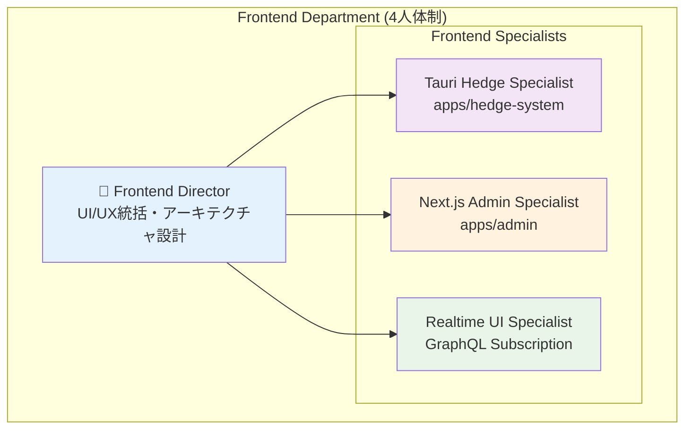
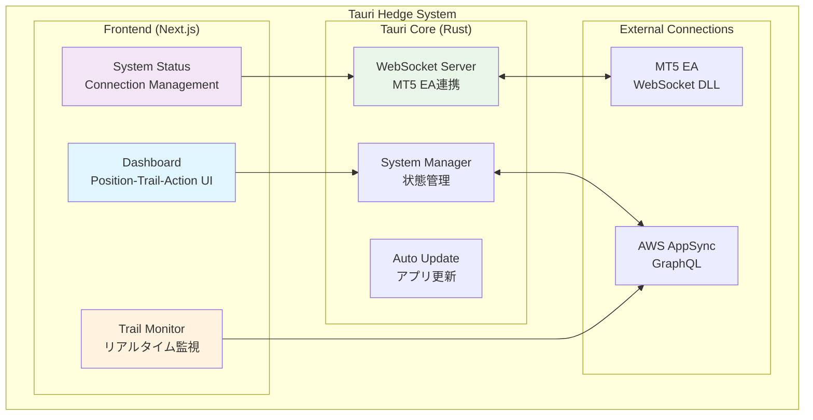
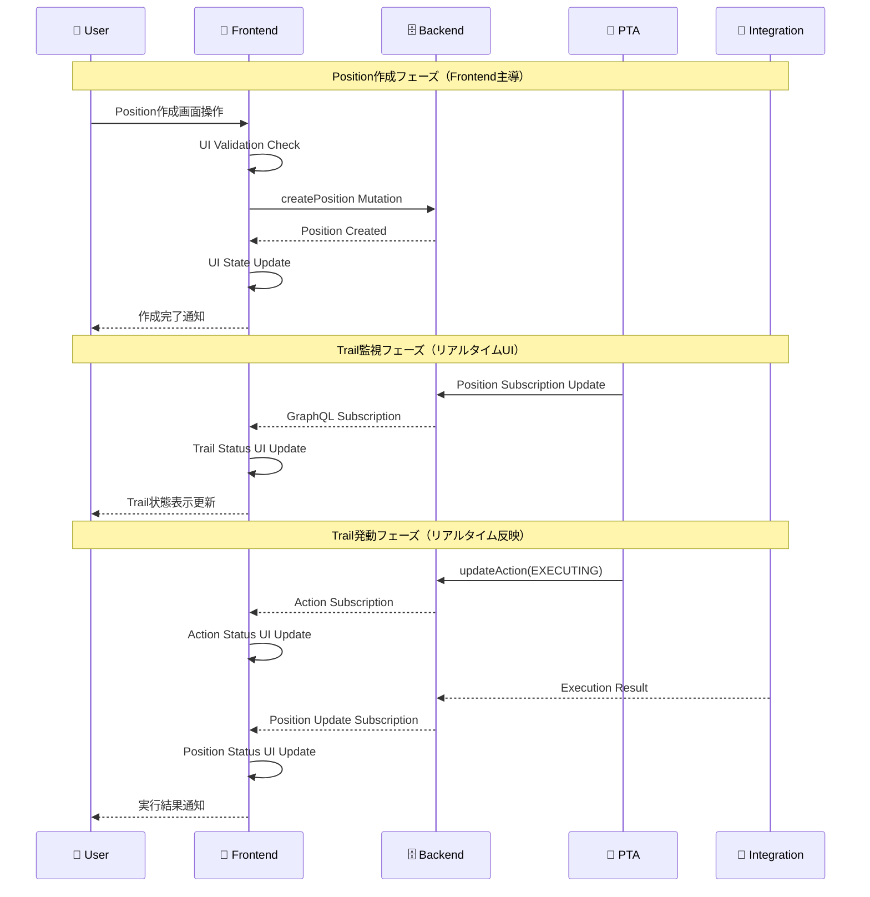

# Frontend Department Complete Architecture Documentation

## 1. Department Overview & Organization

### 1.1 Frontend Department Structure



### 1.2 技術責任分担

| 役割 | 技術領域 | 主要責任 | パフォーマンス目標 |
|------|----------|----------|-------------------|
| **Frontend Director** | 全体アーキテクチャ | UI/UX設計統括・技術選択・品質管理・他部門連携 | システム全体調整 |
| **Tauri Hedge Specialist** | Tauri + Rust + TypeScript | デスクトップアプリ・Position-Trail-Action UI・WebSocket統合 | レンダリング <16ms |
| **Next.js Admin Specialist** | Next.js + React + Tailwind | Web管理画面・Account/Position管理UI・ワークフロー | ページ読み込み <2s |
| **Realtime UI Specialist** | GraphQL Subscription + WebSocket | リアルタイム更新・状態同期・ライブダッシュボード | 更新遅延 <100ms |

### 1.3 Frontend技術スタック

```typescript
interface FrontendTechStack {
  // Tauri Hedge System (apps/hedge-system)
  tauriApp: {
    framework: 'Tauri v2';
    frontend: 'Next.js 15.3.2';
    language: 'TypeScript 5.5.4';
    styling: 'Tailwind CSS v4';
    ui: 'shadcn/ui';
    backend: 'Rust';
    testing: 'Vitest + React Testing Library';
  };
  
  // Next.js Admin (apps/admin)
  adminApp: {
    framework: 'Next.js 15.3.2';
    language: 'TypeScript 5.5.4';
    styling: 'Tailwind CSS v4';
    ui: 'shadcn/ui';
    stateManagement: 'React 19 + Custom Hooks';
    testing: 'Vitest + React Testing Library';
  };
  
  // 共通技術
  common: {
    graphqlClient: 'AWS Amplify GraphQL Client';
    authentication: 'AWS Cognito';
    websocket: 'Native WebSocket + Tauri WebSocket';
    bundler: 'Turborepo';
    linting: 'ESLint --max-warnings 0';
  };
}
```

## 2. アプリケーション設計

### 2.1 Tauri Hedge System設計（apps/hedge-system）

#### アーキテクチャ構成


#### 主要コンポーネント設計
```typescript
// apps/hedge-system/features/dashboard/Dashboard.tsx
interface DashboardProps {
  userId: string;
  positions: Position[];
  actions: Action[];
  accounts: Account[];
}

const Dashboard: React.FC<DashboardProps> = ({ userId, positions, actions, accounts }) => {
  return (
    <div className="dashboard-container">
      <SystemOverview accounts={accounts} />
      <PositionManager positions={positions} userId={userId} />
      <ActionQueue actions={actions} />
      <TrailMonitor positions={positions.filter(p => p.trailWidth > 0)} />
    </div>
  );
};

// Position管理コンポーネント
interface PositionManagerProps {
  positions: Position[];
  userId: string;
}

const PositionManager: React.FC<PositionManagerProps> = ({ positions, userId }) => {
  const [selectedPosition, setSelectedPosition] = useState<Position | null>(null);
  const { executePosition, updateTrailSettings } = usePositionActions();
  
  return (
    <Card className="position-manager">
      <CardHeader>
        <h2>Position Management</h2>
      </CardHeader>
      <CardContent>
        <PositionList 
          positions={positions}
          onSelect={setSelectedPosition}
          onExecute={executePosition}
        />
        {selectedPosition && (
          <PositionDetail 
            position={selectedPosition}
            onUpdateTrail={updateTrailSettings}
          />
        )}
      </CardContent>
    </Card>
  );
};
```

#### Tauri固有機能実装
```rust
// src-tauri/src/websocket.rs
use tauri::Manager;
use tokio_tungstenite::{connect_async, tungstenite::Message};

#[tauri::command]
pub async fn start_websocket_server(app_handle: tauri::AppHandle, port: u16) -> Result<(), String> {
    let listener = TcpListener::bind(format!("127.0.0.1:{}", port))
        .await
        .map_err(|e| e.to_string())?;
    
    while let Ok((stream, _)) = listener.accept().await {
        let app_handle_clone = app_handle.clone();
        tokio::spawn(handle_websocket_connection(stream, app_handle_clone));
    }
    
    Ok(())
}

async fn handle_websocket_connection(stream: TcpStream, app_handle: tauri::AppHandle) {
    let ws_stream = tokio_tungstenite::accept_async(stream).await.unwrap();
    let (mut ws_sender, mut ws_receiver) = ws_stream.split();
    
    while let Some(msg) = ws_receiver.next().await {
        match msg {
            Ok(Message::Text(text)) => {
                // MT5からのメッセージを処理
                let parsed_message: WebSocketMessage = serde_json::from_str(&text).unwrap();
                
                // Frontendに通知
                app_handle.emit_all("mt5-message", &parsed_message).unwrap();
            }
            _ => {}
        }
    }
}
```

### 2.2 Next.js Admin管理画面設計（apps/admin）

#### ページ構成・ルーティング
```typescript
// apps/admin/app/layout.tsx
export default function RootLayout({
  children,
}: {
  children: React.ReactNode;
}) {
  return (
    <html lang="ja">
      <body>
        <AuthProvider>
          <GraphQLProvider>
            <AdminLayout>
              {children}
            </AdminLayout>
          </GraphQLProvider>
        </AuthProvider>
      </body>
    </html>
  );
}

// ページ構成
const ADMIN_ROUTES = {
  '/dashboard': 'ダッシュボード・システム全体監視',
  '/accounts': 'Account管理・口座情報・クレジット管理',
  '/positions': 'Position管理・エントリー・決済・トレール設定',
  '/actions': 'Action管理・実行キュー・状態監視',
  '/hedges': 'Hedge管理・両建て状況・組み替え操作',
  '/clients': 'Client管理・ユーザー管理・PC状態監視'
} as const;
```

#### Account管理機能
```typescript
// apps/admin/features/accounts/components/AccountManager.tsx
interface AccountManagerProps {
  userId: string;
}

const AccountManager: React.FC<AccountManagerProps> = ({ userId }) => {
  const { accounts, loading, error } = useAccountsWithRealtime(userId);
  const { createAccount, updateAccount, deleteAccount } = useAccounts();
  
  return (
    <div className="account-manager">
      <div className="account-header">
        <h1>Account Management</h1>
        <Button onClick={() => setCreateModalOpen(true)}>
          新規口座作成
        </Button>
      </div>
      
      <div className="account-grid">
        {accounts.map(account => (
          <AccountCard 
            key={account.id}
            account={account}
            onUpdate={updateAccount}
            onDelete={deleteAccount}
          />
        ))}
      </div>
      
      <AccountCreateModal 
        open={createModalOpen}
        onClose={() => setCreateModalOpen(false)}
        onCreate={createAccount}
      />
    </div>
  );
};

// リアルタイム口座情報更新
const useAccountsWithRealtime = (userId: string) => {
  const [accounts, setAccounts] = useState<Account[]>([]);
  const { data, loading, error, subscribeToMore } = useQuery(LIST_ACCOUNTS, {
    variables: { userId }
  });
  
  useEffect(() => {
    subscribeToMore({
      document: ON_ACCOUNT_UPDATE,
      variables: { userId },
      updateQuery: (prev, { subscriptionData }) => {
        if (!subscriptionData.data) return prev;
        
        const updatedAccount = subscriptionData.data.onUpdateAccount;
        return {
          ...prev,
          listAccounts: {
            ...prev.listAccounts,
            items: prev.listAccounts.items.map(account =>
              account.id === updatedAccount.id ? updatedAccount : account
            )
          }
        };
      }
    });
  }, [subscribeToMore, userId]);
  
  return { accounts: data?.listAccounts?.items || [], loading, error };
};
```

#### Position管理機能
```typescript
// apps/admin/features/positions/components/PositionManager.tsx
const PositionManager: React.FC = () => {
  const { positions, loading } = useRealtimePositions();
  const [selectedPosition, setSelectedPosition] = useState<Position | null>(null);
  const [workflowStep, setWorkflowStep] = useState<WorkflowStep>('SELECT_ACCOUNT');
  
  return (
    <div className="position-manager">
      <div className="position-workflow">
        <WorkflowStatusTracker currentStep={workflowStep} />
        
        {workflowStep === 'CREATE_POSITION' && (
          <PositionWorkflow 
            onComplete={(position) => {
              setSelectedPosition(position);
              setWorkflowStep('CONFIGURE_TRAIL');
            }}
          />
        )}
        
        {workflowStep === 'CONFIGURE_TRAIL' && selectedPosition && (
          <TrailConfig 
            position={selectedPosition}
            onComplete={() => setWorkflowStep('READY_TO_EXECUTE')}
          />
        )}
      </div>
      
      <div className="position-list">
        <PositionList 
          positions={positions}
          onSelect={setSelectedPosition}
        />
      </div>
      
      {selectedPosition && (
        <PositionDetail 
          position={selectedPosition}
          onUpdate={updatePosition}
        />
      )}
    </div>
  );
};

// Position実行ワークフロー
const PositionWorkflow: React.FC<{ onComplete: (position: Position) => void }> = ({ onComplete }) => {
  const [step, setStep] = useState(1);
  const [formData, setFormData] = useState<CreatePositionInput>();
  
  const steps = [
    { id: 1, title: '口座選択', component: AccountSelector },
    { id: 2, title: 'ポジション設定', component: PositionConfigurator },
    { id: 3, title: '確認・作成', component: PositionConfirmation }
  ];
  
  return (
    <Card className="position-workflow">
      <CardHeader>
        <h3>Position作成ワークフロー</h3>
        <ProgressBar currentStep={step} totalSteps={steps.length} />
      </CardHeader>
      <CardContent>
        {steps.map(stepConfig => 
          stepConfig.id === step && (
            <stepConfig.component 
              key={stepConfig.id}
              data={formData}
              onChange={setFormData}
              onNext={() => setStep(step + 1)}
              onPrev={() => setStep(step - 1)}
              onComplete={onComplete}
            />
          )
        )}
      </CardContent>
    </Card>
  );
};
```

### 2.3 リアルタイムUI設計

#### GraphQL Subscription統合
```typescript
// apps/admin/lib/services/subscription-service.ts
class SubscriptionService {
  private client: GraphQLClient;
  private subscriptions = new Map<string, Observable<any>>();
  
  constructor(client: GraphQLClient) {
    this.client = client;
  }
  
  subscribeToPositions(userId: string): Observable<Position[]> {
    const key = `positions-${userId}`;
    
    if (!this.subscriptions.has(key)) {
      const subscription = this.client.subscription({
        subscription: ON_POSITION_UPDATE,
        variables: { userId }
      }).pipe(
        map(result => result.data.onUpdatePosition),
        scan((acc: Position[], updatedPosition: Position) => {
          const index = acc.findIndex(p => p.id === updatedPosition.id);
          if (index >= 0) {
            acc[index] = updatedPosition;
          } else {
            acc.push(updatedPosition);
          }
          return [...acc];
        }, [])
      );
      
      this.subscriptions.set(key, subscription);
    }
    
    return this.subscriptions.get(key)!;
  }
  
  subscribeToActions(userId: string): Observable<Action[]> {
    const key = `actions-${userId}`;
    
    if (!this.subscriptions.has(key)) {
      const subscription = this.client.subscription({
        subscription: ON_ACTION_UPDATE,
        variables: { userId }
      }).pipe(
        map(result => result.data.onUpdateAction),
        scan((acc: Action[], updatedAction: Action) => {
          const index = acc.findIndex(a => a.id === updatedAction.id);
          if (index >= 0) {
            acc[index] = updatedAction;
          } else {
            acc.push(updatedAction);
          }
          return [...acc];
        }, [])
      );
      
      this.subscriptions.set(key, subscription);
    }
    
    return this.subscriptions.get(key)!;
  }
  
  unsubscribe(key: string): void {
    this.subscriptions.delete(key);
  }
  
  cleanup(): void {
    this.subscriptions.clear();
  }
}

// React Hook統合
const useRealtimePositions = (userId: string) => {
  const [positions, setPositions] = useState<Position[]>([]);
  const [loading, setLoading] = useState(true);
  const subscriptionService = useSubscriptionService();
  
  useEffect(() => {
    const subscription = subscriptionService
      .subscribeToPositions(userId)
      .subscribe({
        next: (updatedPositions) => {
          setPositions(updatedPositions);
          setLoading(false);
        },
        error: (error) => {
          console.error('Position subscription error:', error);
          setLoading(false);
        }
      });
    
    return () => subscription.unsubscribe();
  }, [userId, subscriptionService]);
  
  return { positions, loading };
};
```

#### リアルタイムダッシュボード
```typescript
// apps/admin/features/dashboard/components/Dashboard.tsx
const Dashboard: React.FC = () => {
  const { user } = useAuth();
  const { systemMetrics, connectionStatus } = useDashboardData(user.id);
  
  return (
    <div className="dashboard">
      <div className="dashboard-header">
        <h1>ArbitrageAssistant Dashboard</h1>
        <SystemStatusIndicator status={connectionStatus} />
      </div>
      
      <div className="dashboard-grid">
        <StatsCards metrics={systemMetrics} />
        <MonitoringPanel userId={user.id} />
        <ClientStatusCard />
        <RecentActivity userId={user.id} />
      </div>
    </div>
  );
};

const MonitoringPanel: React.FC<{ userId: string }> = ({ userId }) => {
  const { positions } = useRealtimePositions(userId);
  const { actions } = useRealtimeActions(userId);
  
  const activeTrails = positions.filter(p => p.trailWidth > 0 && p.status === 'OPEN');
  const executingActions = actions.filter(a => a.status === 'EXECUTING');
  
  return (
    <Card className="monitoring-panel">
      <CardHeader>
        <h3>リアルタイム監視</h3>
      </CardHeader>
      <CardContent>
        <div className="monitoring-grid">
          <div className="trail-monitor">
            <h4>アクティブトレール ({activeTrails.length})</h4>
            {activeTrails.map(position => (
              <TrailStatusCard key={position.id} position={position} />
            ))}
          </div>
          
          <div className="action-monitor">
            <h4>実行中アクション ({executingActions.length})</h4>
            {executingActions.map(action => (
              <ActionStatusCard key={action.id} action={action} />
            ))}
          </div>
        </div>
      </CardContent>
    </Card>
  );
};
```

## 3. WebSocket統合設計

### 3.1 WebSocketクライアント統一実装

```typescript
// packages/shared-frontend/websocket-client.ts
interface WebSocketConfig {
  url: string;
  protocols?: string[];
  reconnectInterval?: number;
  maxReconnectAttempts?: number;
}

class UnifiedWebSocketClient {
  private ws: WebSocket | null = null;
  private config: WebSocketConfig;
  private reconnectAttempts = 0;
  private messageHandlers = new Map<string, (message: any) => void>();
  private connectionState: 'connecting' | 'open' | 'closed' | 'error' = 'closed';
  
  constructor(config: WebSocketConfig) {
    this.config = config;
  }
  
  async connect(): Promise<void> {
    return new Promise((resolve, reject) => {
      try {
        this.ws = new WebSocket(this.config.url, this.config.protocols);
        this.connectionState = 'connecting';
        
        this.ws.onopen = () => {
          this.connectionState = 'open';
          this.reconnectAttempts = 0;
          resolve();
        };
        
        this.ws.onmessage = (event) => {
          try {
            const message = JSON.parse(event.data);
            this.handleMessage(message);
          } catch (error) {
            console.error('WebSocket message parse error:', error);
          }
        };
        
        this.ws.onclose = (event) => {
          this.connectionState = 'closed';
          if (!event.wasClean) {
            this.handleReconnect();
          }
        };
        
        this.ws.onerror = (error) => {
          this.connectionState = 'error';
          reject(error);
        };
      } catch (error) {
        reject(error);
      }
    });
  }
  
  send(message: WebSocketMessage): void {
    if (this.ws?.readyState === WebSocket.OPEN) {
      this.ws.send(JSON.stringify(message));
    } else {
      throw new Error('WebSocket connection not open');
    }
  }
  
  subscribe(messageType: string, handler: (message: any) => void): void {
    this.messageHandlers.set(messageType, handler);
  }
  
  unsubscribe(messageType: string): void {
    this.messageHandlers.delete(messageType);
  }
  
  private handleMessage(message: WebSocketMessage): void {
    const handler = this.messageHandlers.get(message.type);
    if (handler) {
      handler(message);
    }
  }
  
  private async handleReconnect(): Promise<void> {
    const maxAttempts = this.config.maxReconnectAttempts || 5;
    
    if (this.reconnectAttempts < maxAttempts) {
      this.reconnectAttempts++;
      const delay = Math.min(1000 * Math.pow(2, this.reconnectAttempts), 30000);
      
      setTimeout(() => {
        this.connect().catch(console.error);
      }, delay);
    }
  }
  
  disconnect(): void {
    if (this.ws) {
      this.ws.close();
      this.ws = null;
    }
  }
  
  getConnectionState(): string {
    return this.connectionState;
  }
}

// React Hook統合
const useWebSocket = (config: WebSocketConfig) => {
  const [client] = useState(() => new UnifiedWebSocketClient(config));
  const [connectionState, setConnectionState] = useState<string>('closed');
  
  useEffect(() => {
    client.connect().then(() => {
      setConnectionState(client.getConnectionState());
    });
    
    return () => {
      client.disconnect();
    };
  }, [client]);
  
  const sendMessage = useCallback((message: WebSocketMessage) => {
    client.send(message);
  }, [client]);
  
  const subscribe = useCallback((messageType: string, handler: (message: any) => void) => {
    client.subscribe(messageType, handler);
  }, [client]);
  
  return { sendMessage, subscribe, connectionState };
};
```

### 3.2 Tauri WebSocket統合

```rust
// src-tauri/src/websocket.rs
use serde::{Deserialize, Serialize};
use tauri::Manager;
use tokio_tungstenite::{connect_async, tungstenite::Message};

#[derive(Debug, Serialize, Deserialize)]
pub struct WebSocketMessage {
    pub id: String,
    pub message_type: String,
    pub source: String,
    pub target: Option<String>,
    pub timestamp: String,
    pub data: serde_json::Value,
}

#[tauri::command]
pub async fn send_websocket_message(
    app_handle: tauri::AppHandle,
    url: String,
    message: WebSocketMessage,
) -> Result<(), String> {
    let (ws_stream, _) = connect_async(&url)
        .await
        .map_err(|e| e.to_string())?;
    
    let (mut write, _read) = ws_stream.split();
    let message_text = serde_json::to_string(&message)
        .map_err(|e| e.to_string())?;
    
    write.send(Message::Text(message_text))
        .await
        .map_err(|e| e.to_string())?;
    
    Ok(())
}

// TypeScript側での使用
import { invoke } from '@tauri-apps/api/tauri';

const sendToMT5 = async (command: MT5Command) => {
  const message: WebSocketMessage = {
    id: crypto.randomUUID(),
    type: 'MT5_COMMAND',
    source: 'hedge-system',
    target: 'mt5-ea',
    timestamp: new Date().toISOString(),
    data: command
  };
  
  await invoke('send_websocket_message', {
    url: 'ws://127.0.0.1:8080',
    message
  });
};
```

## 4. 状態管理設計

### 4.1 React状態管理パターン

```typescript
// packages/shared-frontend/state/position-state.ts
interface PositionState {
  positions: Position[];
  selectedPosition: Position | null;
  loading: boolean;
  error: string | null;
  filters: PositionFilters;
}

interface PositionFilters {
  status?: PositionStatus[];
  symbol?: Symbol[];
  hasTrail?: boolean;
  accountId?: string;
}

type PositionAction = 
  | { type: 'SET_POSITIONS'; payload: Position[] }
  | { type: 'UPDATE_POSITION'; payload: Position }
  | { type: 'SELECT_POSITION'; payload: Position | null }
  | { type: 'SET_LOADING'; payload: boolean }
  | { type: 'SET_ERROR'; payload: string | null }
  | { type: 'SET_FILTERS'; payload: Partial<PositionFilters> };

const positionReducer = (state: PositionState, action: PositionAction): PositionState => {
  switch (action.type) {
    case 'SET_POSITIONS':
      return { ...state, positions: action.payload, loading: false };
    
    case 'UPDATE_POSITION':
      return {
        ...state,
        positions: state.positions.map(p => 
          p.id === action.payload.id ? action.payload : p
        )
      };
    
    case 'SELECT_POSITION':
      return { ...state, selectedPosition: action.payload };
    
    case 'SET_LOADING':
      return { ...state, loading: action.payload };
    
    case 'SET_ERROR':
      return { ...state, error: action.payload, loading: false };
    
    case 'SET_FILTERS':
      return { ...state, filters: { ...state.filters, ...action.payload } };
    
    default:
      return state;
  }
};

// Context Provider
const PositionContext = createContext<{
  state: PositionState;
  dispatch: Dispatch<PositionAction>;
} | null>(null);

export const PositionProvider: React.FC<{ children: React.ReactNode }> = ({ children }) => {
  const [state, dispatch] = useReducer(positionReducer, {
    positions: [],
    selectedPosition: null,
    loading: false,
    error: null,
    filters: {}
  });
  
  return (
    <PositionContext.Provider value={{ state, dispatch }}>
      {children}
    </PositionContext.Provider>
  );
};

// Custom Hook
export const usePositionState = () => {
  const context = useContext(PositionContext);
  if (!context) {
    throw new Error('usePositionState must be used within PositionProvider');
  }
  return context;
};
```

### 4.2 アプリケーション状態同期

```typescript
// packages/shared-frontend/state/app-state-manager.ts
class AppStateManager {
  private stores = new Map<string, any>();
  private syncInterval: NodeJS.Timeout | null = null;
  
  registerStore(name: string, store: any): void {
    this.stores.set(name, store);
  }
  
  startSync(): void {
    this.syncInterval = setInterval(() => {
      this.syncAllStores();
    }, 1000); // 1秒間隔で同期
  }
  
  stopSync(): void {
    if (this.syncInterval) {
      clearInterval(this.syncInterval);
      this.syncInterval = null;
    }
  }
  
  private async syncAllStores(): Promise<void> {
    const syncPromises = Array.from(this.stores.entries()).map(([name, store]) => 
      this.syncStore(name, store)
    );
    
    await Promise.allSettled(syncPromises);
  }
  
  private async syncStore(name: string, store: any): Promise<void> {
    try {
      // GraphQLからの最新データ取得
      const latestData = await this.fetchLatestData(name);
      
      // ストア更新
      store.dispatch({ type: 'SYNC_DATA', payload: latestData });
    } catch (error) {
      console.error(`Store sync error for ${name}:`, error);
    }
  }
  
  private async fetchLatestData(storeName: string): Promise<any> {
    // ストア名に基づいてGraphQLクエリを実行
    // 実装は各ストアタイプに応じて分岐
    return {};
  }
}

// React Context統合
const AppStateContext = createContext<AppStateManager | null>(null);

export const AppStateProvider: React.FC<{ children: React.ReactNode }> = ({ children }) => {
  const [stateManager] = useState(() => new AppStateManager());
  
  useEffect(() => {
    stateManager.startSync();
    return () => stateManager.stopSync();
  }, [stateManager]);
  
  return (
    <AppStateContext.Provider value={stateManager}>
      {children}
    </AppStateContext.Provider>
  );
};
```

## 5. 部門間連携インターフェース

### 5.1 Frontend部門データフロー責任

```typescript
// Frontend部門: UI状態管理・ユーザー操作
interface FrontendResponsibilities {
  stateManagement: {
    updatePositionState: (positionId: string, state: any) => void;
    updateActionState: (actionId: string, state: any) => void;
    syncBackendState: () => Promise<void>;
  };
  
  userInterface: {
    renderPositionList: (positions: Position[]) => void;
    handleUserAction: (action: UserAction) => void;
    showNotification: (message: string, type: 'info' | 'error') => void;
  };
  
  websocketClient: {
    connect: () => Promise<void>;
    sendMessage: (message: WebSocketMessage) => void;
    onMessage: (handler: (message: WebSocketMessage) => void) => void;
  };
}
```

### 5.2 WebSocket Protocol統一

```typescript
// Frontend部門: UI Update Protocol
interface FrontendMessage extends WebSocketMessage {
  data: {
    componentId: string;
    updateType: 'STATE' | 'PROPS' | 'EVENT';
    payload: any;
  };
}

// 統一メッセージフォーマット
interface WebSocketMessage {
  id: string;
  type: MessageType;
  source: DepartmentType;
  target?: DepartmentType;
  timestamp: string;
  data: any;
  metadata?: MessageMetadata;
}

enum MessageType {
  // Position関連
  POSITION_CREATE = 'POSITION_CREATE',
  POSITION_UPDATE = 'POSITION_UPDATE',
  POSITION_DELETE = 'POSITION_DELETE',
  
  // Action関連
  ACTION_EXECUTE = 'ACTION_EXECUTE',
  ACTION_STATUS = 'ACTION_STATUS',
  ACTION_COMPLETE = 'ACTION_COMPLETE',
  
  // Account関連
  ACCOUNT_UPDATE = 'ACCOUNT_UPDATE',
  PRICE_UPDATE = 'PRICE_UPDATE',
  
  // System関連
  SYSTEM_STATUS = 'SYSTEM_STATUS',
  ERROR = 'ERROR',
  HEARTBEAT = 'HEARTBEAT'
}

enum DepartmentType {
  BACKEND = 'backend',
  FRONTEND = 'frontend',
  INTEGRATION = 'integration',
  PTA = 'pta',
  QUALITY = 'quality'
}
```

### 5.3 Position-Trail-Action実行フロー（Frontend視点）



## 6. パフォーマンス最適化

### 6.1 React最適化

```typescript
// コンポーネント最適化
const OptimizedPositionList = React.memo<PositionListProps>(({ positions, onSelect }) => {
  const [virtualizer] = useState(() => new FixedSizeList({
    height: 600,
    itemCount: positions.length,
    itemSize: 80,
    overscan: 5
  }));
  
  const memoizedPositions = useMemo(() => 
    positions.map(position => ({
      ...position,
      formattedPrice: formatPrice(position.entryPrice),
      formattedTime: formatTime(position.entryTime)
    }))
  , [positions]);
  
  return (
    <div className="position-list">
      {virtualizer.getRangeToRender().map(index => (
        <PositionCard 
          key={memoizedPositions[index].id}
          position={memoizedPositions[index]}
          onClick={onSelect}
        />
      ))}
    </div>
  );
}, (prevProps, nextProps) => {
  // 浅い比較による再レンダリング制御
  return (
    prevProps.positions.length === nextProps.positions.length &&
    prevProps.positions.every((pos, index) => 
      pos.id === nextProps.positions[index]?.id &&
      pos.updatedAt === nextProps.positions[index]?.updatedAt
    )
  );
});

// カスタムフック最適化
const useOptimizedPositions = (userId: string) => {
  const [positions, setPositions] = useState<Position[]>([]);
  const [loading, setLoading] = useState(true);
  
  // デバウンス処理
  const debouncedUserId = useDebounce(userId, 300);
  
  // クエリメモ化
  const queryOptions = useMemo(() => ({
    variables: { userId: debouncedUserId },
    skip: !debouncedUserId
  }), [debouncedUserId]);
  
  const { data, loading: queryLoading, subscribeToMore } = useQuery(
    LIST_POSITIONS,
    queryOptions
  );
  
  // Subscriptionメモ化
  const subscriptionHandler = useCallback((prev, { subscriptionData }) => {
    if (!subscriptionData.data) return prev;
    
    const updatedPosition = subscriptionData.data.onUpdatePosition;
    return {
      ...prev,
      listPositions: {
        ...prev.listPositions,
        items: prev.listPositions.items.map(position =>
          position.id === updatedPosition.id ? updatedPosition : position
        )
      }
    };
  }, []);
  
  useEffect(() => {
    if (data?.listPositions?.items) {
      setPositions(data.listPositions.items);
      setLoading(false);
    }
  }, [data]);
  
  useEffect(() => {
    if (debouncedUserId) {
      subscribeToMore({
        document: ON_POSITION_UPDATE,
        variables: { userId: debouncedUserId },
        updateQuery: subscriptionHandler
      });
    }
  }, [debouncedUserId, subscribeToMore, subscriptionHandler]);
  
  return { positions, loading: loading || queryLoading };
};
```

### 6.2 バンドルサイズ最適化

```typescript
// 動的インポート活用
const PositionDetail = lazy(() => import('./PositionDetail'));
const AccountManager = lazy(() => import('./AccountManager'));
const TrailConfig = lazy(() => import('./TrailConfig'));

// ページレベルでの最適化
const AdminApp: React.FC = () => {
  return (
    <Router>
      <Suspense fallback={<LoadingSpinner />}>
        <Routes>
          <Route path="/positions" element={<PositionDetail />} />
          <Route path="/accounts" element={<AccountManager />} />
          <Route path="/trail" element={<TrailConfig />} />
        </Routes>
      </Suspense>
    </Router>
  );
};
```

### 6.3 パフォーマンス基準

```typescript
interface FrontendPerformanceStandards {
  rendering: {
    componentRenderTime: '< 16ms';
    stateUpdateLatency: '< 5ms';
    uiResponseTime: '< 100ms';
    bundleSize: '< 2MB';
  };
  
  realtime: {
    subscriptionLatency: '< 100ms';
    websocketLatency: '< 20ms';
    uiUpdateDelay: '< 50ms';
  };
  
  user_experience: {
    pageLoadTime: '< 2s';
    interactionResponseTime: '< 100ms';
    animationFrameRate: '60fps';
    memoryUsage: '< 100MB';
  };
}
```

## 7. テスト戦略

### 7.1 Frontend部門テスト責任

```typescript
interface FrontendTestingResponsibilities {
  unitTests: {
    scope: 'React Components, Custom Hooks';
    coverage: '85%';
    tools: 'Vitest + React Testing Library';
  };
  
  integrationTests: {
    scope: 'GraphQL Client, WebSocket Client';
    coverage: '80%';
    tools: 'Vitest + MSW';
  };
  
  e2eTests: {
    scope: 'User Workflows, UI Interactions';
    coverage: '70%';
    tools: 'Playwright';
  };
}
```

### 7.2 テスト実装例

```typescript
// コンポーネントテスト
import { render, screen, fireEvent } from '@testing-library/react';
import { PositionManager } from './PositionManager';

describe('PositionManager', () => {
  it('displays positions list correctly', () => {
    const mockPositions = [
      { id: '1', symbol: 'USDJPY', volume: 1.0, status: 'OPEN' },
      { id: '2', symbol: 'EURUSD', volume: 0.5, status: 'PENDING' }
    ];
    
    render(<PositionManager positions={mockPositions} userId="user-1" />);
    
    expect(screen.getByText('USDJPY')).toBeInTheDocument();
    expect(screen.getByText('EURUSD')).toBeInTheDocument();
  });
  
  it('handles position selection', () => {
    const mockOnSelect = jest.fn();
    const mockPositions = [
      { id: '1', symbol: 'USDJPY', volume: 1.0, status: 'OPEN' }
    ];
    
    render(
      <PositionManager 
        positions={mockPositions} 
        userId="user-1"
        onSelect={mockOnSelect}
      />
    );
    
    fireEvent.click(screen.getByText('USDJPY'));
    expect(mockOnSelect).toHaveBeenCalledWith(mockPositions[0]);
  });
});

// Custom Hook テスト
import { renderHook, waitFor } from '@testing-library/react';
import { useRealtimePositions } from './useRealtimePositions';

describe('useRealtimePositions', () => {
  it('subscribes to position updates', async () => {
    const { result } = renderHook(() => useRealtimePositions('user-1'));
    
    await waitFor(() => {
      expect(result.current.loading).toBe(false);
    });
    
    expect(result.current.positions).toBeDefined();
  });
});
```

## 8. セキュリティ考慮事項

### 8.1 認証・認可

```typescript
// JWT Token処理
const useAuth = () => {
  const [user, setUser] = useState<User | null>(null);
  
  useEffect(() => {
    const validateToken = async () => {
      try {
        const { tokens } = await fetchAuthSession();
        if (tokens?.idToken) {
          const payload = parseJWTPayload(tokens.idToken);
          setUser({
            id: payload.sub,
            email: payload.email,
            role: payload['custom:role']
          });
        }
      } catch (error) {
        setUser(null);
      }
    };
    
    validateToken();
  }, []);
  
  return { user, isAuthenticated: !!user };
};
```

### 8.2 入力検証

```typescript
// フォーム検証
const usePositionForm = () => {
  const validateInput = (input: CreatePositionInput) => {
    const errors: string[] = [];
    
    if (input.volume <= 0) {
      errors.push('Volume must be greater than 0');
    }
    
    if (input.volume > 100) {
      errors.push('Volume cannot exceed 100');
    }
    
    if (!VALID_SYMBOLS.includes(input.symbol)) {
      errors.push('Invalid trading symbol');
    }
    
    return errors;
  };
  
  return { validateInput };
};
```

## 9. 運用・監視

### 9.1 エラー監視

```typescript
// エラーバウンダリ
class ErrorBoundary extends React.Component {
  constructor(props) {
    super(props);
    this.state = { hasError: false, error: null };
  }
  
  static getDerivedStateFromError(error) {
    return { hasError: true, error };
  }
  
  componentDidCatch(error, errorInfo) {
    console.error('Frontend Error:', error, errorInfo);
    // エラー報告サービスに送信
    reportError(error, errorInfo);
  }
  
  render() {
    if (this.state.hasError) {
      return <ErrorFallback error={this.state.error} />;
    }
    
    return this.props.children;
  }
}
```

### 9.2 パフォーマンス監視

```typescript
// パフォーマンス計測
const usePerformanceMonitor = () => {
  useEffect(() => {
    const observer = new PerformanceObserver((list) => {
      for (const entry of list.getEntries()) {
        if (entry.entryType === 'measure') {
          console.log(`${entry.name}: ${entry.duration}ms`);
        }
      }
    });
    
    observer.observe({ entryTypes: ['measure'] });
    
    return () => observer.disconnect();
  }, []);
};
```

この Frontend Department Complete Architecture Documentation により、MVP要件を満たす高品質なフロントエンドアプリケーションシステムが構築できます。Tauri Hedge SystemとNext.js Admin管理画面の両方で一貫性のあるUI/UX、効率的な状態管理、リアルタイム更新機能、そして他部門との seamless な連携を実現します。