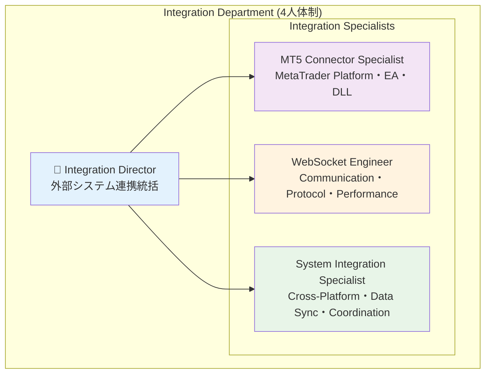
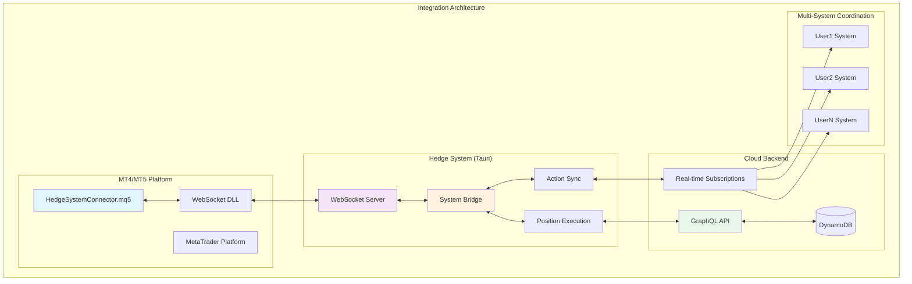
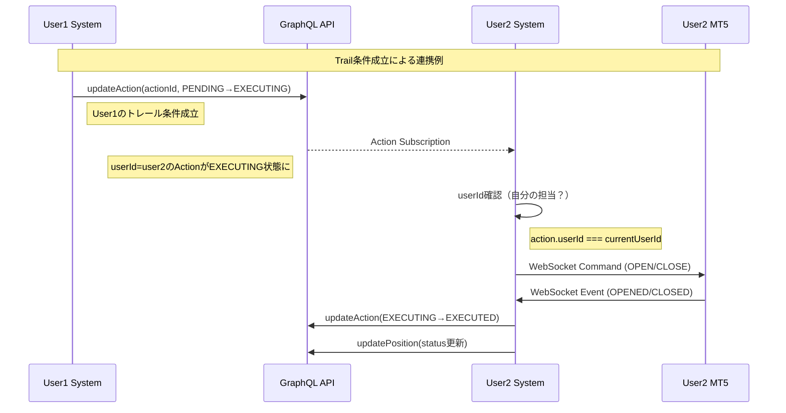

# Integration Department Complete Architecture Documentation

## 1. Department Overview & Organization

### 1.1 Integration Department Structure



### 1.2 技術責任分担

| 役割 | 技術領域 | 主要責任 | パフォーマンス目標 |
|------|----------|----------|-------------------|
| **Integration Director** | システム全体連携 | 外部システム統括・アーキテクチャ設計・部門間連携・品質管理 | システム全体調整 |
| **MT5 Connector Specialist** | MT5・EA・MQL5・C++DLL | MT5連携・注文実行・ポジション監視・WebSocket DLL | 執行遅延 <500ms |
| **WebSocket Engineer** | WebSocket・通信プロトコル | リアルタイム通信・メッセージ処理・プロトコル設計・パフォーマンス | 通信遅延 <20ms |
| **System Integration Specialist** | Cross-Platform連携 | システム間連携・データ同期・多システム協調・障害対応 | 同期遅延 <200ms |

### 1.3 Integration技術スタック

```typescript
interface IntegrationTechStack {
  // MT5 Platform Integration
  mt5Platform: {
    language: 'MQL5';
    dllFramework: 'C++17 + websocketpp';
    platform: 'MetaTrader 5';
    connector: 'HedgeSystemConnector.mq5';
    communication: 'WebSocket DLL';
  };
  
  // Communication Layer
  communication: {
    protocol: 'WebSocket + JSON';
    security: 'TLS/SSL + JWT';
    server: 'TypeScript + Tauri';
    client: 'C++ WebSocket DLL';
    compression: 'Optional Message Compression';
  };
  
  // System Bridge
  systemBridge: {
    language: 'TypeScript';
    framework: 'Tauri v2';
    coordination: 'Multi-System Management';
    stateSync: 'Real-time Synchronization';
  };
  
  // Performance & Monitoring
  monitoring: {
    latencyTracking: 'Performance Monitor';
    errorHandling: 'Multi-layer Error Recovery';
    healthCheck: 'Continuous Health Monitoring';
    analytics: 'Integration Analytics Service';
  };
}
```

## 2. Integration Architecture Overview

### 2.1 System Architecture



### 2.2 Technology Components

| コンポーネント | 技術 | バージョン | 役割 |
|---|---|---|---|
| **MT5 EA** | MQL5 | MT5 Compatible | 取引実行・ポジション管理 |
| **WebSocket DLL** | C++17 + websocketpp | v1.0.0 | 高性能通信ライブラリ |
| **WebSocket Server** | TypeScript + Tauri | Tauri v2 | 通信ハブ・メッセージ処理 |
| **System Bridge** | TypeScript | - | 複数システム間連携 |
| **Communication** | WebSocket + JSON | - | リアルタイム双方向通信 |
| **Security** | TLS/SSL + JWT | - | 暗号化・認証 |

## 3. MT5 EA Integration Design

### 3.1 HedgeSystemConnector.mq5 Architecture

```mermaid
graph TB
    subgraph "MT5 EA Architecture"
        OnInit[OnInit()]
        OnDeinit[OnDeinit()]
        OnTick[OnTick()]
        OnTimer[OnTimer()]
        
        subgraph "Core Functions"
            WSManager[WebSocket Manager]
            OrderManager[Order Manager]
            PositionMonitor[Position Monitor]
            AccountMonitor[Account Monitor]
            EventHandler[Event Handler]
        end
        
        subgraph "MT5 APIs"
            OrderSend[OrderSend()]
            OrderClose[OrderClose()]
            AccountInfo[AccountInfo()]
            PositionsTotal[PositionsTotal()]
        end
    end
    
    OnInit --> WSManager
    OnTick --> PositionMonitor
    OnTimer --> AccountMonitor
    WSManager --> EventHandler
    OrderManager --> OrderSend
    OrderManager --> OrderClose
    PositionMonitor --> PositionsTotal
    AccountMonitor --> AccountInfo
    
    style WSManager fill:#e1f5fe
    style OrderManager fill:#f3e5f5
    style PositionMonitor fill:#fff3e0
```

### 3.2 EA Core Functions Implementation

#### 3.2.1 WebSocket Connection Management
```mql5
// WebSocket接続管理クラス
class CWebSocketManager {
private:
    string m_url;
    string m_token;
    string m_accountId;
    bool m_connected;
    datetime m_lastHeartbeat;
    
public:
    bool Connect(string url, string token);
    void Disconnect();
    bool SendMessage(string message);
    string ReceiveMessage();
    bool IsConnected();
    void HandleReconnection();
};

// 初期化処理
int OnInit() {
    // アカウントID生成
    string accountId = AccountInfoString(ACCOUNT_NAME) + "_" + 
                      IntegerToString(AccountInfoInteger(ACCOUNT_LOGIN));
    
    // WebSocket接続
    if (!wsManager.Connect("ws://localhost:8080", "auth-token")) {
        Print("WebSocket connection failed");
        return INIT_FAILED;
    }
    
    // タイマー設定（5秒間隔）
    EventSetTimer(5);
    return INIT_SUCCEEDED;
}
```

#### 3.2.2 Order Execution System
```mql5
// Position実行システム
class CPositionExecutor {
private:
    struct PositionRequest {
        string positionId;
        string actionId;
        string symbol;
        ENUM_ORDER_TYPE orderType;
        double volume;
        double price;
        double sl;
        double tp;
    };
    
public:
    bool ExecutePosition(PositionRequest& request);
    bool ClosePosition(string positionId, string actionId);
    void UpdatePositionStatus(string positionId, string status);
};

// 注文実行
bool CPositionExecutor::ExecutePosition(PositionRequest& request) {
    MqlTradeRequest tradeRequest = {};
    MqlTradeResult result = {};
    
    // 注文パラメータ設定
    tradeRequest.action = TRADE_ACTION_DEAL;
    tradeRequest.symbol = request.symbol;
    tradeRequest.volume = request.volume;
    tradeRequest.type = request.orderType;
    tradeRequest.price = SymbolInfoDouble(request.symbol, SYMBOL_ASK);
    tradeRequest.deviation = 10;
    tradeRequest.magic = 12345;
    tradeRequest.comment = "HedgeSystem_" + request.positionId;
    
    // 注文送信
    if (OrderSend(tradeRequest, result)) {
        // 成功通知
        SendPositionUpdate(request.positionId, "OPENED", result.order, result.price);
        return true;
    } else {
        // 失敗通知
        SendPositionUpdate(request.positionId, "FAILED", 0, 0);
        return false;
    }
}
```

#### 3.2.3 Real-time Monitoring System
```mql5
// ポジション監視システム
class CPositionMonitor {
private:
    struct PositionInfo {
        ulong ticket;
        string positionId;
        string symbol;
        double volume;
        double openPrice;
        double currentPrice;
        double profit;
        datetime openTime;
    };
    
    PositionInfo m_positions[];
    
public:
    void UpdatePositions();
    void CheckTrailConditions();
    void SendPositionUpdates();
};

// OnTimer()での定期実行
void OnTimer() {
    // ポジション更新（5秒間隔）
    positionMonitor.UpdatePositions();
    
    // アカウント情報更新（10秒間隔）
    static int accountUpdateCounter = 0;
    if (++accountUpdateCounter >= 2) {
        accountMonitor.SendAccountUpdate();
        accountUpdateCounter = 0;
    }
    
    // WebSocket接続確認
    if (!wsManager.IsConnected()) {
        wsManager.HandleReconnection();
    }
}
```

### 3.3 EA Message Processing

#### 3.3.1 Command Reception Processing
```mql5
// コマンド処理システム
void ProcessReceivedMessage(string message) {
    // JSON解析（簡易実装）
    if (StringFind(message, "\"type\":\"OPEN\"") != -1) {
        ProcessOpenCommand(message);
    }
    else if (StringFind(message, "\"type\":\"CLOSE\"") != -1) {
        ProcessCloseCommand(message);
    }
    else if (StringFind(message, "\"type\":\"HEARTBEAT\"") != -1) {
        ProcessHeartbeat(message);
    }
}

// OPEN コマンド処理
void ProcessOpenCommand(string message) {
    // メッセージから情報抽出
    string positionId = ExtractJsonValue(message, "positionId");
    string symbol = ExtractJsonValue(message, "symbol");
    string side = ExtractJsonValue(message, "side");
    double volume = StringToDouble(ExtractJsonValue(message, "volume"));
    
    // 注文タイプ決定
    ENUM_ORDER_TYPE orderType = (side == "BUY") ? ORDER_TYPE_BUY : ORDER_TYPE_SELL;
    
    // 注文実行
    PositionRequest request;
    request.positionId = positionId;
    request.symbol = symbol;
    request.orderType = orderType;
    request.volume = volume;
    
    positionExecutor.ExecutePosition(request);
}
```

#### 3.3.2 Event Transmission Processing
```mql5
// イベント送信システム
void SendPositionUpdate(string positionId, string status, ulong mtTicket, double price) {
    string message = StringFormat(
        "{"
        "\"type\":\"POSITION_UPDATE\","
        "\"timestamp\":\"%s\","
        "\"accountId\":\"%s\","
        "\"positionId\":\"%s\","
        "\"status\":\"%s\","
        "\"mtTicket\":\"%I64u\","
        "\"price\":%.5f"
        "}",
        TimeToString(TimeCurrent(), TIME_DATE|TIME_SECONDS),
        accountId,
        positionId,
        status,
        mtTicket,
        price
    );
    
    wsManager.SendMessage(message);
}

// アカウント情報送信
void SendAccountUpdate() {
    string message = StringFormat(
        "{"
        "\"type\":\"ACCOUNT_UPDATE\","
        "\"timestamp\":\"%s\","
        "\"accountId\":\"%s\","
        "\"balance\":%.2f,"
        "\"credit\":%.2f,"
        "\"equity\":%.2f,"
        "\"margin\":%.2f"
        "}",
        TimeToString(TimeCurrent(), TIME_DATE|TIME_SECONDS),
        accountId,
        AccountInfoDouble(ACCOUNT_BALANCE),
        AccountInfoDouble(ACCOUNT_CREDIT),
        AccountInfoDouble(ACCOUNT_EQUITY),
        AccountInfoDouble(ACCOUNT_MARGIN)
    );
    
    wsManager.SendMessage(message);
}
```

## 4. WebSocket DLL Design

### 4.1 C++ DLL Architecture

```mermaid
graph TB
    subgraph "WebSocket DLL Architecture"
        subgraph "Public Interface"
            ConnectAPI[WSConnect()]
            SendAPI[WSSendMessage()]
            ReceiveAPI[WSReceiveMessage()]
            StatusAPI[WSIsConnected()]
        end
        
        subgraph "Core Implementation"
            Client[WebSocket Client]
            MessageQueue[Message Queue]
            ThreadPool[Thread Pool]
            ErrorHandler[Error Handler]
        end
        
        subgraph "Dependencies"
            WebSocketPP[websocketpp]
            OpenSSL[OpenSSL]
            BoostAsio[Boost.Asio]
        end
    end
    
    ConnectAPI --> Client
    SendAPI --> MessageQueue
    ReceiveAPI --> MessageQueue
    StatusAPI --> Client
    Client --> WebSocketPP
    Client --> OpenSSL
    ThreadPool --> BoostAsio
    
    style Client fill:#e1f5fe
    style MessageQueue fill:#f3e5f5
    style ThreadPool fill:#fff3e0
```

### 4.2 DLL Implementation Details

#### 4.2.1 Public API Design
```cpp
// HedgeSystemWebSocket.h
#pragma once

#ifdef HEDGESYSTEMWEBSOCKET_EXPORTS
#define HEDGESYSTEMWEBSOCKET_API __declspec(dllexport)
#else
#define HEDGESYSTEMWEBSOCKET_API __declspec(dllimport)
#endif

extern "C" {
    // 接続管理
    HEDGESYSTEMWEBSOCKET_API bool WSConnect(const char* url, const char* token);
    HEDGESYSTEMWEBSOCKET_API void WSDisconnect();
    HEDGESYSTEMWEBSOCKET_API bool WSIsConnected();
    
    // メッセージ送受信
    HEDGESYSTEMWEBSOCKET_API bool WSSendMessage(const char* message);
    HEDGESYSTEMWEBSOCKET_API const char* WSReceiveMessage();
    
    // エラーハンドリング
    HEDGESYSTEMWEBSOCKET_API const char* WSGetLastError();
    
    // 統計情報
    HEDGESYSTEMWEBSOCKET_API int WSGetConnectionCount();
    HEDGESYSTEMWEBSOCKET_API double WSGetLatency();
}
```

#### 4.2.2 WebSocket Client Implementation
```cpp
// HedgeSystemWebSocket.cpp
#include <websocketpp/config/asio_client.hpp>
#include <websocketpp/client.hpp>
#include <queue>
#include <mutex>
#include <thread>

class WebSocketClient {
private:
    typedef websocketpp::client<websocketpp::config::asio_tls_client> client;
    typedef websocketpp::lib::shared_ptr<websocketpp::lib::asio::ssl::context> context_ptr;
    
    client m_client;
    websocketpp::connection_hdl m_hdl;
    std::queue<std::string> m_message_queue;
    std::mutex m_queue_mutex;
    std::thread m_thread;
    bool m_connected;
    std::string m_last_error;
    
public:
    WebSocketClient();
    ~WebSocketClient();
    
    bool connect(const std::string& uri, const std::string& token);
    void disconnect();
    bool send_message(const std::string& message);
    std::string receive_message();
    bool is_connected() const;
    std::string get_last_error() const;
    
private:
    void on_message(websocketpp::connection_hdl hdl, client::message_ptr msg);
    void on_open(websocketpp::connection_hdl hdl);
    void on_close(websocketpp::connection_hdl hdl);
    void on_fail(websocketpp::connection_hdl hdl);
    context_ptr on_tls_init();
};

// 接続実装
bool WebSocketClient::connect(const std::string& uri, const std::string& token) {
    try {
        m_client.clear_access_channels(websocketpp::log::alevel::all);
        m_client.clear_error_channels(websocketpp::log::elevel::all);
        
        m_client.init_asio();
        m_client.set_tls_init_handler([this](websocketpp::connection_hdl) {
            return on_tls_init();
        });
        
        // イベントハンドラー設定
        m_client.set_message_handler([this](websocketpp::connection_hdl hdl, client::message_ptr msg) {
            on_message(hdl, msg);
        });
        
        m_client.set_open_handler([this](websocketpp::connection_hdl hdl) {
            on_open(hdl);
        });
        
        m_client.set_close_handler([this](websocketpp::connection_hdl hdl) {
            on_close(hdl);
        });
        
        m_client.set_fail_handler([this](websocketpp::connection_hdl hdl) {
            on_fail(hdl);
        });
        
        // 接続作成
        websocketpp::lib::error_code ec;
        auto con = m_client.get_connection(uri, ec);
        if (ec) {
            m_last_error = ec.message();
            return false;
        }
        
        // 認証ヘッダー追加
        con->append_header("Authorization", "Bearer " + token);
        
        m_hdl = con->get_handle();
        m_client.connect(con);
        
        // 非同期実行開始
        m_thread = std::thread([this]() {
            m_client.run();
        });
        
        // 接続完了待機（最大5秒）
        auto start = std::chrono::steady_clock::now();
        while (!m_connected && 
               std::chrono::steady_clock::now() - start < std::chrono::seconds(5)) {
            std::this_thread::sleep_for(std::chrono::milliseconds(100));
        }
        
        return m_connected;
    }
    catch (const std::exception& e) {
        m_last_error = e.what();
        return false;
    }
}
```

#### 4.2.3 Message Queue Implementation
```cpp
// メッセージ受信処理
void WebSocketClient::on_message(websocketpp::connection_hdl hdl, client::message_ptr msg) {
    std::lock_guard<std::mutex> lock(m_queue_mutex);
    m_message_queue.push(msg->get_payload());
}

// メッセージ取得（ノンブロッキング）
std::string WebSocketClient::receive_message() {
    std::lock_guard<std::mutex> lock(m_queue_mutex);
    if (m_message_queue.empty()) {
        return "";
    }
    
    std::string message = m_message_queue.front();
    m_message_queue.pop();
    return message;
}

// メッセージ送信
bool WebSocketClient::send_message(const std::string& message) {
    if (!m_connected) {
        m_last_error = "Not connected";
        return false;
    }
    
    try {
        websocketpp::lib::error_code ec;
        m_client.send(m_hdl, message, websocketpp::frame::opcode::text, ec);
        if (ec) {
            m_last_error = ec.message();
            return false;
        }
        return true;
    }
    catch (const std::exception& e) {
        m_last_error = e.what();
        return false;
    }
}
```

## 5. System Bridge Design

### 5.1 TypeScript Integration System

```typescript
// apps/hedge-system/lib/websocket-server.ts
interface WebSocketServerConfig {
  port: number;
  host: string;
  authToken: string;
  maxConnections: number;
  heartbeatInterval: number;
  messageTimeout: number;
}

class HedgeSystemWebSocketServer {
  private server: WebSocket.Server;
  private connections: Map<string, WebSocketConnection>;
  private messageHandlers: Map<string, MessageHandler>;
  private config: WebSocketServerConfig;
  
  constructor(config: WebSocketServerConfig) {
    this.config = config;
    this.connections = new Map();
    this.messageHandlers = new Map();
    this.setupMessageHandlers();
  }
  
  // メッセージハンドラー設定
  private setupMessageHandlers(): void {
    this.messageHandlers.set('POSITION_UPDATE', this.handlePositionUpdate.bind(this));
    this.messageHandlers.set('ACCOUNT_UPDATE', this.handleAccountUpdate.bind(this));
    this.messageHandlers.set('HEARTBEAT', this.handleHeartbeat.bind(this));
    this.messageHandlers.set('ERROR', this.handleError.bind(this));
  }
  
  // Position更新処理
  private async handlePositionUpdate(message: PositionUpdateMessage): Promise<void> {
    try {
      // DynamoDB更新
      await amplifyClient.models?.Position?.update({
        id: message.positionId,
        status: message.status as PositionStatus,
        mtTicket: message.mtTicket?.toString(),
        entryPrice: message.price,
        entryTime: message.timestamp,
        updatedAt: new Date().toISOString()
      });
      
      // Action更新（該当する場合）
      if (message.actionId) {
        await amplifyClient.models?.Action?.update({
          id: message.actionId,
          status: message.status === 'OPENED' ? 'EXECUTED' : 'FAILED',
          updatedAt: new Date().toISOString()
        });
      }
      
      console.log(`Position ${message.positionId} updated to ${message.status}`);
    } catch (error) {
      console.error('Failed to update position:', error);
    }
  }
  
  // Account情報更新処理
  private async handleAccountUpdate(message: AccountUpdateMessage): Promise<void> {
    try {
      await amplifyClient.models?.Account?.update({
        id: message.accountId,
        balance: message.balance,
        credit: message.credit,
        equity: message.equity,
        lastUpdated: message.timestamp,
        updatedAt: new Date().toISOString()
      });
      
      console.log(`Account ${message.accountId} updated`);
    } catch (error) {
      console.error('Failed to update account:', error);
    }
  }
}
```

### 5.2 Multi-System Coordination

```typescript
// 複数システム間連携
class SystemBridge {
  private subscriptions: Map<string, GraphQLSubscription>;
  private userValidation: UserValidationService;
  
  constructor() {
    this.subscriptions = new Map();
    this.userValidation = new UserValidationService();
    this.setupSubscriptions();
  }
  
  // GraphQL Subscription設定
  private setupSubscriptions(): void {
    // Action実行監視
    const actionSubscription = amplifyClient.graphql({
      query: subscriptions.onUpdateAction,
      variables: { 
        filter: { 
          userId: { eq: this.getCurrentUserId() },
          status: { eq: 'EXECUTING' }
        }
      }
    }).subscribe({
      next: (event) => this.handleActionUpdate(event.data.onUpdateAction),
      error: (error) => console.error('Action subscription error:', error)
    });
    
    this.subscriptions.set('actions', actionSubscription);
    
    // Position監視
    const positionSubscription = amplifyClient.graphql({
      query: subscriptions.onUpdatePosition,
      variables: {
        filter: {
          userId: { eq: this.getCurrentUserId() }
        }
      }
    }).subscribe({
      next: (event) => this.handlePositionUpdate(event.data.onUpdatePosition),
      error: (error) => console.error('Position subscription error:', error)
    });
    
    this.subscriptions.set('positions', positionSubscription);
  }
  
  // Action更新処理（userIdベース担当判定）
  private async handleActionUpdate(action: Action): Promise<void> {
    // 担当判定
    if (!this.userValidation.isMyResponsibility(action.userId)) {
      console.log(`Action ${action.id} is not my responsibility (userId: ${action.userId})`);
      return;
    }
    
    // 実行状態確認
    if (action.status !== 'EXECUTING') {
      return;
    }
    
    console.log(`Executing action ${action.id} for user ${action.userId}`);
    
    try {
      // MT5に実行コマンド送信
      const command = this.buildExecutionCommand(action);
      await this.sendToMT5(action.accountId, command);
      
      console.log(`Action ${action.id} sent to MT5`);
    } catch (error) {
      console.error(`Failed to execute action ${action.id}:`, error);
      
      // エラー時はFAILED状態に更新
      await amplifyClient.models?.Action?.update({
        id: action.id,
        status: 'FAILED',
        updatedAt: new Date().toISOString()
      });
    }
  }
  
  // 実行コマンド構築
  private buildExecutionCommand(action: Action): MT5Command {
    return {
      type: action.type, // 'ENTRY' or 'CLOSE'
      timestamp: new Date().toISOString(),
      accountId: action.accountId,
      positionId: action.positionId,
      actionId: action.id,
      // 追加パラメータ（Positionから取得）
      symbol: action.position?.symbol,
      volume: action.position?.volume,
      side: action.type === 'ENTRY' ? 'BUY' : 'CLOSE' // 簡略化
    };
  }
}
```

## 6. Communication Protocol Design

### 6.1 Message Format Specifications

#### 6.1.1 Hedge System → MT5 (Commands)
```typescript
// 基本コマンド構造
interface BaseCommand {
  type: string;
  timestamp: string;
  accountId: string;
  positionId: string;
  actionId?: string;
}

// OPEN コマンド
interface OpenCommand extends BaseCommand {
  type: 'OPEN';
  symbol: string;
  side: 'BUY' | 'SELL';
  volume: number;
  metadata: {
    executionType: 'ENTRY' | 'EXIT';
    userId: string;
  };
}

// CLOSE コマンド
interface CloseCommand extends BaseCommand {
  type: 'CLOSE';
  mtTicket?: string;
  metadata: {
    exitReason: string;
    userId: string;
  };
}

// HEARTBEAT コマンド
interface HeartbeatCommand {
  type: 'HEARTBEAT';
  timestamp: string;
  accountId: string;
}
```

#### 6.1.2 MT5 → Hedge System (Events)
```typescript
// 基本イベント構造
interface BaseEvent {
  type: string;
  timestamp: string;
  accountId: string;
  positionId?: string;
  actionId?: string;
}

// OPENED イベント
interface OpenedEvent extends BaseEvent {
  type: 'OPENED';
  positionId: string;
  mtTicket: string;
  price: number;
  status: 'SUCCESS' | 'FAILED';
  errorMessage?: string;
}

// CLOSED イベント
interface ClosedEvent extends BaseEvent {
  type: 'CLOSED';
  positionId: string;
  mtTicket: string;
  price: number;
  profit: number;
  status: 'SUCCESS' | 'FAILED';
}

// ACCOUNT_UPDATE イベント
interface AccountUpdateEvent extends BaseEvent {
  type: 'ACCOUNT_UPDATE';
  balance: number;
  credit: number;
  equity: number;
  margin: number;
  freeMargin: number;
}

// POSITION_UPDATE イベント
interface PositionUpdateEvent extends BaseEvent {
  type: 'POSITION_UPDATE';
  positions: {
    mtTicket: string;
    symbol: string;
    volume: number;
    openPrice: number;
    currentPrice: number;
    profit: number;
    openTime: string;
  }[];
}
```

### 6.2 Protocol Implementation

#### 6.2.1 Message Serialization
```typescript
class MessageSerializer {
  // コマンドシリアライゼーション
  static serializeCommand(command: BaseCommand): string {
    return JSON.stringify({
      ...command,
      version: '1.0',
      checksum: this.calculateChecksum(command)
    });
  }
  
  // イベントデシリアライゼーション
  static deserializeEvent(message: string): BaseEvent {
    try {
      const parsed = JSON.parse(message);
      
      // バージョンチェック
      if (parsed.version !== '1.0') {
        throw new Error(`Unsupported protocol version: ${parsed.version}`);
      }
      
      // チェックサム検証
      if (!this.verifyChecksum(parsed)) {
        throw new Error('Checksum verification failed');
      }
      
      return parsed as BaseEvent;
    } catch (error) {
      throw new Error(`Failed to deserialize message: ${error.message}`);
    }
  }
  
  // チェックサム計算
  private static calculateChecksum(data: any): string {
    const content = JSON.stringify(data);
    return btoa(content).substring(0, 8); // 簡易チェックサム
  }
  
  // チェックサム検証
  private static verifyChecksum(data: any): boolean {
    const { checksum, ...content } = data;
    return checksum === this.calculateChecksum(content);
  }
}
```

## 7. Department Integration Interface

### 7.1 Integration Department Data Flow Responsibilities

```typescript
// Integration部門: 外部システム連携・通信管理
interface IntegrationResponsibilities {
  mt5Integration: {
    connectToMT5: (accountId: string) => Promise<boolean>;
    executeOrder: (order: OrderRequest) => Promise<OrderResult>;
    getPriceUpdates: () => Observable<PriceUpdate>;
    closePosition: (ticket: string) => Promise<boolean>;
  };
  
  websocketServer: {
    startServer: (port: number) => Promise<void>;
    broadcastMessage: (message: WebSocketMessage) => void;
    handleClientConnection: (clientId: string) => void;
  };
  
  protocolManagement: {
    validateMessage: (message: WebSocketMessage) => boolean;
    transformData: (data: any, format: string) => any;
    handleError: (error: StandardError) => void;
  };
}
```

### 7.2 Multi-System Coordination Design



### 7.3 Responsibility Determination Logic

```typescript
// ユーザー検証サービス
class UserValidationService {
  private currentUserId: string;
  
  constructor() {
    this.currentUserId = this.getCurrentUserId();
  }
  
  // 担当判定
  isMyResponsibility(resourceUserId: string): boolean {
    return resourceUserId === this.currentUserId;
  }
  
  // 現在のユーザーID取得
  private getCurrentUserId(): string {
    // JWT トークンからuserId取得
    const session = Auth.currentSession();
    const token = session.getIdToken();
    const payload = token.getPayload();
    return payload.sub;
  }
  
  // Action担当判定
  async validateActionExecution(actionId: string): Promise<boolean> {
    try {
      const action = await amplifyClient.models?.Action?.get({ id: actionId });
      if (!action) {
        console.error(`Action ${actionId} not found`);
        return false;
      }
      
      // userIdベース担当判定
      if (!this.isMyResponsibility(action.userId)) {
        console.log(`Action ${actionId} belongs to user ${action.userId}, not current user ${this.currentUserId}`);
        return false;
      }
      
      // 状態確認
      if (action.status !== 'EXECUTING') {
        console.log(`Action ${actionId} is not in EXECUTING state: ${action.status}`);
        return false;
      }
      
      return true;
    } catch (error) {
      console.error(`Failed to validate action ${actionId}:`, error);
      return false;
    }
  }
}
```

### 7.4 Unified WebSocket Protocol

```typescript
// Integration部門: MT5 Command Protocol
interface IntegrationMessage extends WebSocketMessage {
  data: {
    command: MT5Command;
    accountId: string;
    parameters: MT5Parameters;
  };
}

// 統一メッセージフォーマット
interface WebSocketMessage {
  id: string;
  type: MessageType;
  source: DepartmentType;
  target?: DepartmentType;
  timestamp: string;
  data: any;
  metadata?: MessageMetadata;
}

enum MessageType {
  // Position関連
  POSITION_CREATE = 'POSITION_CREATE',
  POSITION_UPDATE = 'POSITION_UPDATE',
  POSITION_DELETE = 'POSITION_DELETE',
  
  // Action関連
  ACTION_EXECUTE = 'ACTION_EXECUTE',
  ACTION_STATUS = 'ACTION_STATUS',
  ACTION_COMPLETE = 'ACTION_COMPLETE',
  
  // Account関連
  ACCOUNT_UPDATE = 'ACCOUNT_UPDATE',
  PRICE_UPDATE = 'PRICE_UPDATE',
  
  // System関連
  SYSTEM_STATUS = 'SYSTEM_STATUS',
  ERROR = 'ERROR',
  HEARTBEAT = 'HEARTBEAT'
}

enum DepartmentType {
  BACKEND = 'backend',
  FRONTEND = 'frontend',
  INTEGRATION = 'integration',
  PTA = 'pta',
  QUALITY = 'quality'
}
```

## 8. Error Handling & Recovery

### 8.1 Multi-layer Error Handling

```typescript
// エラー分類
enum ErrorType {
  CONNECTION_ERROR = 'CONNECTION_ERROR',
  AUTHENTICATION_ERROR = 'AUTHENTICATION_ERROR',
  MESSAGE_FORMAT_ERROR = 'MESSAGE_FORMAT_ERROR',
  EXECUTION_ERROR = 'EXECUTION_ERROR',
  TIMEOUT_ERROR = 'TIMEOUT_ERROR',
  SYSTEM_ERROR = 'SYSTEM_ERROR'
}

// エラーハンドラー
class IntegrationErrorHandler {
  private retryPolicy: RetryPolicy;
  private fallbackManager: FallbackManager;
  
  constructor() {
    this.retryPolicy = new RetryPolicy({
      maxRetries: 3,
      baseDelay: 1000,
      maxDelay: 10000,
      backoffMultiplier: 2
    });
    this.fallbackManager = new FallbackManager();
  }
  
  // エラー処理
  async handleError(error: IntegrationError): Promise<ErrorHandlingResult> {
    console.error(`Integration error: ${error.type} - ${error.message}`);
    
    switch (error.type) {
      case ErrorType.CONNECTION_ERROR:
        return await this.handleConnectionError(error);
        
      case ErrorType.EXECUTION_ERROR:
        return await this.handleExecutionError(error);
        
      case ErrorType.TIMEOUT_ERROR:
        return await this.handleTimeoutError(error);
        
      default:
        return await this.handleGenericError(error);
    }
  }
  
  // 接続エラー処理
  private async handleConnectionError(error: IntegrationError): Promise<ErrorHandlingResult> {
    // 自動再接続試行
    const retryResult = await this.retryPolicy.execute(async () => {
      return await this.reconnectToMT5(error.accountId);
    });
    
    if (retryResult.success) {
      return { success: true, action: 'RECONNECTED' };
    }
    
    // フォールバック：手動操作モード
    await this.fallbackManager.enableManualMode(error.accountId);
    return { success: false, action: 'FALLBACK_TO_MANUAL' };
  }
  
  // 実行エラー処理
  private async handleExecutionError(error: IntegrationError): Promise<ErrorHandlingResult> {
    // Action状態をFAILEDに更新
    if (error.actionId) {
      await amplifyClient.models?.Action?.update({
        id: error.actionId,
        status: 'FAILED',
        updatedAt: new Date().toISOString()
      });
    }
    
    // Position状態をCANCELEDに更新
    if (error.positionId) {
      await amplifyClient.models?.Position?.update({
        id: error.positionId,
        status: 'CANCELED',
        exitReason: `Execution failed: ${error.message}`,
        updatedAt: new Date().toISOString()
      });
    }
    
    return { success: false, action: 'STATUS_UPDATED' };
  }
}
```

### 8.2 Recovery Mechanisms

```typescript
// 自動回復システム
class RecoveryManager {
  private healthChecker: HealthChecker;
  private stateRecovery: StateRecoveryService;
  
  constructor() {
    this.healthChecker = new HealthChecker();
    this.stateRecovery = new StateRecoveryService();
    this.startHealthMonitoring();
  }
  
  // ヘルスモニタリング開始
  private startHealthMonitoring(): void {
    setInterval(async () => {
      const health = await this.healthChecker.checkSystemHealth();
      
      if (!health.overall) {
        console.warn('System health degraded, initiating recovery');
        await this.initiateRecovery(health);
      }
    }, 30000); // 30秒間隔
  }
  
  // 回復処理
  private async initiateRecovery(health: HealthStatus): Promise<void> {
    // WebSocket接続回復
    if (!health.websocketConnection) {
      await this.recoverWebSocketConnection();
    }
    
    // GraphQL接続回復
    if (!health.graphqlConnection) {
      await this.recoverGraphQLConnection();
    }
    
    // 状態同期回復
    if (!health.stateSync) {
      await this.stateRecovery.resyncState();
    }
    
    // タイムアウトしたPosition/Action回復
    if (!health.timeoutHandling) {
      await this.stateRecovery.cleanupTimeouts();
    }
  }
  
  // 状態同期回復
  async resyncState(): Promise<void> {
    console.log('Starting state resynchronization');
    
    try {
      // 現在のuserId取得
      const userId = await this.getCurrentUserId();
      
      // 未完了のPosition取得
      const incompletePositions = await amplifyClient.models?.Position?.list({
        filter: {
          userId: { eq: userId },
          status: { 
            in: ['PENDING', 'OPENING', 'CLOSING'] 
          }
        }
      });
      
      // 未完了のAction取得
      const incompleteActions = await amplifyClient.models?.Action?.list({
        filter: {
          userId: { eq: userId },
          status: { 
            in: ['PENDING', 'EXECUTING'] 
          }
        }
      });
      
      // タイムアウト検知・クリーンアップ
      await this.cleanupTimedOutOperations(incompletePositions?.data || []);
      await this.cleanupTimedOutOperations(incompleteActions?.data || []);
      
      console.log('State resynchronization completed');
    } catch (error) {
      console.error('Failed to resync state:', error);
    }
  }
}
```

## 9. Performance Optimization

### 9.1 Communication Optimization

```typescript
// パフォーマンス監視
class PerformanceMonitor {
  private metrics: Map<string, PerformanceMetric>;
  private alertThresholds: AlertThresholds;
  
  constructor() {
    this.metrics = new Map();
    this.alertThresholds = {
      websocketLatency: 10, // ms
      mt5ResponseTime: 50, // ms
      messageQueueSize: 100,
      connectionDropRate: 0.01 // 1%
    };
    this.startMonitoring();
  }
  
  // レイテンシー測定
  async measureLatency(operation: string, fn: () => Promise<void>): Promise<number> {
    const start = performance.now();
    await fn();
    const end = performance.now();
    const latency = end - start;
    
    this.recordMetric(operation, latency);
    
    // アラート確認
    if (this.shouldAlert(operation, latency)) {
      await this.sendAlert(operation, latency);
    }
    
    return latency;
  }
  
  // メトリクス記録
  private recordMetric(operation: string, value: number): void {
    const metric = this.metrics.get(operation) || {
      name: operation,
      values: [],
      average: 0,
      min: Infinity,
      max: 0,
      count: 0
    };
    
    metric.values.push(value);
    metric.count++;
    metric.min = Math.min(metric.min, value);
    metric.max = Math.max(metric.max, value);
    metric.average = metric.values.reduce((a, b) => a + b, 0) / metric.count;
    
    // 古いデータ削除（最新1000件まで）
    if (metric.values.length > 1000) {
      metric.values.shift();
    }
    
    this.metrics.set(operation, metric);
  }
}
```

### 9.2 Connection Pool Optimization

```typescript
// 接続プール管理
class ConnectionPoolManager {
  private pools: Map<string, ConnectionPool>;
  private config: PoolConfig;
  
  constructor(config: PoolConfig) {
    this.pools = new Map();
    this.config = config;
  }
  
  // 接続プール取得・作成
  getPool(accountId: string): ConnectionPool {
    if (!this.pools.has(accountId)) {
      const pool = new ConnectionPool({
        accountId,
        maxConnections: this.config.maxConnectionsPerAccount,
        keepAliveInterval: this.config.keepAliveInterval,
        reconnectDelay: this.config.reconnectDelay
      });
      this.pools.set(accountId, pool);
    }
    return this.pools.get(accountId)!;
  }
  
  // プール統計情報
  getPoolStats(): PoolStats[] {
    return Array.from(this.pools.entries()).map(([accountId, pool]) => ({
      accountId,
      activeConnections: pool.getActiveConnectionCount(),
      totalConnections: pool.getTotalConnectionCount(),
      averageLatency: pool.getAverageLatency(),
      errorRate: pool.getErrorRate(),
      lastActivity: pool.getLastActivity()
    }));
  }
}
```

### 9.3 Performance Standards

```typescript
interface IntegrationPerformanceStandards {
  communication: {
    websocketLatency: '< 20ms';
    mt5ExecutionTime: '< 500ms';
    priceUpdateFrequency: '> 10Hz';
    connectionRecoveryTime: '< 3s';
  };
  
  coordination: {
    actionSyncLatency: '< 200ms';
    systemResponseTime: '< 1s';
    crossSystemLatency: '< 100ms';
    stateConsistencyDelay: '< 500ms';
  };
  
  reliability: {
    connectionUptime: '> 99.9%';
    messageDeliveryRate: '> 99.95%';
    executionSuccessRate: '> 99%';
    errorRecoveryTime: '< 30s';
  };
}
```

## 10. Security Design

### 10.1 Authentication & Encryption

```typescript
// セキュリティマネージャー
class SecurityManager {
  private tokenManager: TokenManager;
  private encryptionService: EncryptionService;
  
  constructor() {
    this.tokenManager = new TokenManager();
    this.encryptionService = new EncryptionService();
  }
  
  // WebSocket認証
  async authenticateWebSocketConnection(token: string): Promise<AuthResult> {
    try {
      // JWT検証
      const payload = await this.tokenManager.verifyToken(token);
      
      // userIdベース権限確認
      const userId = payload.sub;
      const hasPermission = await this.checkIntegrationPermission(userId);
      
      if (!hasPermission) {
        return { success: false, error: 'Insufficient permissions' };
      }
      
      return { 
        success: true, 
        userId,
        accountAccess: await this.getUserAccountAccess(userId)
      };
      
    } catch (error) {
      return { success: false, error: error.message };
    }
  }
  
  // メッセージ暗号化
  async encryptMessage(message: string, accountId: string): Promise<string> {
    const key = await this.getAccountEncryptionKey(accountId);
    return await this.encryptionService.encrypt(message, key);
  }
  
  // メッセージ復号化
  async decryptMessage(encryptedMessage: string, accountId: string): Promise<string> {
    const key = await this.getAccountEncryptionKey(accountId);
    return await this.encryptionService.decrypt(encryptedMessage, key);
  }
}
```

### 10.2 Access Control

```typescript
// アクセス制御
class AccessController {
  private permissions: Map<string, UserPermissions>;
  
  // アカウントアクセス権限確認
  async canAccessAccount(userId: string, accountId: string): Promise<boolean> {
    try {
      // アカウント所有者確認
      const account = await amplifyClient.models?.Account?.get({ id: accountId });
      if (!account) {
        return false;
      }
      
      // userIdベース所有権確認
      if (account.userId !== userId) {
        console.warn(`User ${userId} attempted to access account ${accountId} owned by ${account.userId}`);
        return false;
      }
      
      return true;
    } catch (error) {
      console.error(`Access control error for user ${userId}, account ${accountId}:`, error);
      return false;
    }
  }
  
  // Position操作権限確認
  async canExecutePosition(userId: string, positionId: string): Promise<boolean> {
    try {
      const position = await amplifyClient.models?.Position?.get({ id: positionId });
      if (!position) {
        return false;
      }
      
      // userIdベース所有権確認
      return position.userId === userId;
    } catch (error) {
      console.error(`Position execution access control error:`, error);
      return false;
    }
  }
}
```

## 11. Operations & Monitoring

### 11.1 Integrated Monitoring System

```typescript
// 統合監視
class IntegrationMonitor {
  private metrics: MetricsCollector;
  private alertManager: AlertManager;
  private dashboard: MonitoringDashboard;
  
  constructor() {
    this.metrics = new MetricsCollector();
    this.alertManager = new AlertManager();
    this.dashboard = new MonitoringDashboard();
    this.setupMonitoring();
  }
  
  // 監視設定
  private setupMonitoring(): void {
    // WebSocket監視
    this.monitorWebSocketHealth();
    
    // MT5連携監視
    this.monitorMT5Integration();
    
    // システム間連携監視
    this.monitorSystemCoordination();
    
    // パフォーマンス監視
    this.monitorPerformanceMetrics();
  }
  
  // リアルタイムダッシュボード
  generateDashboardData(): DashboardData {
    return {
      connectionStatus: this.getConnectionStatus(),
      performanceMetrics: this.getPerformanceMetrics(),
      errorRates: this.getErrorRates(),
      activeUsers: this.getActiveUsers(),
      systemHealth: this.getSystemHealth(),
      recentAlerts: this.getRecentAlerts()
    };
  }
}
```

### 11.2 Logging & Analytics

```typescript
// ログ管理
class LogManager {
  private loggers: Map<string, Logger>;
  private analyticsService: AnalyticsService;
  
  constructor() {
    this.loggers = new Map();
    this.analyticsService = new AnalyticsService();
    this.setupLoggers();
  }
  
  // 構造化ログ
  logIntegrationEvent(event: IntegrationEvent): void {
    const logger = this.getLogger(event.category);
    
    const logEntry = {
      timestamp: new Date().toISOString(),
      category: event.category,
      type: event.type,
      userId: event.userId,
      accountId: event.accountId,
      positionId: event.positionId,
      actionId: event.actionId,
      data: event.data,
      performanceMetrics: event.metrics
    };
    
    logger.info(logEntry);
    
    // 分析用データ送信
    this.analyticsService.track(logEntry);
  }
  
  // パフォーマンス分析
  analyzePerformance(timeRange: TimeRange): PerformanceAnalysis {
    const logs = this.getLogsInRange(timeRange);
    
    return {
      averageLatency: this.calculateAverageLatency(logs),
      throughput: this.calculateThroughput(logs),
      errorRate: this.calculateErrorRate(logs),
      bottlenecks: this.identifyBottlenecks(logs),
      recommendations: this.generateRecommendations(logs)
    };
  }
}
```

## 12. Testing Strategy

### 12.1 Integration Department Testing Responsibilities

```typescript
interface IntegrationTestingResponsibilities {
  unitTests: {
    scope: 'WebSocket Server, Protocol Handlers';
    coverage: '80%';
    tools: 'Jest + Mock WebSocket';
  };
  
  integrationTests: {
    scope: 'MT5 Connection, DLL Integration';
    coverage: '75%';
    tools: 'Jest + MT5 Test Environment';
  };
  
  systemTests: {
    scope: 'End-to-End Trading Flow';
    coverage: '70%';
    tools: 'Custom Integration Test Framework';
  };
}
```

### 12.2 Test Implementation Examples

```typescript
// WebSocket通信テスト
describe('WebSocket Communication', () => {
  let server: HedgeSystemWebSocketServer;
  let mockMT5Client: MockMT5Client;
  
  beforeEach(() => {
    server = new HedgeSystemWebSocketServer(testConfig);
    mockMT5Client = new MockMT5Client();
  });
  
  it('should handle position execution command', async () => {
    const command: OpenCommand = {
      type: 'OPEN',
      timestamp: new Date().toISOString(),
      accountId: 'test-account',
      positionId: 'test-position',
      symbol: 'USDJPY',
      side: 'BUY',
      volume: 1.0,
      metadata: {
        executionType: 'ENTRY',
        userId: 'test-user'
      }
    };
    
    await server.sendCommand(command);
    
    const receivedCommand = await mockMT5Client.getLastCommand();
    expect(receivedCommand.type).toBe('OPEN');
    expect(receivedCommand.symbol).toBe('USDJPY');
  });
  
  it('should handle execution result event', async () => {
    const event: OpenedEvent = {
      type: 'OPENED',
      timestamp: new Date().toISOString(),
      accountId: 'test-account',
      positionId: 'test-position',
      mtTicket: '12345',
      price: 110.50,
      status: 'SUCCESS'
    };
    
    await mockMT5Client.sendEvent(event);
    
    // DynamoDB更新確認
    const position = await amplifyClient.models?.Position?.get({
      id: 'test-position'
    });
    expect(position?.status).toBe('OPEN');
    expect(position?.mtTicket).toBe('12345');
  });
});

// システム連携テスト
describe('Multi-System Coordination', () => {
  it('should coordinate action execution between users', async () => {
    // User1がトレール条件を満たしてActionを作成
    const action = await createTestAction({
      userId: 'user2',
      type: 'ENTRY',
      status: 'PENDING'
    });
    
    // User2システムがAction実行を監視
    const user2System = new SystemBridge();
    await user2System.start();
    
    // ActionをEXECUTING状態に更新
    await amplifyClient.models?.Action?.update({
      id: action.id,
      status: 'EXECUTING'
    });
    
    // User2システムが反応してMT5にコマンド送信することを確認
    await waitFor(() => {
      expect(mockMT5Server.getLastCommand()).toBeDefined();
    });
  });
});
```

この Integration Department Complete Architecture Documentation により、MT4/MT5プラットフォームとHedge System間の高性能・高信頼性な統合が実現でき、複数ユーザー間でのPosition-Trail-Action協調動作が可能になります。特にuserIdベースの担当システム分離により、スケーラブルで安全な多システム連携が実現されます。