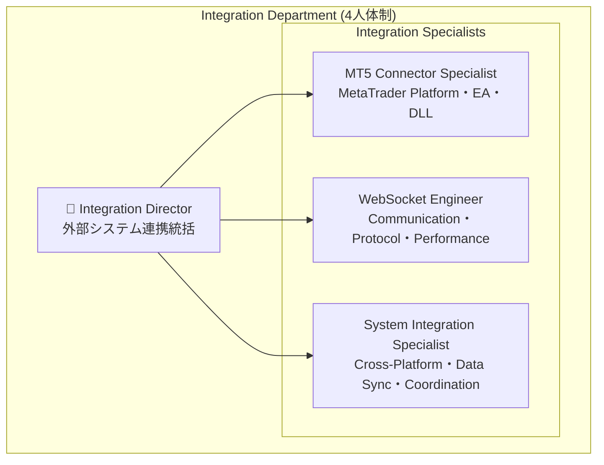
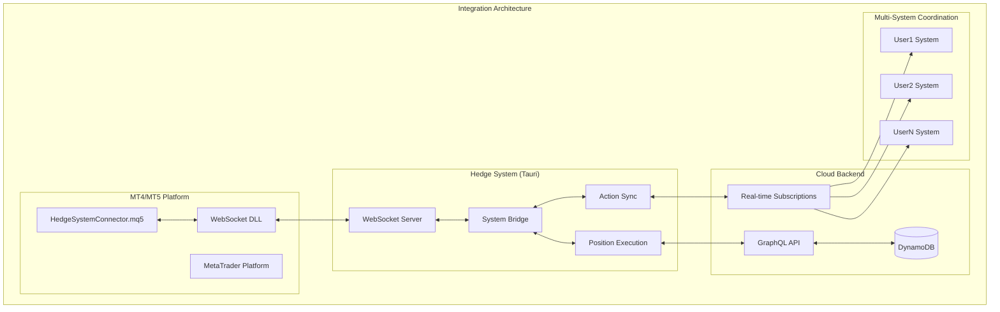

# Integration Department Complete Architecture Documentation

## 1. Department Overview & Organization

### 1.1 Integration Department Structure



### 1.2 技術責任分担

| 役割 | 技術領域 | 主要責任 | パフォーマンス目標 |
|------|----------|----------|-------------------|
| **Integration Director** | システム全体連携 | 外部システム統括・アーキテクチャ設計・部門間連携・品質管理 | システム全体調整 |
| **MT5 Connector Specialist** | MT5・EA・MQL5・C++DLL | MT5連携・注文実行・ポジション監視・WebSocket DLL | 執行遅延 <500ms |
| **WebSocket Engineer** | WebSocket・通信プロトコル | リアルタイム通信・メッセージ処理・プロトコル設計・パフォーマンス | 通信遅延 <20ms |
| **System Integration Specialist** | Cross-Platform連携 | システム間連携・データ同期・多システム協調・障害対応 | 同期遅延 <200ms |

### 1.3 Integration技術スタック

```typescript
interface IntegrationTechStack {
  mt5Platform: {
    language: 'MQL5';
    dllFramework: 'C++17 + websocketpp';
    platform: 'MetaTrader 5';
    connector: 'HedgeSystemConnector.mq5';
    communication: 'WebSocket DLL';
  };
  
  communication: {
    protocol: 'WebSocket + JSON';
    security: 'TLS/SSL + JWT';
    server: 'TypeScript + Tauri';
    client: 'C++ WebSocket DLL';
    compression: 'Optional Message Compression';
  };
  
  systemBridge: {
    language: 'TypeScript';
    framework: 'Tauri v2';
    coordination: 'Multi-System Management';
    stateSync: 'Real-time Synchronization';
  };
  
  monitoring: {
    latencyTracking: 'Performance Monitor';
    errorHandling: 'Multi-layer Error Recovery';
    healthCheck: 'Continuous Health Monitoring';
    analytics: 'Integration Analytics Service';
  };
}
```

## 2. Integration Architecture Overview

### 2.1 System Architecture



### 2.2 Technology Components

| コンポーネント | 技術 | バージョン | 役割 |
|---|---|---|---|
| **MT5 EA** | MQL5 | MT5 Compatible | 取引実行・ポジション管理 |
| **WebSocket DLL** | C++17 + websocketpp | v1.0.0 | 高性能通信ライブラリ |
| **WebSocket Server** | TypeScript + Tauri | Tauri v2 | 通信ハブ・メッセージ処理 |
| **System Bridge** | TypeScript | - | 複数システム間連携 |
| **Communication** | WebSocket + JSON | - | リアルタイム双方向通信 |
| **Security** | TLS/SSL + JWT | - | 暗号化・認証 |

## 3. MT5 EA Integration Design

### 3.1 HedgeSystemConnector.mq5 Architecture

```mql5
// Core EA Functions
class CHedgeSystemConnector {
private:
    CWebSocketManager m_wsManager;
    COrderManager m_orderManager;
    CPositionMonitor m_positionMonitor;
    CAccountMonitor m_accountMonitor;
    
public:
    // EA Lifecycle
    bool Initialize();
    void Deinitialize();
    void OnTick();
    void OnTimer();
    
    // Core Operations
    bool ConnectToSystem();
    bool ExecuteOrder(const COrderRequest& request);
    void MonitorPositions();
    void SendAccountUpdate();
};
```

### 3.2 WebSocket Connection Management

```mql5
class CWebSocketManager {
private:
    string m_url;
    string m_token;
    bool m_connected;
    datetime m_lastHeartbeat;
    
public:
    bool Connect(string url, string token);
    void Disconnect();
    bool SendMessage(string message);
    string ReceiveMessage();
    bool IsConnected() { return m_connected; }
    void SendHeartbeat();
    bool HandleReconnection();
};
```

## 4. WebSocket DLL Design

### 4.1 C++ DLL Public API

```cpp
// DLL Export Functions
extern "C" {
    __declspec(dllexport) int ConnectWebSocket(const char* url, const char* token);
    __declspec(dllexport) int SendMessage(const char* message);
    __declspec(dllexport) int ReceiveMessage(char* buffer, int bufferSize);
    __declspec(dllexport) int IsConnected();
    __declspec(dllexport) void DisconnectWebSocket();
    __declspec(dllexport) int GetLastError();
}
```

### 4.2 WebSocket Client Implementation

```cpp
class WebSocketClient {
private:
    websocketpp::client<websocketpp::config::asio_client> client;
    websocketpp::connection_hdl hdl;
    std::thread networkThread;
    std::queue<std::string> messageQueue;
    std::mutex queueMutex;
    
public:
    bool connect(const std::string& uri, const std::string& token);
    void disconnect();
    bool sendMessage(const std::string& message);
    std::string receiveMessage();
    bool isConnected() const;
};
```

## 5. Communication Protocol Design

### 5.1 Message Format Specifications

#### Commands (Hedge System → MT5)
```typescript
interface BaseCommand {
  type: string;
  timestamp: string;
  accountId: string;
  positionId: string;
  actionId?: string;
}

interface OpenCommand extends BaseCommand {
  type: 'OPEN';
  symbol: string;
  side: 'BUY' | 'SELL';
  volume: number;
  metadata: {
    executionType: 'ENTRY' | 'EXIT';
    userId: string;
  };
}

interface CloseCommand extends BaseCommand {
  type: 'CLOSE';
  mtTicket?: string;
  metadata: {
    exitReason: string;
    userId: string;
  };
}
```

#### Events (MT5 → Hedge System)
```typescript
interface BaseEvent {
  type: string;
  timestamp: string;
  accountId: string;
  positionId?: string;
  actionId?: string;
}

interface OpenedEvent extends BaseEvent {
  type: 'OPENED';
  positionId: string;
  mtTicket: string;
  price: number;
  status: 'SUCCESS' | 'FAILED';
  errorMessage?: string;
}

interface ClosedEvent extends BaseEvent {
  type: 'CLOSED';
  positionId: string;
  mtTicket: string;
  price: number;
  profit: number;
  status: 'SUCCESS' | 'FAILED';
}
```

## 6. System Bridge Design

### 6.1 TypeScript Integration System

```typescript
export class IntegrationBridge {
  private wsServer: WebSocketServer;
  private systemCoordinator: SystemCoordinator;
  private messageHandler: MessageHandler;
  
  constructor(config: IntegrationConfig) {
    this.wsServer = new WebSocketServer(config.websocket);
    this.systemCoordinator = new SystemCoordinator(config.coordination);
    this.messageHandler = new MessageHandler();
  }
  
  async initialize(): Promise<void> {
    await this.wsServer.start();
    await this.systemCoordinator.initialize();
    this.setupMessageHandlers();
  }
  
  private setupMessageHandlers(): void {
    this.wsServer.on('message', this.handleIncomingMessage.bind(this));
    this.systemCoordinator.on('action', this.handleSystemAction.bind(this));
  }
}
```

### 6.2 Multi-System Coordination

```typescript
export class SystemCoordinator {
  private systems: Map<string, SystemConnection> = new Map();
  private actionQueue: ActionQueue;
  private stateSync: StateSync;
  
  async coordinateAction(action: SystemAction): Promise<CoordinationResult> {
    // 1. Validate action
    const validation = await this.validateAction(action);
    if (!validation.valid) {
      throw new Error(`Invalid action: ${validation.reason}`);
    }
    
    // 2. Determine target systems
    const targetSystems = this.determineTargetSystems(action);
    
    // 3. Execute coordinated action
    const results = await Promise.allSettled(
      targetSystems.map(system => this.executeOnSystem(system, action))
    );
    
    // 4. Handle results and sync state
    return this.processResults(results, action);
  }
}
```

## 7. Enhanced Integration Responsibilities

### 7.1 High-Performance Integration Interface

```typescript
interface EnhancedIntegrationResponsibilities {
  // MT5統合（実行遅延<500ms保証）
  mt5Integration: {
    connectToMT5: (accountId: string, priority?: 'HIGH' | 'NORMAL') => Promise<ConnectionResult>;
    executeOrderFast: (order: OptimizedOrderRequest) => Promise<OrderExecutionResult>;
    getPriceUpdatesHighFreq: () => Observable<HighFreqPriceUpdate>;
    closePositionBatch: (tickets: string[]) => Promise<BatchCloseResult>;
    monitorConnectionHealth: () => Observable<ConnectionHealthStatus>;
    enableAutoRecovery: (config: RecoveryConfig) => void;
  };
  
  // WebSocketサーバー（通信遅延<20ms保証）
  websocketServer: {
    startServerOptimized: (config: OptimizedServerConfig) => Promise<ServerStartResult>;
    broadcastMessageFast: (message: PriorityWebSocketMessage) => Promise<BroadcastResult>;
    handleClientConnectionPooled: (clientId: string, connectionMeta: ConnectionMetadata) => Promise<ConnectionHandleResult>;
    monitorConnections: () => Observable<ConnectionMonitoringData>;
    optimizeMessageQueue: (queueConfig: MessageQueueConfig) => Promise<QueueOptimizationResult>;
  };
  
  // システム間連携（同期遅延<200ms保証）
  systemCoordination: {
    syncDataAcrossSystems: (syncRequest: SystemSyncRequest) => Promise<SyncResult>;
    handleCrossSystemConflicts: (conflicts: SystemConflict[]) => Promise<ConflictResolutionResult>;
    maintainSystemConsistency: () => Observable<ConsistencyStatus>;
    orchestrateMultiSystemActions: (action: MultiSystemAction) => Promise<OrchestrationResult>;
  };
}
```

## 8. Error Handling & Recovery

### 8.1 Multi-layer Error Handling

```typescript
export class ErrorHandler {
  private readonly recoveryStrategies: Map<ErrorType, RecoveryStrategy>;
  
  async handleError(error: IntegrationError): Promise<ErrorHandlingResult> {
    // 1. Error classification
    const errorType = this.classifyError(error);
    
    // 2. Determine recovery strategy
    const strategy = this.recoveryStrategies.get(errorType);
    if (!strategy) {
      return { success: false, reason: 'No recovery strategy available' };
    }
    
    // 3. Execute recovery
    const recoveryResult = await strategy.execute(error);
    
    // 4. Log and monitor
    this.logErrorAndRecovery(error, recoveryResult);
    
    return recoveryResult;
  }
  
  private classifyError(error: IntegrationError): ErrorType {
    if (error.source === 'websocket' && error.code === 'CONNECTION_LOST') {
      return ErrorType.CONNECTION_ERROR;
    }
    if (error.source === 'mt5' && error.code === 'ORDER_FAILED') {
      return ErrorType.EXECUTION_ERROR;
    }
    return ErrorType.SYSTEM_ERROR;
  }
}
```

## 9. Performance Optimization

### 9.1 Communication Optimization

```typescript
export class CommunicationOptimizer {
  private connectionPool: ConnectionPool;
  private messageCompressor: MessageCompressor;
  private latencyTracker: LatencyTracker;
  
  optimizeForLatency(): OptimizationConfig {
    return {
      compression: false,           // 低遅延優先
      batchSize: 1,                // 即座送信
      heartbeatInterval: 1000,     // 1秒間隔
      reconnectStrategy: 'IMMEDIATE',
      priorityQueue: true,         // 優先度付きキュー
    };
  }
  
  optimizeForThroughput(): OptimizationConfig {
    return {
      compression: true,           // 帯域幅節約
      batchSize: 50,              // バッチ処理
      heartbeatInterval: 5000,    // 5秒間隔
      reconnectStrategy: 'BACKOFF',
      priorityQueue: false,       // 単純FIFO
    };
  }
}
```

### 9.2 Performance Standards

| 項目 | 目標値 | 監視方法 |
|------|--------|----------|
| **MT5注文実行** | <500ms | 注文実行時間計測 |
| **WebSocket通信** | <20ms | ラウンドトリップ時間 |
| **システム同期** | <200ms | データ同期完了時間 |
| **接続復旧** | <3秒 | 接続断から復旧まで |
| **メッセージ処理** | <10ms | メッセージ処理時間 |

## 10. Security Design

### 10.1 Authentication & Encryption

```typescript
export class SecurityManager {
  private jwtValidator: JWTValidator;
  private tlsConfig: TLSConfig;
  private accessControl: AccessControl;
  
  async authenticateConnection(token: string, clientInfo: ClientInfo): Promise<AuthResult> {
    // 1. Token validation
    const tokenValid = await this.jwtValidator.validate(token);
    if (!tokenValid.valid) {
      return { success: false, reason: 'Invalid token' };
    }
    
    // 2. Access control check
    const accessGranted = await this.accessControl.checkAccess(
      tokenValid.payload.userId,
      clientInfo.requestedPermissions
    );
    
    if (!accessGranted) {
      return { success: false, reason: 'Access denied' };
    }
    
    return { success: true, sessionId: this.generateSessionId() };
  }
}
```

## 11. Operations & Monitoring

### 11.1 Integrated Monitoring System

```typescript
export class IntegrationMonitor {
  private metricsCollector: MetricsCollector;
  private alertManager: AlertManager;
  private healthChecker: HealthChecker;
  
  startMonitoring(): void {
    // Performance metrics
    this.metricsCollector.collectMetrics([
      'mt5_execution_latency',
      'websocket_round_trip_time',
      'system_sync_duration',
      'connection_pool_utilization',
      'message_queue_depth'
    ]);
    
    // Health checks
    this.healthChecker.scheduleChecks([
      { name: 'mt5_connectivity', interval: 30000 },
      { name: 'websocket_server', interval: 10000 },
      { name: 'system_coordinator', interval: 60000 }
    ]);
    
    // Alert thresholds
    this.alertManager.setThresholds({
      mt5_execution_latency: 500,      // ms
      websocket_round_trip_time: 20,   // ms
      system_sync_duration: 200,       // ms
      connection_failures: 3,          // count/5min
    });
  }
}
```

## 12. Testing Strategy

### 12.1 Integration Testing Responsibilities

```typescript
export class IntegrationTestSuite {
  // MT5連携テスト
  async testMT5Integration(): Promise<TestResult> {
    const tests = [
      this.testMT5Connection(),
      this.testOrderExecution(),
      this.testPositionMonitoring(),
      this.testReconnectionRecovery()
    ];
    
    return this.executeTestSuite('MT5Integration', tests);
  }
  
  // WebSocket通信テスト
  async testWebSocketCommunication(): Promise<TestResult> {
    const tests = [
      this.testWebSocketConnection(),
      this.testMessageSerialization(),
      this.testLatencyRequirements(),
      this.testConnectionPooling()
    ];
    
    return this.executeTestSuite('WebSocketCommunication', tests);
  }
  
  // システム間連携テスト
  async testSystemCoordination(): Promise<TestResult> {
    const tests = [
      this.testMultiSystemSync(),
      this.testConflictResolution(),
      this.testDataConsistency(),
      this.testFailoverScenarios()
    ];
    
    return this.executeTestSuite('SystemCoordination', tests);
  }
}
```

### 12.2 Performance Testing

```typescript
export class PerformanceTestSuite {
  async runLatencyTests(): Promise<LatencyTestResult> {
    const results = {
      mt5ExecutionLatency: await this.measureMT5ExecutionLatency(),
      websocketRoundTrip: await this.measureWebSocketLatency(),
      systemSyncLatency: await this.measureSystemSyncLatency()
    };
    
    return this.validateLatencyRequirements(results);
  }
  
  async runThroughputTests(): Promise<ThroughputTestResult> {
    return {
      messagesPerSecond: await this.measureMessageThroughput(),
      ordersPerMinute: await this.measureOrderThroughput(),
      concurrentConnections: await this.measureConnectionCapacity()
    };
  }
}
```

---

**Integration Department Architecture Summary:**
- **4人体制**: Director + 3 Specialists (MT5, WebSocket, System Integration)
- **Core Technologies**: MQL5 EA, C++ WebSocket DLL, TypeScript System Bridge
- **Performance Targets**: MT5 <500ms, WebSocket <20ms, System Sync <200ms
- **Security**: TLS/SSL + JWT authentication, multi-layer access control
- **Monitoring**: Real-time performance tracking, automated health checks, alert management
- **Testing**: Comprehensive integration, performance, and reliability testing