# アーキテクチャ設計書 - Hedge System MVP

## 1. はじめに

### 1-1. 本書の目的
本書は、Hedge System MVPのソフトウェアアーキテクチャ、技術スタック、およびコンポーネント間の相互作用を詳細に定義します。

### 1-2. アーキテクチャ原則
- **クラウドネイティブ**: AWS Amplifyを最大限活用
- **イベント駆動**: リアルタイム性を重視した非同期処理
- **疎結合**: コンポーネント間の独立性を保持
- **スケーラビリティ**: 将来の拡張を考慮した設計
- **セキュアバイデザイン**: セキュリティを設計段階から組み込み

## 2. アーキテクチャ全体像

### 2-1. レイヤードアーキテクチャ

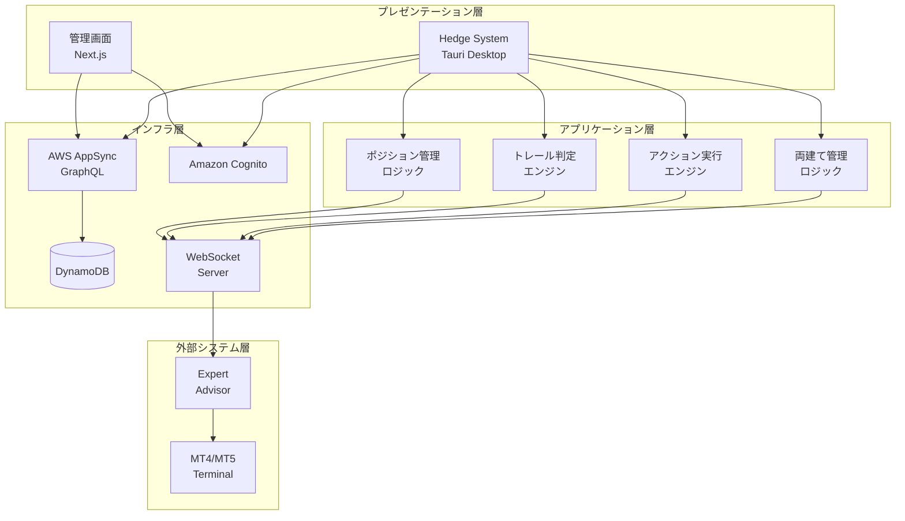

### 2-2. デプロイメントアーキテクチャ

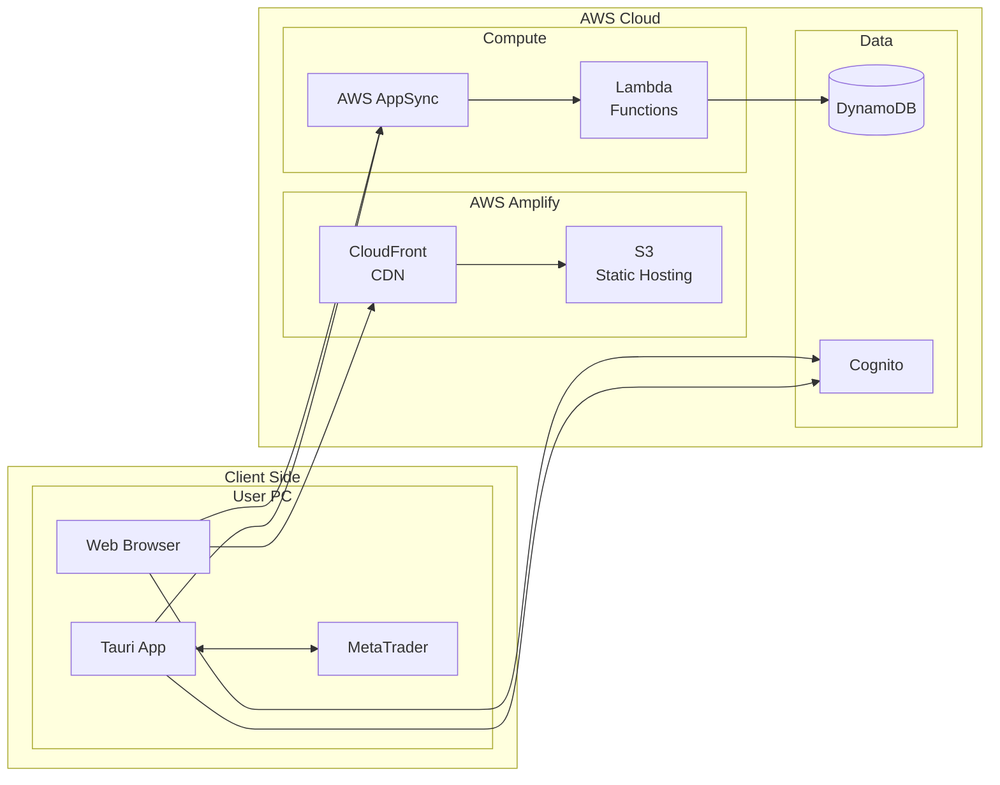

## 3. Hedge Systemクライアント詳細

### 3-1. コンポーネント構成

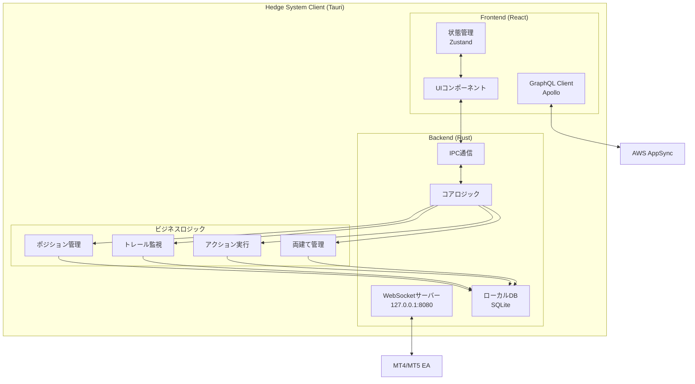

### 3-2. 主要モジュール詳細

#### 3-2-1. 口座管理モジュール

```typescript
interface AccountManager {
  // 口座情報の管理
  accounts: Map<string, Account>;
  
  // 口座の登録・更新
  registerAccount(account: Account): Promise<void>;
  updateAccountInfo(accountId: string, info: AccountInfo): void;
  
  // クレジット監視
  monitorCredit(accountId: string): Observable<CreditChange>;
  
  // 残高・証拠金監視
  monitorBalance(accountId: string): Observable<BalanceUpdate>;
  
  // ユーザー所有確認
  isOwnAccount(accountId: string, userId: string): boolean;
}
```

#### 3-2-2. ポジション実行エンジン

```typescript
interface PositionExecutionEngine {
  // ポジション実行管理
  executePosition(positionId: string): Promise<ExecutionResult>;
  
  // ステータス遷移管理
  transitionStatus(
    positionId: string, 
    newStatus: PositionStatus
  ): Promise<void>;
  
  // MT4/5連携
  sendOrderToMT(order: OrderRequest): Promise<MTResponse>;
  
  // 実行判定
  canExecute(position: Position, userId: string): boolean;
}
```

#### 3-2-3. トレール判定エンジン

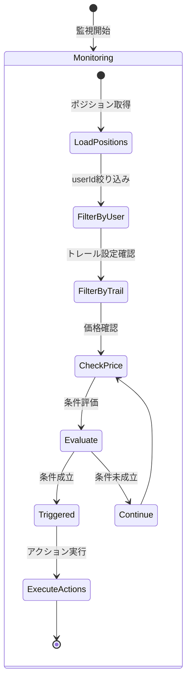

```typescript
interface TrailEngine {
  // トレール監視対象の管理
  monitoredPositions: Map<string, TrailConfig>;
  
  // 監視開始・停止
  startMonitoring(position: Position): void;
  stopMonitoring(positionId: string): void;
  
  // 条件判定
  evaluateTrailCondition(
    position: Position, 
    currentPrice: number
  ): boolean;
  
  // トリガー実行
  triggerActions(actionIds: string[]): Promise<void>;
}
```

#### 3-2-4. 両建て管理モジュール

```typescript
interface HedgeManager {
  // ポジション分析
  analyzePositions(positions: Position[]): HedgeAnalysis;
  
  // ネットポジション計算
  calculateNetPosition(positions: Position[]): NetPosition;
  
  // 最適化提案
  suggestOptimization(
    positions: Position[], 
    credit: number
  ): OptimizationPlan;
  
  // リスク評価
  evaluateRisk(positions: Position[]): RiskMetrics;
}
```

### 3-3. データフロー

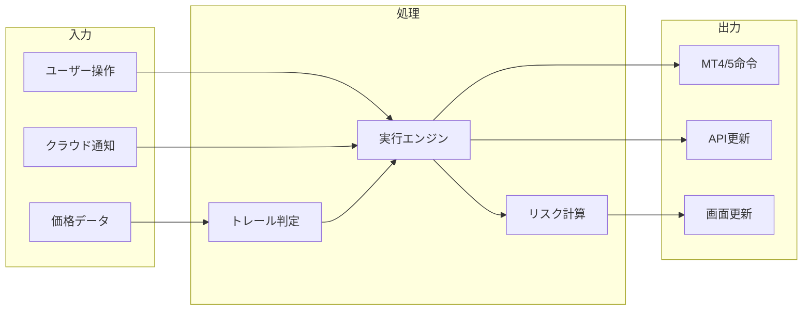

## 4. 管理者画面（Next.js）詳細

### 4-1. アプリケーション構成

```mermaid
graph TB
    subgraph "Next.js Application"
        subgraph "Pages (App Router)"
            Home[/dashboard]
            Accounts[/accounts]
            Positions[/positions]
            Actions[/actions]
            Monitor[/monitor]
        end

        subgraph "Components"
            Layout[Layout]
            Forms[Form Components]
            Tables[Table Components]
            Charts[Chart Components]
            Realtime[Realtime Components]
        end

        subgraph "Hooks & Utils"
            GraphQL[GraphQL Hooks]
            Auth[Auth Hooks]
            Subscribe[Subscription Hooks]
            Calc[計算ユーティリティ]
        end

        subgraph "State Management"
            Context[React Context]
            Cache[Apollo Cache]
            Local[Local State]
        end
    end

    Pages --> Components
    Components --> Hooks
    Hooks --> State
```

### 4-2. 主要画面構成

#### 4-2-1. ダッシュボード

```typescript
interface DashboardProps {
  // リアルタイムデータ
  accounts: Account[];
  positions: Position[];
  activeActions: Action[];
  
  // 集計データ
  totalBalance: number;
  totalCredit: number;
  netPosition: NetPosition;
  
  // アラート
  alerts: Alert[];
}
```

#### 4-2-2. ポジション管理画面

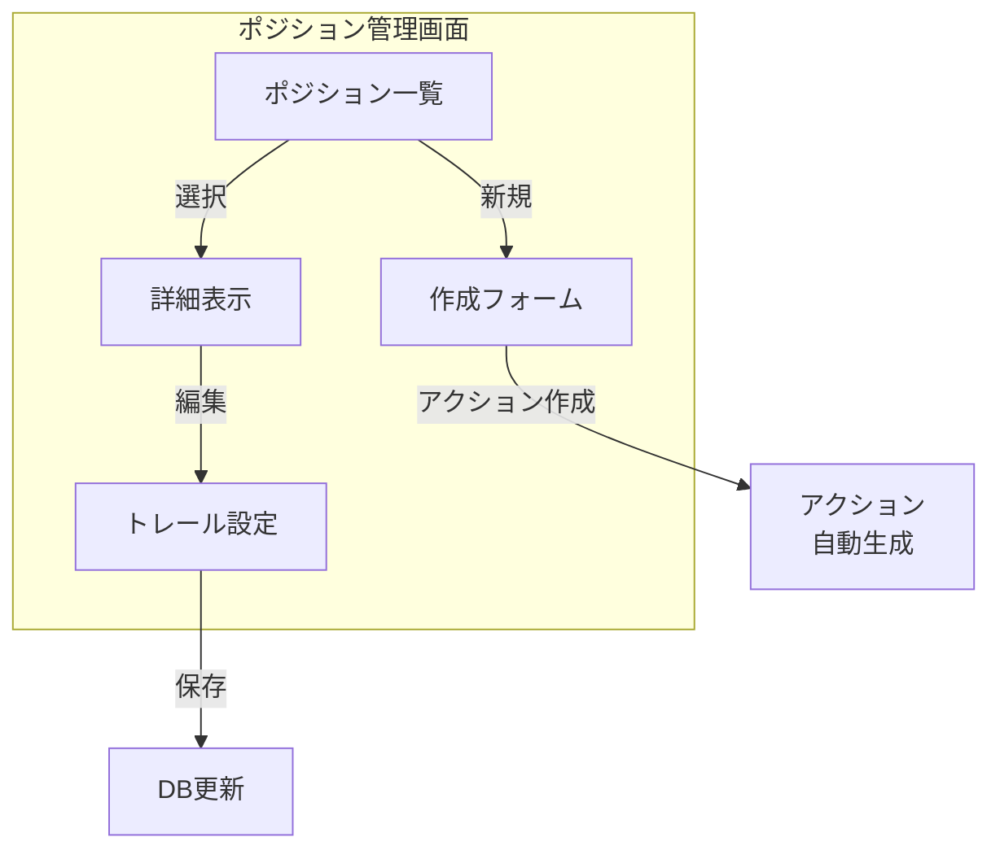

### 4-3. リアルタイム更新機構

```typescript
// GraphQL Subscription実装例
const POSITION_SUBSCRIPTION = gql`
  subscription OnPositionUpdate($userId: ID!) {
    onUpdatePosition(userId: $userId) {
      id
      status
      entryPrice
      currentPrice
      unrealizedPL
      trailWidth
      updatedAt
    }
  }
`;

// Subscription Hook
function usePositionSubscription(userId: string) {
  const { data, loading, error } = useSubscription(
    POSITION_SUBSCRIPTION,
    { 
      variables: { userId },
      // 再接続設定
      shouldResubscribe: true,
    }
  );
  
  return { position: data?.onUpdatePosition, loading, error };
}
```

## 5. AWS Amplifyインフラ構成

### 5-1. インフラアーキテクチャ

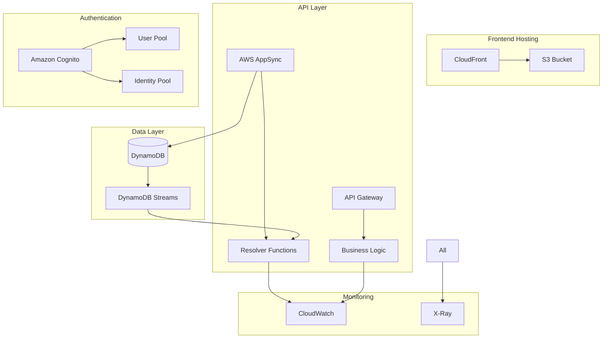

### 5-2. DynamoDBテーブル設計

```yaml
Tables:
  - TableName: Users
    PartitionKey: id (S)
    GSI:
      - IndexName: byEmail
        PartitionKey: email (S)
    
  - TableName: Accounts
    PartitionKey: id (S)
    GSI:
      - IndexName: byUserId
        PartitionKey: userId (S)
        SortKey: createdAt (S)
    
  - TableName: Positions
    PartitionKey: id (S)
    GSI:
      - IndexName: byUserId
        PartitionKey: userId (S)
        SortKey: createdAt (S)
      - IndexName: byAccountId
        PartitionKey: accountId (S)
        SortKey: status (S)
      - IndexName: byUserIdAndStatus
        PartitionKey: userId (S)
        SortKey: status (S)
    
  - TableName: Actions
    PartitionKey: id (S)
    GSI:
      - IndexName: byUserId
        PartitionKey: userId (S)
        SortKey: createdAt (S)
      - IndexName: byUserIdAndStatus
        PartitionKey: userId (S)
        SortKey: status (S)
```

### 5-3. GraphQL スキーマ構成

```graphql
type Subscription {
  # ユーザー別のリアルタイム更新
  onCreatePosition(userId: ID!): Position
    @aws_subscribe(mutations: ["createPosition"])
  
  onUpdatePosition(userId: ID!): Position
    @aws_subscribe(mutations: ["updatePosition"])
  
  onCreateAction(userId: ID!): Action
    @aws_subscribe(mutations: ["createAction"])
  
  onUpdateAction(userId: ID!): Action
    @aws_subscribe(mutations: ["updateAction"])
  
  # 口座情報のリアルタイム更新
  onUpdateAccount(userId: ID!): Account
    @aws_subscribe(mutations: ["updateAccount"])
}
```

## 6. セキュリティアーキテクチャ

### 6-1. 認証・認可フロー

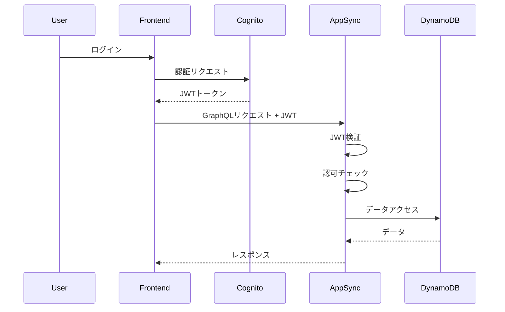

### 6-2. データアクセス制御

```typescript
// GraphQL Resolver での認可実装例
export const updatePosition: Resolver = async (
  source,
  args,
  context
) => {
  const { userId } = context.identity;
  const { id, ...updates } = args.input;
  
  // 所有者確認
  const position = await getPosition(id);
  if (position.userId !== userId && !isAdmin(context)) {
    throw new UnauthorizedError("Access denied");
  }
  
  // 更新実行
  return await updatePositionItem(id, updates);
};
```

## 7. 通信アーキテクチャ

### 7-1. WebSocket通信設計

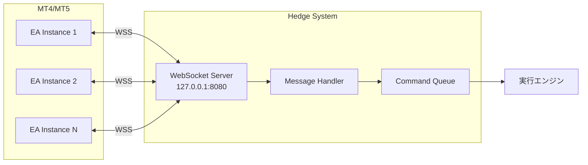

### 7-2. メッセージングパターン

```typescript
// Command パターン
interface Command {
  id: string;
  type: 'OPEN' | 'CLOSE' | 'MODIFY';
  accountId: string;
  payload: any;
  timestamp: Date;
}

// Event パターン
interface Event {
  id: string;
  type: 'OPENED' | 'CLOSED' | 'FAILED';
  accountId: string;
  correlationId: string;
  payload: any;
  timestamp: Date;
}

// Request-Response相関
class MessageCorrelator {
  private pending = new Map<string, PendingRequest>();
  
  async sendAndWait(command: Command): Promise<Event> {
    const promise = new Promise<Event>((resolve, reject) => {
      this.pending.set(command.id, { resolve, reject });
    });
    
    await this.send(command);
    return promise;
  }
}
```

## 8. エラーハンドリングアーキテクチャ

### 8-1. エラー分類と処理フロー

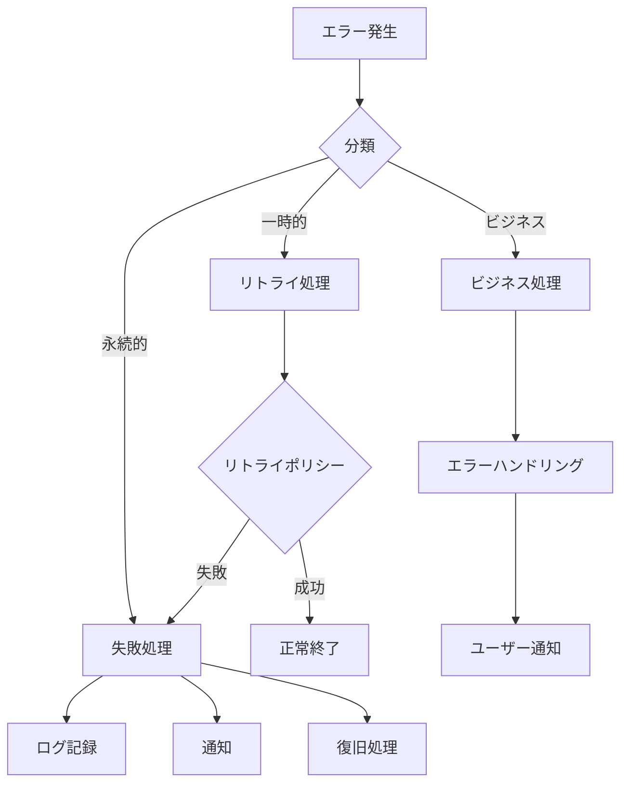

### 8-2. サーキットブレーカーパターン

```typescript
class CircuitBreaker {
  private failureCount = 0;
  private lastFailureTime?: Date;
  private state: 'CLOSED' | 'OPEN' | 'HALF_OPEN' = 'CLOSED';
  
  async execute<T>(
    operation: () => Promise<T>
  ): Promise<T> {
    if (this.state === 'OPEN') {
      if (this.shouldAttemptReset()) {
        this.state = 'HALF_OPEN';
      } else {
        throw new CircuitOpenError();
      }
    }
    
    try {
      const result = await operation();
      this.onSuccess();
      return result;
    } catch (error) {
      this.onFailure();
      throw error;
    }
  }
}
```

## 9. パフォーマンス最適化

### 9-1. キャッシング戦略

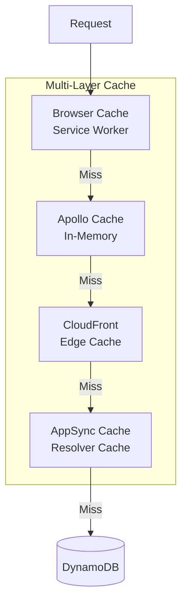

### 9-2. 非同期処理アーキテクチャ

```typescript
// イベント駆動処理
class EventProcessor {
  private eventBus = new EventEmitter();
  private workers = new Map<string, Worker>();
  
  // 非同期バッチ処理
  async processBatch(events: Event[]): Promise<void> {
    const batches = this.groupByType(events);
    
    await Promise.all(
      batches.map(batch => 
        this.processInWorker(batch.type, batch.events)
      )
    );
  }
  
  // Worker Thread活用
  private async processInWorker(
    type: string, 
    events: Event[]
  ): Promise<void> {
    const worker = this.workers.get(type);
    return new Promise((resolve, reject) => {
      worker.postMessage({ events });
      worker.once('message', resolve);
      worker.once('error', reject);
    });
  }
}
```

## 10. 監視・運用アーキテクチャ

### 10-1. ログ収集アーキテクチャ

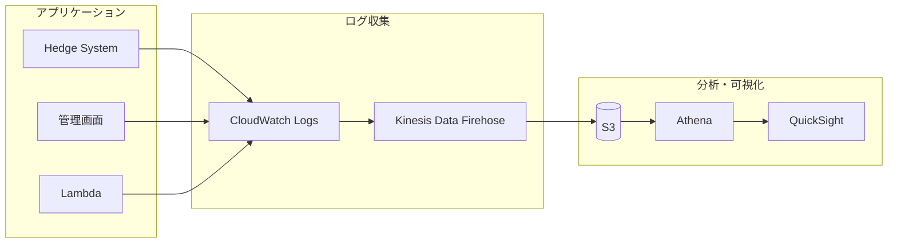

### 10-2. メトリクス設計

```yaml
CustomMetrics:
  Business:
    - MetricName: PositionExecutionTime
      Unit: Milliseconds
      Dimensions: [AccountType, Symbol]
    
    - MetricName: TrailTriggerCount
      Unit: Count
      Dimensions: [UserId, Symbol]
    
    - MetricName: ActivePositions
      Unit: Count
      Dimensions: [UserId, Status]
  
  Technical:
    - MetricName: WebSocketConnections
      Unit: Count
      Dimensions: [UserId]
    
    - MetricName: APILatency
      Unit: Milliseconds
      Dimensions: [Operation, StatusCode]
    
    - MetricName: CacheHitRate
      Unit: Percent
      Dimensions: [CacheLevel]
```

## 11. 開発・デプロイアーキテクチャ

### 11-1. CI/CDパイプライン

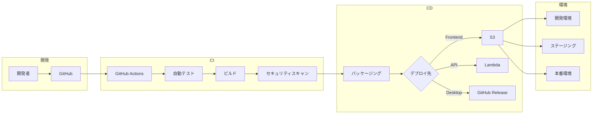

### 11-2. 環境構成

| 環境 | 用途 | URL | 特徴 |
|------|------|-----|------|
| **開発環境** | 開発・テスト | dev.hedge-system.com | 自動デプロイ、ダミーデータ |
| **ステージング** | 受入テスト | stg.hedge-system.com | 本番同等構成、テストデータ |
| **本番環境** | 本番運用 | app.hedge-system.com | 高可用性、本番データ |

## 12. まとめ

本アーキテクチャ設計により、以下を実現します：

1. **高可用性**: AWS Amplifyの活用による99.9%の稼働率
2. **リアルタイム性**: WebSocketとGraphQL Subscriptionによる即時反映
3. **拡張性**: マイクロサービス的な設計による機能追加の容易さ
4. **セキュリティ**: 多層防御による堅牢なセキュリティ
5. **運用性**: 包括的な監視と自動化されたデプロイ

これらの設計により、ボーナスアービトラージ取引の自動化と効率化を実現し、ユーザーに価値を提供します。