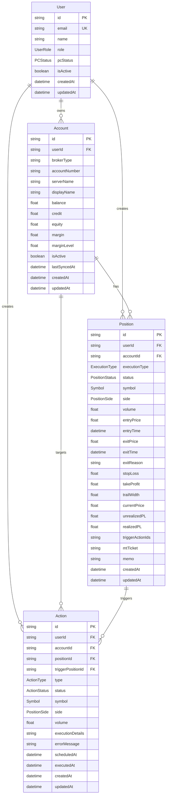

# データベース設計書 - Hedge System MVP

## 1. はじめに

### 1-1. 本書の目的

本書は、Hedge System MVPのデータベース設計を詳細に定義します。Amazon DynamoDBを使用したNoSQLデータベース設計により、高いスケーラビリティとパフォーマンスを実現します。

### 1-2. 設計方針

- **単一テーブル設計の不採用**: データモデルの複雑性を避け、エンティティごとにテーブルを分離
- **GSI活用**: アクセスパターンに応じた効率的なクエリを実現
- **整合性**: 結果整合性を許容しつつ、ビジネスクリティカルな操作では強整合性を確保
- **コスト最適化**: 読み取り/書き込みキャパシティの適切な設定

## 2. データモデル概要

### 2-1. エンティティ関連図（ERD）



### 2-2. データ型定義

| データ型   | DynamoDB型 | 説明              | 例                                       |
| ---------- | ---------- | ----------------- | ---------------------------------------- |
| **ID型**   | String (S) | UUID v4形式       | `"550e8400-e29b-41d4-a716-446655440000"` |
| **日時型** | String (S) | ISO 8601形式      | `"2024-06-23T10:00:00.000Z"`             |
| **金額型** | Number (N) | 小数点以下6桁まで | `12345.678901`                           |
| **列挙型** | String (S) | 定義済み文字列    | `"PENDING"`, `"OPEN"`                    |
| **JSON型** | String (S) | JSON文字列        | `"[\"act-001\",\"act-002\"]"`            |

## 3. テーブル詳細設計

### 3-1. Usersテーブル

#### 属性定義

| 属性名          | 型      | 必須 | 説明               | 制約               |
| --------------- | ------- | ---- | ------------------ | ------------------ |
| **id**          | String  | ✓    | ユーザーID (PK)    | UUID v4            |
| **email**       | String  | ✓    | メールアドレス     | RFC 5322準拠、一意 |
| **name**        | String  | ✓    | 表示名             | 1-100文字          |
| **role**        | String  | ✓    | ユーザーロール     | CLIENT \| ADMIN    |
| **pcStatus**    | String  | ✓    | PC接続状態         | ONLINE \| OFFLINE  |
| **isActive**    | Boolean | ✓    | アカウント有効状態 | true \| false      |
| **lastLoginAt** | String  | -    | 最終ログイン日時   | ISO 8601           |
| **createdAt**   | String  | ✓    | 作成日時           | ISO 8601           |
| **updatedAt**   | String  | ✓    | 更新日時           | ISO 8601           |

#### インデックス設計

```yaml
PrimaryKey:
  PartitionKey: id

GlobalSecondaryIndexes:
  - IndexName: byEmail
    PartitionKey: email
    ProjectionType: ALL
    RCU: 5
    WCU: 5
```

### 3-2. Accountsテーブル

#### 属性定義

| 属性名               | 型      | 必須 | 説明                   | 制約                      |
| -------------------- | ------- | ---- | ---------------------- | ------------------------- |
| **id**               | String  | ✓    | 口座ID (PK)            | UUID v4                   |
| **userId**           | String  | ✓    | 所有者ID               | Users.id参照              |
| **brokerType**       | String  | ✓    | ブローカータイプ       | MT4 \| MT5                |
| **accountNumber**    | String  | ✓    | 口座番号               | 1-20文字                  |
| **serverName**       | String  | ✓    | サーバー名             | 1-100文字                 |
| **displayName**      | String  | ✓    | 表示名                 | 1-100文字                 |
| **balance**          | Number  | ✓    | 現金残高               | 0以上                     |
| **credit**           | Number  | ✓    | クレジット（ボーナス） | 0以上                     |
| **equity**           | Number  | ✓    | 有効証拠金             | -                         |
| **margin**           | Number  | ✓    | 必要証拠金             | 0以上                     |
| **marginLevel**      | Number  | -    | 証拠金維持率（%）      | 0以上                     |
| **currency**         | String  | ✓    | 基準通貨               | USD \| JPY \| EUR         |
| **leverage**         | Number  | ✓    | レバレッジ             | 1-1000                    |
| **isActive**         | Boolean | ✓    | 有効状態               | true \| false             |
| **connectionStatus** | String  | ✓    | 接続状態               | CONNECTED \| DISCONNECTED |
| **lastSyncedAt**     | String  | -    | 最終同期日時           | ISO 8601                  |
| **createdAt**        | String  | ✓    | 作成日時               | ISO 8601                  |
| **updatedAt**        | String  | ✓    | 更新日時               | ISO 8601                  |

#### インデックス設計

```yaml
PrimaryKey:
  PartitionKey: id

GlobalSecondaryIndexes:
  - IndexName: byUserId
    PartitionKey: userId
    SortKey: createdAt
    ProjectionType: ALL
    RCU: 10
    WCU: 5

  - IndexName: byUserIdAndStatus
    PartitionKey: userId
    SortKey: isActive
    ProjectionType: INCLUDE
    ProjectedAttributes: [displayName, balance, credit, equity]
    RCU: 10
    WCU: 5
```

### 3-3. Positionsテーブル

#### 属性定義

| 属性名               | 型     | 必須 | 説明                     | 制約            |
| -------------------- | ------ | ---- | ------------------------ | --------------- |
| **id**               | String | ✓    | ポジションID (PK)        | UUID v4         |
| **userId**           | String | ✓    | 作成者ID                 | Users.id参照    |
| **accountId**        | String | ✓    | 所属口座ID               | Accounts.id参照 |
| **executionType**    | String | ✓    | 実行タイプ               | ENTRY \| EXIT   |
| **status**           | String | ✓    | ステータス               | 下記参照        |
| **symbol**           | String | ✓    | 通貨ペア                 | 下記参照        |
| **side**             | String | ✓    | 売買方向                 | BUY \| SELL     |
| **volume**           | Number | ✓    | ロット数                 | 0.01以上        |
| **entryPrice**       | Number | -    | 約定価格                 | 0以上           |
| **entryTime**        | String | -    | 約定時刻                 | ISO 8601        |
| **exitPrice**        | Number | -    | 決済価格                 | 0以上           |
| **exitTime**         | String | -    | 決済時刻                 | ISO 8601        |
| **exitReason**       | String | -    | 決済理由                 | 1-500文字       |
| **stopLoss**         | Number | -    | ストップロス             | 0以上           |
| **takeProfit**       | Number | -    | テイクプロフィット       | 0以上           |
| **trailWidth**       | Number | ✓    | トレール幅（pips）       | 0以上           |
| **currentPrice**     | Number | -    | 現在価格                 | 0以上           |
| **unrealizedPL**     | Number | -    | 未実現損益               | -               |
| **realizedPL**       | Number | -    | 実現損益                 | -               |
| **commission**       | Number | -    | 手数料                   | -               |
| **swap**             | Number | -    | スワップ                 | -               |
| **triggerActionIds** | String | -    | トリガーアクションID配列 | JSON配列        |
| **mtTicket**         | String | -    | MT4/5チケット番号        | 1-20文字        |
| **memo**             | String | -    | メモ                     | 0-1000文字      |
| **createdAt**        | String | ✓    | 作成日時                 | ISO 8601        |
| **updatedAt**        | String | ✓    | 更新日時                 | ISO 8601        |

#### ステータス定義

| ステータス   | 説明                 | 次の遷移先        |
| ------------ | -------------------- | ----------------- |
| **PENDING**  | 作成済み・発注待機中 | OPENING, CANCELED |
| **OPENING**  | 発注処理中           | OPEN, CANCELED    |
| **OPEN**     | ポジション保有中     | CLOSING, STOPPED  |
| **CLOSING**  | 決済処理中           | CLOSED, OPEN      |
| **CLOSED**   | 正常決済済み         | -                 |
| **STOPPED**  | ロスカット済み       | -                 |
| **CANCELED** | キャンセル済み       | -                 |

#### インデックス設計

```yaml
PrimaryKey:
  PartitionKey: id

GlobalSecondaryIndexes:
  - IndexName: byUserId
    PartitionKey: userId
    SortKey: createdAt
    ProjectionType: ALL
    RCU: 20
    WCU: 10

  - IndexName: byAccountId
    PartitionKey: accountId
    SortKey: status
    ProjectionType: ALL
    RCU: 10
    WCU: 5

  - IndexName: byUserIdAndStatus
    PartitionKey: userId
    SortKey: status
    ProjectionType: ALL
    RCU: 20
    WCU: 10

  - IndexName: byStatusAndUpdatedAt
    PartitionKey: status
    SortKey: updatedAt
    ProjectionType: INCLUDE
    ProjectedAttributes: [userId, accountId, symbol, volume]
    RCU: 10
    WCU: 5
```

### 3-4. Actionsテーブル

#### 属性定義

| 属性名                | 型     | 必須 | 説明                   | 制約             |
| --------------------- | ------ | ---- | ---------------------- | ---------------- |
| **id**                | String | ✓    | アクションID (PK)      | UUID v4          |
| **userId**            | String | ✓    | 作成者ID               | Users.id参照     |
| **accountId**         | String | ✓    | 対象口座ID             | Accounts.id参照  |
| **positionId**        | String | -    | 対象ポジションID       | Positions.id参照 |
| **triggerPositionId** | String | -    | トリガー元ポジションID | Positions.id参照 |
| **type**              | String | ✓    | アクションタイプ       | ENTRY \| CLOSE   |
| **status**            | String | ✓    | ステータス             | 下記参照         |
| **symbol**            | String | ✓    | 通貨ペア               | Positionと同じ   |
| **side**              | String | ✓    | 売買方向               | BUY \| SELL      |
| **volume**            | Number | ✓    | ロット数               | 0.01以上         |
| **executionDetails**  | String | -    | 実行詳細               | JSON文字列       |
| **errorMessage**      | String | -    | エラーメッセージ       | 0-1000文字       |
| **retryCount**        | Number | -    | リトライ回数           | 0-5              |
| **scheduledAt**       | String | -    | 実行予定日時           | ISO 8601         |
| **executedAt**        | String | -    | 実行完了日時           | ISO 8601         |
| **createdAt**         | String | ✓    | 作成日時               | ISO 8601         |
| **updatedAt**         | String | ✓    | 更新日時               | ISO 8601         |

#### ステータス定義

| ステータス    | 説明           | 次の遷移先           |
| ------------- | -------------- | -------------------- |
| **PENDING**   | 待機中         | EXECUTING, CANCELED  |
| **EXECUTING** | 実行中         | EXECUTED, FAILED     |
| **EXECUTED**  | 実行完了       | -                    |
| **FAILED**    | 実行失敗       | PENDING (リトライ時) |
| **CANCELED**  | キャンセル済み | -                    |

#### インデックス設計

```yaml
PrimaryKey:
  PartitionKey: id

GlobalSecondaryIndexes:
  - IndexName: byUserId
    PartitionKey: userId
    SortKey: createdAt
    ProjectionType: ALL
    RCU: 15
    WCU: 10

  - IndexName: byUserIdAndStatus
    PartitionKey: userId
    SortKey: status
    ProjectionType: ALL
    RCU: 20
    WCU: 10

  - IndexName: byTriggerPositionId
    PartitionKey: triggerPositionId
    SortKey: createdAt
    ProjectionType: ALL
    RCU: 10
    WCU: 5

  - IndexName: byStatusAndScheduledAt
    PartitionKey: status
    SortKey: scheduledAt
    ProjectionType: INCLUDE
    ProjectedAttributes: [userId, accountId, type]
    RCU: 10
    WCU: 5
```

## 4. アクセスパターン分析

### 4-1. 主要アクセスパターン

| パターン | 説明                       | 使用インデックス                     | 頻度 |
| -------- | -------------------------- | ------------------------------------ | ---- |
| **AP1**  | ユーザーの全ポジション取得 | Positions.byUserId                   | 高   |
| **AP2**  | 実行中アクション取得       | Actions.byUserIdAndStatus            | 高   |
| **AP3**  | トレール監視対象取得       | Positions.byUserIdAndStatus + filter | 高   |
| **AP4**  | 口座別ポジション取得       | Positions.byAccountId                | 中   |
| **AP5**  | トリガーアクション取得     | Actions.byTriggerPositionId          | 中   |
| **AP6**  | ユーザー認証               | Users.byEmail                        | 中   |
| **AP7**  | 口座情報一覧               | Accounts.byUserId                    | 低   |

## 5. データ整合性設計

### 5-1. トランザクション要件

| トランザクション   | 対象テーブル       | 整合性要件                             |
| ------------------ | ------------------ | -------------------------------------- |
| **エントリー作成** | Actions, Positions | アクションとポジションの同時作成を保証 |
| **ポジション実行** | Positions          | ステータス遷移の原子性を保証           |
| **トレール発動**   | Actions (複数)     | 複数アクションの一括更新を保証         |

### 5-2. 制約設計

- **一意性制約**: 各テーブルのPKで保証
- **参照整合性**: アプリケーション層で実装
- **楽観的ロック**: updatedAtフィールドによるバージョン管理

## 6. パフォーマンス設計

### 6-1. キャパシティ設計

| テーブル      | 読み取りキャパシティ | 書き込みキャパシティ | Auto Scaling  |
| ------------- | -------------------- | -------------------- | ------------- |
| **Users**     | 10 RCU               | 5 WCU                | 有効 (10-100) |
| **Accounts**  | 20 RCU               | 10 WCU               | 有効 (20-200) |
| **Positions** | 50 RCU               | 30 WCU               | 有効 (50-500) |
| **Actions**   | 40 RCU               | 25 WCU               | 有効 (40-400) |

### 6-2. インデックス最適化方針

- **パーティション分散**: IDにランダムプレフィックスを含める
- **ホットパーティション対策**: userIdによる適切な分散
- **プロジェクション**: 必要最小限の属性のみ含める

## 7. セキュリティ設計

### 7-1. 基本設定

- **暗号化**: DynamoDB暗号化（KMS）を有効化
- **バックアップ**: Point-in-Time Recovery有効化（35日間）
- **アクセス制御**: IAMロールによるテーブル/インデックスレベルの制御

### 7-2. アクセス権限

| ロール          | 権限       | 対象                         |
| --------------- | ---------- | ---------------------------- |
| **AppSyncRole** | Read/Write | 全テーブル、全GSI            |
| **LambdaRole**  | Read/Write | 必要なテーブルのみ           |
| **BackupRole**  | Read       | 全テーブル（バックアップ用） |

## 8. まとめ

本データベース設計により、以下を実現します：

1. **高パフォーマンス**: GSIを活用した効率的なクエリ
2. **スケーラビリティ**: DynamoDBの特性を活かした水平スケール
3. **データ整合性**: トランザクションと楽観的ロックによる保護
4. **セキュリティ**: 暗号化とアクセス制御による保護

この設計は、MVP段階から将来の拡張まで対応可能な柔軟性を持ち、ボーナスアービトラージ取引システムの基盤として機能します。
