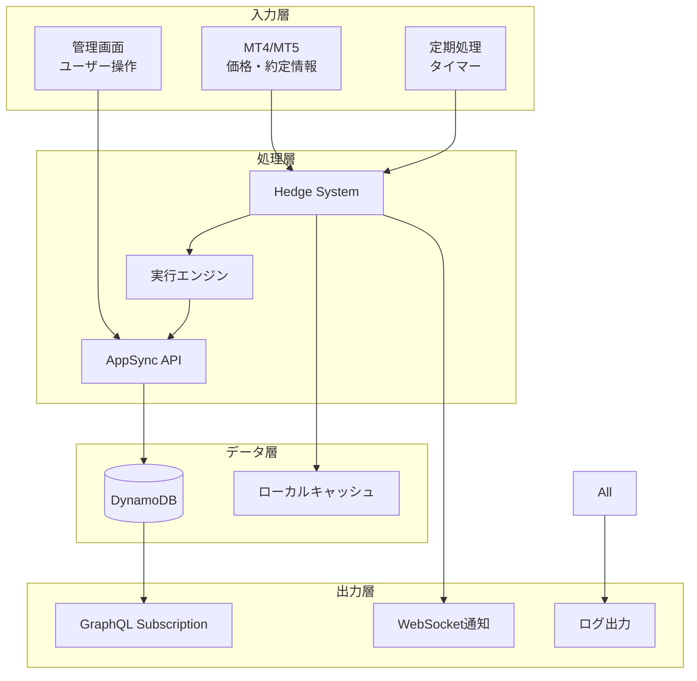
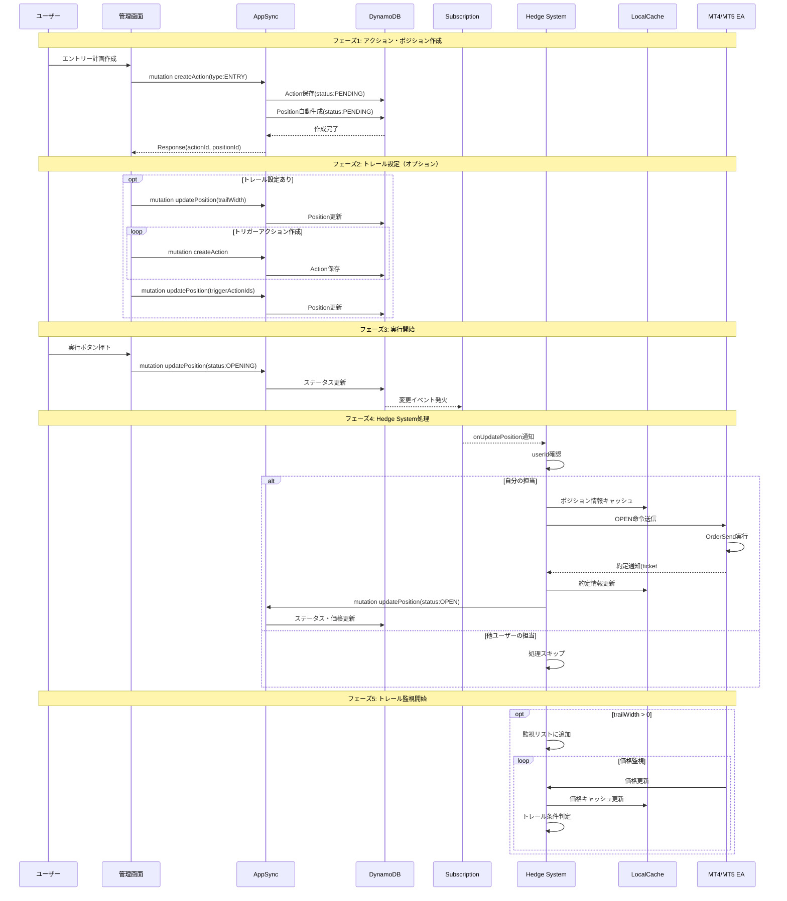
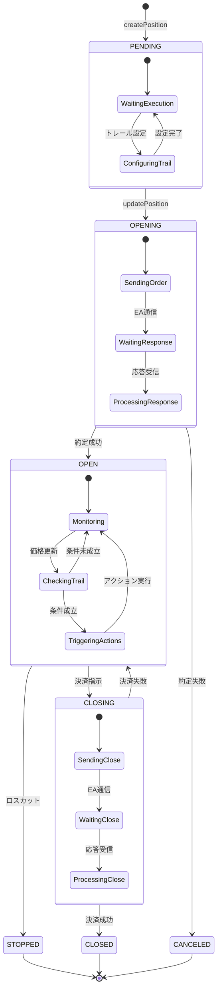
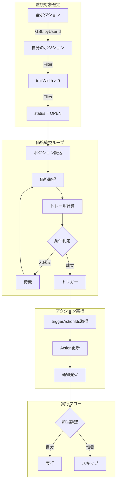
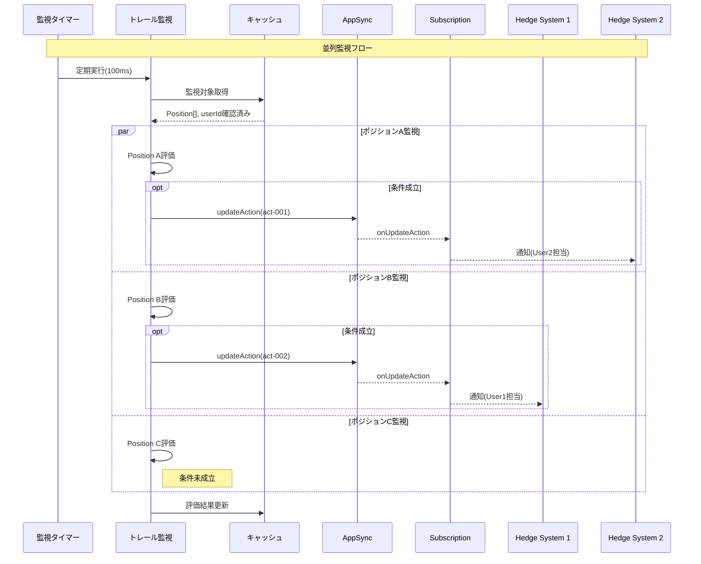
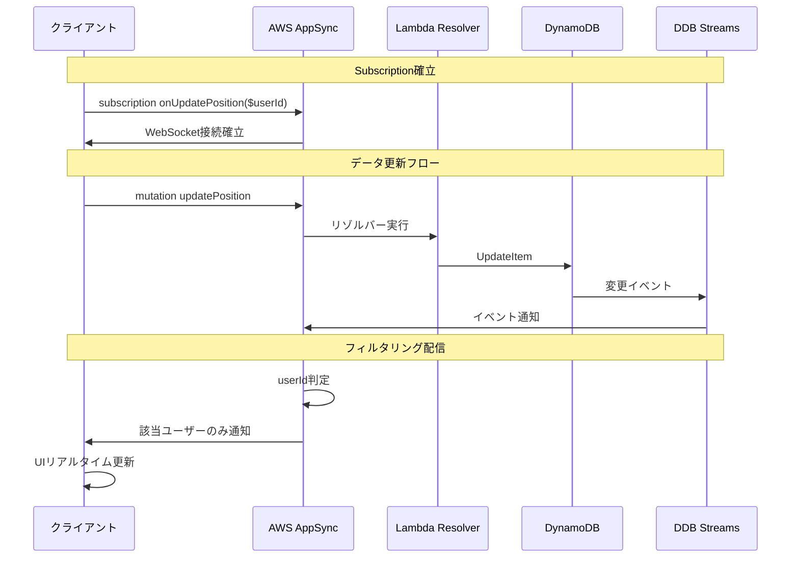
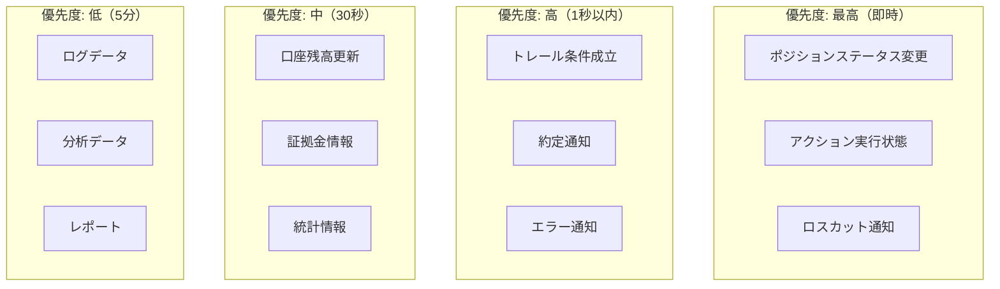
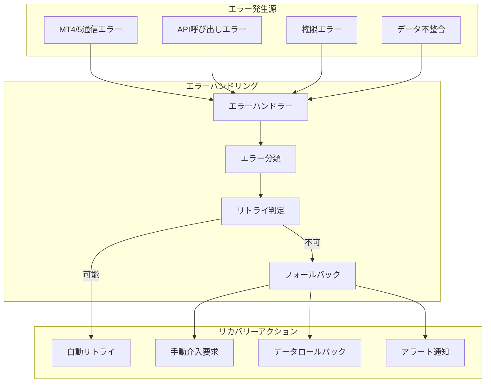
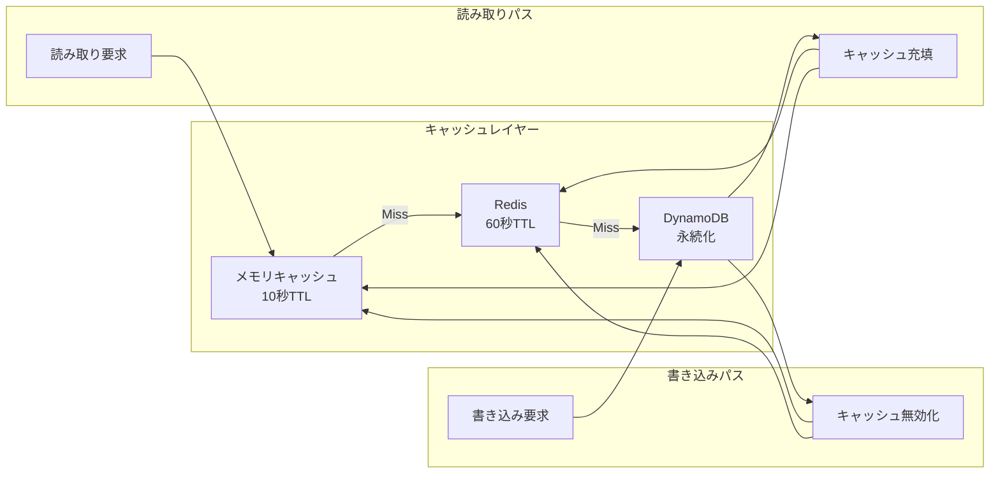

# データフロー設計書 - Hedge System MVP

## 1. はじめに

### 1-1. 本書の目的

本書は、Hedge System MVP内でのデータの流れ、処理タイミング、同期メカニズムを詳細に定義します。システム全体のデータフローを可視化し、開発者が実装時に参照できる具体的な指針を提供します。

### 1-2. データフローの基本原則

- **イベント駆動**: GraphQL SubscriptionとWebSocketによるリアルタイム伝播
- **結果整合性**: 非同期処理を許容し、最終的な整合性を保証
- **冪等性**: 同じ操作を複数回実行しても結果が変わらない設計

## 2. データフロー全体像

### 2-1. システム間データフロー概要



### 2-2. データカテゴリと特性

| カテゴリ               | データ種別       | 更新頻度 | 同期方式       | 整合性要件       |
| ---------------------- | ---------------- | -------- | -------------- | ---------------- |
| **マスタデータ**       | User, Account    | 低       | 同期           | 強整合性         |
| **トランザクション**   | Position, Action | 高       | 非同期         | 結果整合性       |
| **リアルタイムデータ** | 価格, 残高       | 極高     | ストリーミング | ベストエフォート |
| **集計データ**         | 統計, レポート   | 中       | バッチ         | 結果整合性       |

## 3. ポジション実行フロー詳細

### 3-1. エントリー実行データフロー



### 3-2. ポジション状態遷移とデータ更新



### 3-3. データ更新タイミング

| イベント           | 更新対象         | 更新内容                                | 通知先         |
| ------------------ | ---------------- | --------------------------------------- | -------------- |
| **ポジション作成** | Position, Action | 初期データ                              | -              |
| **実行開始**       | Position.status  | PENDING→OPENING                         | 全Hedge System |
| **約定成功**       | Position         | status, entryPrice, entryTime, mtTicket | 全Hedge System |
| **価格更新**       | LocalCache       | currentPrice, unrealizedPL              | ローカルのみ   |
| **トレール発動**   | Action.status    | PENDING→EXECUTING                       | 全Hedge System |
| **決済完了**       | Position         | status, exitPrice, exitTime, realizedPL | 全Hedge System |

## 4. トレール実行フロー詳細

### 4-1. トレール監視データフロー



### 4-2. トレール条件判定フロー

トレール条件は以下の要素で判定：

- **現在価格と約定価格の差**: pips単位で計算
- **売買方向**: BUYは価格上昇、SELLは価格下降で発動
- **トレール幅**: 設定されたpips以上の変動で発動
- **ポジションステータス**: OPEN状態のみ監視対象

### 4-3. 複数ポジション並列トレール



## 5. アクション連携フロー

### 5-1. クロスユーザーアクション実行

```mermaid
graph LR
    subgraph "User1環境"
        Pos1[Position A<br/>トレール監視中]
        HS1[Hedge System 1]
        Act1[triggerActionIds:<br/>[act-001]]
    end

    subgraph "User2環境"
        Act2[Action(act-001)<br/>type: ENTRY<br/>status: PENDING]
        Pos2[Position B<br/>status: PENDING]
        HS2[Hedge System 2]
    end

    subgraph "AWS Cloud"
        API[AppSync]
        DB[(DynamoDB)]
        Sub[Subscription]
    end

    Pos1 -->|監視| HS1
    HS1 -->|条件成立| Act1
    Act1 -->|更新| API
    API --> DB
    DB --> Sub
    Sub -->|通知| HS2
    HS2 -->|userId確認| Act2
    Act2 -->|実行| Pos2
    Pos2 -->|PENDING→OPEN| API
```

### 5-2. アクションチェーン実行

アクションの連鎖的な実行パターン：

- **初期トリガー**: ロスカットやトレール条件成立
- **連鎖実行**: triggerActionIdsに基づく自動実行
- **実行順序**: タイムスタンプによる順序保証
- **結果追跡**: 各アクションの成功/失敗を記録

## 6. リアルタイム同期メカニズム

### 6-1. GraphQL Subscription フロー



### 6-2. データ同期優先度マトリクス



### 6-3. オプティミスティック更新

楽観的UI更新パターンにより、ユーザー体験を向上：

1. **即座にUIを更新** - ユーザー操作に対して即座に反応
2. **バックグラウンドでAPI実行** - 実際のデータ更新を非同期で実行
3. **結果に応じて調整** - 成功時は確定、失敗時はロールバック

## 7. バッチ処理フロー

### 7-1. 定期バッチ処理

```mermaid
graph TB
    subgraph "30秒バッチ"
        Timer1[タイマー起動] --> Accounts[口座情報収集]
        Accounts --> Balance[残高計算]
        Balance --> Credit[クレジット計算]
        Credit --> Batch1[バッチ更新]
        Batch1 --> API1[AppSync更新]
    end

    subgraph "5分バッチ"
        Timer2[タイマー起動] --> Stats[統計収集]
        Stats --> Aggregate[集計処理]
        Aggregate --> Report[レポート生成]
        Report --> S3[S3保存]
    end

    subgraph "日次バッチ"
        Timer3[タイマー起動] --> Archive[アーカイブ]
        Archive --> Clean[データクリーン]
        Clean --> Backup[バックアップ]
    end
```



## 8. エラー処理とリカバリーフロー

### 8-1. エラー伝播フロー



## 9. パフォーマンス最適化

### 9-1. データキャッシング戦略



## 10. まとめ

本データフロー設計により、以下を実現します：

1. **高パフォーマンス**: 効率的なデータアクセスパターンとキャッシング戦略
2. **リアルタイム性**: GraphQL SubscriptionとWebSocketによる即時更新
3. **信頼性**: エラーハンドリングとリカバリーメカニズム
4. **スケーラビリティ**: 非同期処理とバッチ処理による負荷分散

この設計により、複数ユーザー間での協調動作を含む、複雑なトレーディングシステムのデータフローを効率的に管理できます。
