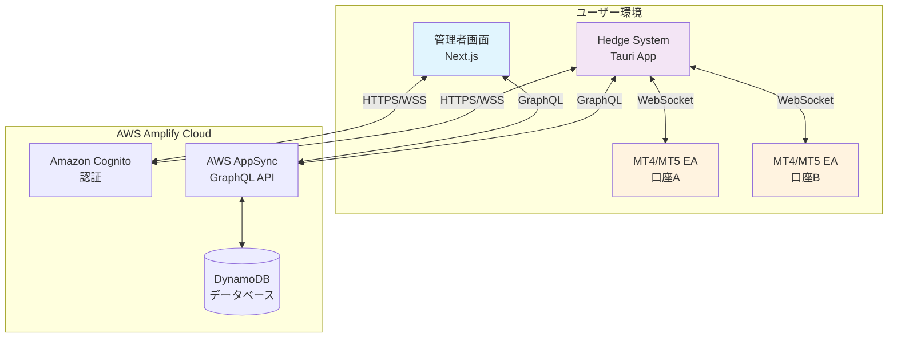
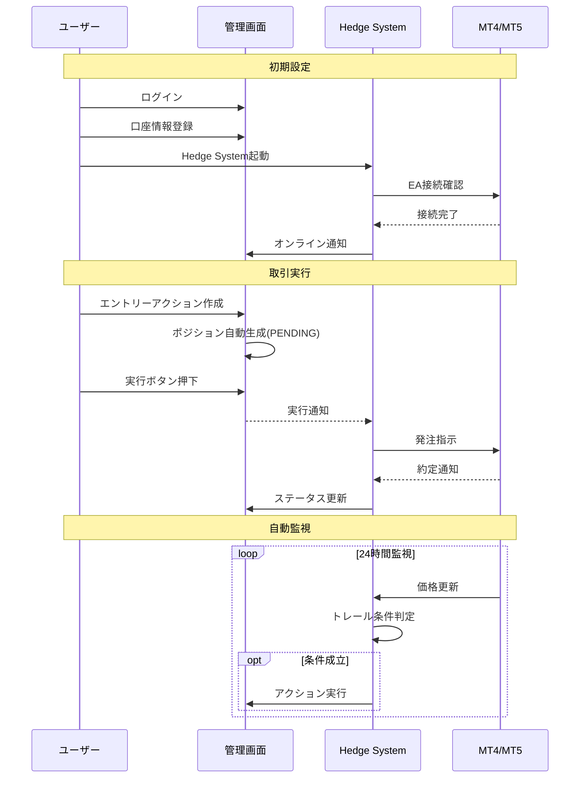
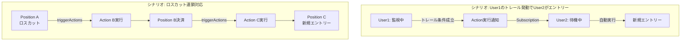

# システム概要設計書 - Hedge System MVP

## 1. はじめに

### 1-1. 本書の目的
本書は、ボーナスアービトラージ業務向けの自動取引システム「Hedge System」のMVP（Minimum Viable Product）における全体概要を定義するものです。

### 1-2. 対象読者
- プロジェクトステークホルダー
- 開発チームメンバー
- システム運用担当者
- 新規参画メンバー

### 1-3. 関連ドキュメント
- アーキテクチャ設計書
- データベース設計書
- WebSocket通信設計書
- GraphQL API設計書

## 2. システムの背景と目的

### 2-1. ビジネス背景
FX取引において、ブローカーが提供するボーナス（クレジット）を活用したアービトラージ取引は、リスクを最小化しながら利益を得る手法として注目されています。しかし、以下の課題が存在します：

- 複数口座・複数ポジションの手動管理の煩雑さ
- トレーリングストップの24時間監視の必要性
- 両建てポジションの最適な組み替えタイミングの判断
- ロスカット発生時の迅速な対応

### 2-2. システムの目的
本システムは、上記の課題を解決し、以下を実現することを目的とします：

1. **自動化による効率化**
   - ポジション管理の自動化
   - トレーリングストップの24時間自動監視
   - ロスカット時の自動アクション実行

2. **リスク管理の向上**
   - 両建てポジションの可視化
   - クレジット状況のリアルタイム把握
   - 証拠金維持率の継続的監視

3. **複数ユーザー間の協調**
   - トレール条件達成時の他ユーザーへの通知
   - アクションの自動連携実行

### 2-3. システムの特徴
- **1ユーザー1PC制約**: シンプルで確実な実行を保証
- **クラウドネイティブ**: AWS Amplifyを活用した高可用性
- **リアルタイム性**: WebSocketとGraphQL Subscriptionによる即時反映
- **拡張性**: 将来的な機能追加を考慮した設計

## 3. システム全体像

### 3-1. システム構成図

### 3-2. システム構成要素

| コンポーネント | 説明 | 技術スタック |
|---------------|------|-------------|
| **管理者画面** | Webベースの管理インターフェース | Next.js 14, React 18, TypeScript |
| **Hedge System** | ローカルPC上で動作するデスクトップアプリ | Tauri 2.0, Rust, React |
| **MT4/MT5 EA** | MetaTrader上で動作するExpert Advisor | MQL4/MQL5 |
| **認証サービス** | ユーザー認証・認可 | Amazon Cognito |
| **API** | データアクセスとリアルタイム通信 | AWS AppSync (GraphQL) |
| **データベース** | システムデータの永続化 | Amazon DynamoDB |

## 4. 主要機能概要

### 4-1. 機能一覧（MVP範囲）

| 機能カテゴリ | 機能名 | 説明 | 優先度 |
|-------------|--------|------|--------|
| **口座管理** | 口座登録 | MT4/MT5口座の登録・管理 | 必須 |
| | クレジット管理 | ボーナス残高の追跡 | 必須 |
| | 残高監視 | リアルタイム残高更新 | 必須 |
| **ポジション管理** | エントリー実行 | 新規ポジションの作成 | 必須 |
| | 決済実行 | 既存ポジションの決済 | 必須 |
| | トレール設定 | トレーリングストップの設定 | 必須 |
| **両建て管理** | ポジション俯瞰 | 全ポジションの一覧表示 | 必須 |
| | ネット計算 | 実質ポジションの算出 | 必須 |
| | 組み替え支援 | 最適な両建て提案 | 必須 |
| **自動実行** | トレール監視 | 24時間価格監視 | 必須 |
| | アクション連携 | 条件達成時の自動実行 | 必須 |
| | ロスカット対応 | 強制決済時の自動処理 | 必須 |
| **監視・通知** | リアルタイム表示 | ポジション状態の即時反映 | 必須 |
| | アラート通知 | 重要イベントの通知 | オプション |

### 4-2. ユーザーロール

| ロール | 説明 | 主な権限 |
|--------|------|---------|
| **CLIENT** | 一般トレーダー | 自己所有データの作成・編集・閲覧 |
| **ADMIN** | システム管理者 | 全データの作成・編集・閲覧・削除 |

## 5. システム利用フロー

### 5-1. 基本的な利用シナリオ

### 5-2. 複数ユーザー連携シナリオ

## 6. 非機能要件概要

### 6-1. パフォーマンス要件

| 項目 | 要件 | 備考 |
|------|------|------|
| **レスポンスタイム** | API: 500ms以内 | 95パーセンタイル |
| **スループット** | 100リクエスト/秒 | ピーク時想定 |
| **同時接続数** | 100ユーザー | MVP段階の想定 |
| **データ更新頻度** | ポジション: 即時 口座情報: 30秒毎 | |

### 6-2. 可用性要件

| 項目 | 要件 | 備考 |
|------|------|------|
| **稼働率** | 99.9% | 年間ダウンタイム8.76時間 |
| **計画停止** | 月1回、深夜2時間以内 | 事前通知あり |
| **障害復旧時間** | 1時間以内 | Critical障害 |

### 6-3. セキュリティ要件

- **認証**: Amazon Cognito（JWT）
- **通信暗号化**: TLS 1.3
- **データ暗号化**: DynamoDB暗号化（保存時）
- **アクセス制御**: userIdベースの行レベルセキュリティ

## 7. 制約事項

### 7-1. システム制約
- **1ユーザー1PC制約**: 同一ユーザーの複数PC同時接続は不可
- **MT4/MT5依存**: MetaTraderが稼働していることが前提
- **インターネット接続必須**: クラウド連携のため常時接続が必要

### 7-2. 運用制約
- **24時間稼働推奨**: トレール監視のためPC常時起動を推奨
- **定期メンテナンス**: 月1回のシステムメンテナンス
- **バックアップ**: 日次自動バックアップ（DynamoDB）

## 8. 今後の拡張計画

### 8-1. Phase 2（MVP後）
- モバイルアプリ対応
- 高度なリスク分析機能
- バックテスト機能
- 複数通貨ペア同時監視

### 8-2. Phase 3
- AI/ML活用の取引最適化
- 他ブローカー対応
- API公開（サードパーティ連携）

## 9. 用語集

| 用語 | 説明 |
|------|------|
| **ボーナスアービトラージ** | ブローカーのボーナス（クレジット）を活用した裁定取引 |
| **両建て** | 同一通貨ペアで買いと売りの両方のポジションを保有すること |
| **トレーリングストップ** | 価格の有利な方向への動きに追従する動的なストップロス |
| **ロスカット** | 証拠金維持率が一定水準を下回った際の強制決済 |
| **EA (Expert Advisor)** | MetaTrader上で動作する自動売買プログラム |
| **GSI (Global Secondary Index)** | DynamoDBの高速検索用インデックス |

## 10. 改訂履歴

| 版数 | 日付 | 変更内容 | 作成者 |
|------|------|---------|--------|
| 1.0 | 2024-XX-XX | 初版作成 | - |