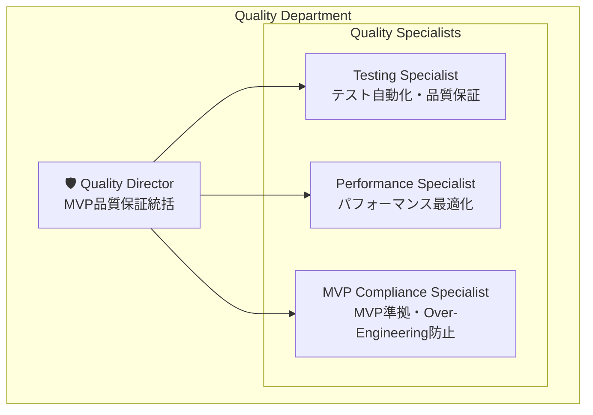
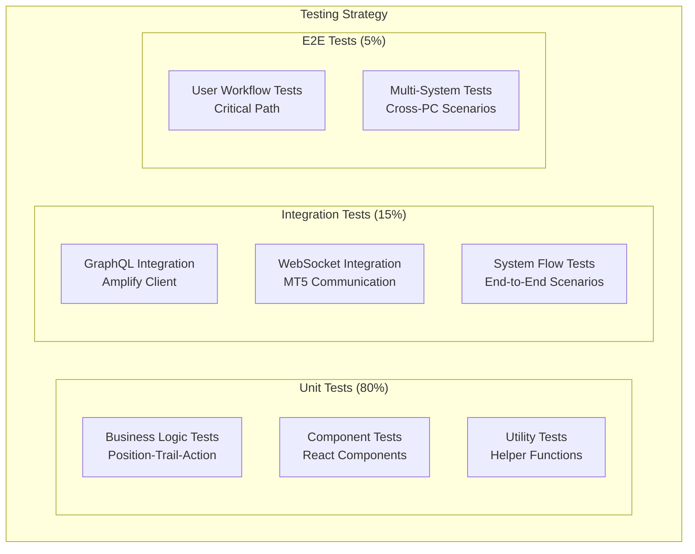
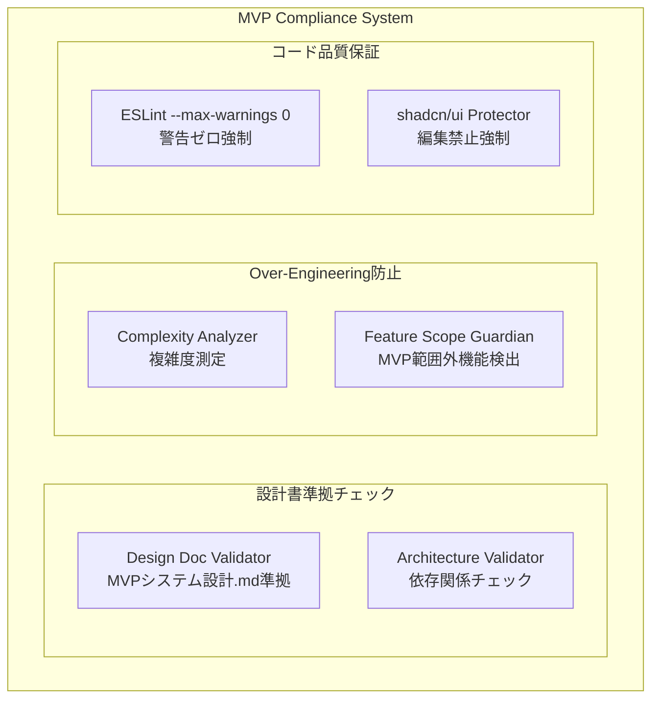

# Quality Department Architecture - Compact Edition

## 1. Department Organization

### 1.1 Quality Department Structure (4人体制)



### 1.2 技術責任分担

| 役割 | 技術領域 | 主要責任 | パフォーマンス目標 |
|------|----------|----------|-------------------|
| **Quality Director** | 品質統括・アーキテクチャ | MVP品質保証統括・Over-Engineering防止・品質基準策定 | システム全体品質調整 |
| **Testing Specialist** | テスト自動化・品質保証 | Vitest + React Testing Library・テストカバレッジ>80%・CI/CD統合 | テスト実行 <30s |
| **Performance Specialist** | パフォーマンス最適化 | Turborepo最適化・GraphQL最適化・ビルド<30s維持 | ビルド <30s, Bundle <2MB |
| **MVP Compliance Specialist** | MVP準拠・設計書チェック | MVPシステム設計.md絶対準拠・ESLint --max-warnings 0・shadcn/ui保護 | 準拠率 >95% |

### 1.3 技術スタック概要

```typescript
interface QualityTechStack {
  testing: {
    framework: 'Vitest';
    componentTesting: 'React Testing Library';
    coverage: '@vitest/coverage-v8';
    targetCoverage: '>80%';
  };
  
  performance: {
    buildOptimization: 'Turborepo';
    bundleAnalyzer: '@next/bundle-analyzer';
    performanceMetrics: 'Web Vitals';
    buildTimeTarget: '<30s';
  };
  
  codeQuality: {
    linter: 'ESLint';
    formatter: 'Prettier';
    typeChecker: 'TypeScript strict mode';
    warningsPolicy: '--max-warnings 0';
  };
  
  mvpCompliance: {
    designDocChecker: 'Custom MVP Validator';
    fileProtection: 'shadcn/ui Protection';
    overEngineeringDetector: 'Complexity Analyzer';
  };
}
```

## 2. Testing Strategy

### 2.1 Testing Architecture (80/15/5構成)



### 2.2 Testing Framework Configuration

```typescript
interface TestingFrameworkConfig {
  vitest: {
    environment: 'jsdom' | 'node';
    coverage: {
      provider: '@vitest/coverage-v8';
      threshold: {
        global: { functions: 80, lines: 80, statements: 80, branches: 80 };
      };
      exclude: ['node_modules/**', 'dist/**', '**/*.d.ts', '**/shadcn-ui/**'];
    };
  };
  
  reactTestingLibrary: {
    setupFiles: ['./test-setup.ts'];
    testEnvironment: 'jsdom';
  };
}
```

### 2.3 Core Testing Priorities

**Position-Trail-Action Business Logic (最重要)**
- Position状態遷移: PENDING→OPENING→OPEN/CANCELED
- userId担当判定ロジック
- Trail Engine: ロング・ショート・トレール発動条件
- Action Sync Engine: GraphQL Subscription処理

**React Component Testing**
- Position Manager: 基本レンダリング・実行ボタン・リアルタイム更新
- Dashboard: システム状態表示・メトリクス表示

**GraphQL Integration Testing**
- Position/Action Subscription
- Mutation (Position作成・更新)
- Error handling & retry logic

## 3. Performance Optimization

### 3.1 Performance Standards (全部門統一)

```typescript
interface UnifiedPerformanceStandards {
  backend: {
    graphqlQueryLatency: '< 100ms';
    subscriptionDelay: '< 50ms';
    mutationResponseTime: '< 200ms';
  };
  
  frontend: {
    componentRenderTime: '< 16ms';
    stateUpdateLatency: '< 5ms';
    bundleSize: '< 2MB';
  };
  
  integration: {
    websocketLatency: '< 20ms';
    mt5ExecutionTime: '< 500ms';
    connectionRecoveryTime: '< 3s';
  };
  
  quality: {
    testExecutionTime: '< 30s';
    validationTime: '< 5s';
    monitoringOverhead: '< 1%';
  };
}
```

### 3.2 Performance Monitoring

**Build Performance**
- Turborepo並列ビルド効率化
- Bundle Size監視・最適化
- Dependency重複検出・削除
- Cache Hit Rate向上

**Runtime Performance**
- Web Vitals監視 (LCP, FID, CLS)
- GraphQL Query最適化
- WebSocket通信効率化
- Memory/CPU使用量監視

**Performance Optimization Process**
1. メトリクス収集・閾値監視
2. ボトルネック特定・分析
3. 最適化実装・検証
4. 継続監視・アラート

## 4. MVP Compliance & Code Quality

### 4.1 MVP Compliance Architecture



### 4.2 MVP Compliance Rules

**設計書準拠**
- MVPシステム設計.md絶対準拠
- Data Model・API仕様・Business Logic一致
- 勝手な機能追加・仕様変更禁止

**Over-Engineering防止**
- 複雑度制限 (Cyclomatic Complexity < 10)
- 不必要な抽象化検出
- MVP範囲外機能検出・排除
- 適切でないデザインパターン検出

**コード品質基準**
- ESLint --max-warnings 0 (警告絶対禁止)
- TypeScript strict mode必須
- Prettier formatting強制
- shadcn/ui編集絶対禁止

### 4.3 Forbidden Modifications Protection

**保護対象**
- shadcn/ui components (編集禁止)
- MVPシステム設計.md (変更検出)
- 核心Business Logicの無断変更

**検出方法**
- File hash comparison
- Git diff analysis  
- Code complexity metrics
- Dependency graph validation

## 5. Cross-Department Validation & Quality Gates

### 5.1 部門間整合性チェック

**Schema Consistency (Backend基準)**
- GraphQLスキーマ統一性
- Frontend UI State Extension
- Integration MT5 State Extension

**Protocol Alignment (Integration基準)**
- WebSocketメッセージフォーマット統一
- Error handling統一
- Performance標準統一

**既知の課題・解決策**
```graphql
# Frontend UI State Extension (Missing in Backend)
type PositionUIState {
  isSelected: Boolean!
  isExpanded: Boolean!
  lastViewedAt: AWSDateTime
}

extend type Position {
  uiState: PositionUIState
}

# Integration MT5 State (Missing in Backend)
enum ConnectionStatus { CONNECTED, DISCONNECTED, CONNECTING, ERROR }

type MT5State {
  connectionStatus: ConnectionStatus!
  lastPriceUpdate: AWSDateTime
  executionLatency: Float
}

extend type Position {
  mt5State: MT5State
}
```

### 5.2 Quality Gates (CI/CD統合)

```typescript
interface QualityGates {
  pre_commit: {
    eslint: 'no warnings allowed';
    prettier: 'formatted required';
    typescript: 'no type errors';
    tests: 'affected tests must pass';
  };
  
  pull_request: {
    full_test_suite: 'all tests must pass';
    performance_check: 'no performance regression';
    compliance_check: 'MVP compliance maintained';
    interdepartment_validation: 'schema consistency verified';
  };
  
  pre_release: {
    e2e_tests: 'critical paths verified';
    performance_benchmarks: 'all metrics within limits';
    security_scan: 'no vulnerabilities';
  };
}
```

### 5.3 Quality Scoring & Alerts

**品質スコア計算**
- Testing: 30% (カバレッジ・パス率)
- Performance: 25% (ビルド時間・Bundle サイズ)
- Compliance: 25% (MVP準拠率)
- Validation: 20% (部門間整合性)

**アラート閾値**
- 品質スコア<80: Critical Alert
- テストカバレッジ<80%: High Alert
- ビルド時間>30s: Medium Alert
- MVP準拠<95%: Critical Alert

### 5.4 Continuous Quality Monitoring

**監視スケジュール**
- 15分間隔: 軽量品質チェック
- 1時間間隔: 完全品質チェック
- 日次: 詳細分析・トレンド分析
- 週次: 部門間整合性チェック

**Quality Dashboard Key Metrics**
- Overall Quality Score
- Test Coverage Trend
- Performance Metrics Trend
- MVP Compliance Rate
- Active Alerts Count
- Improvement Recommendations

## 6. Implementation Priorities

### 6.1 緊急実装項目 (Critical)

1. **GraphQLスキーマ統一** 
   - PositionUIState・MT5State の Backend schema追加
   - 統一StandardErrorフォーマット実装

2. **Testing Framework完全実装**
   - Vitest + React Testing Library設定
   - Position-Trail-Action核心ロジックテスト
   - カバレッジ80%達成

3. **Performance監視システム**
   - Turborepo並列ビルド最適化
   - Web Vitals リアルタイム監視
   - Bundle Size監視・最適化

4. **MVP Compliance自動化**
   - 設計書準拠チェッカー実装
   - Over-Engineering検出器実装
   - shadcn/ui保護システム実装

### 6.2 運用フロー

**日常運用**
1. 開発時: Quality Gates自動チェック
2. PR時: 完全品質チェック実行
3. リリース時: 全項目検証・承認

**品質改善サイクル**
1. メトリクス収集・分析
2. 改善機会特定
3. 改善計画策定・実行  
4. 効果測定・フィードバック

---

この Quality Department Architecture により、**「ultrathink・完璧品質・妥協禁止」** の品質基準が自動的に強制され、MVP要件を満たす高品質システムが継続的に保証されます。

**核心原則**: 
- Testing Strategy (80/15/5) 厳格実行
- Performance基準 (<30s build, <2MB bundle) 絶対遵守
- MVP Compliance (>95%) 妥協なし実現
- 部門間整合性 完全統一