# Quality Department Complete Architecture Documentation

## 1. Department Overview & Organization

### 1.1 Quality Department Structure

```mermaid
graph TB
    subgraph "Quality Department (4人体制)"
        Director[🛡️ Quality Director<br/>MVP品質保証統括]
        
        subgraph "Quality Specialists"
            TestingSpec[Testing Specialist<br/>テスト自動化・品質保証]
            PerformanceSpec[Performance Specialist<br/>パフォーマンス最適化]
            ComplianceSpec[MVP Compliance Specialist<br/>MVP準拠・Over-Engineering防止]
        end
    end
    
    Director --> TestingSpec
    Director --> PerformanceSpec
    Director --> ComplianceSpec
    
    style Director fill:#fff8e1
    style TestingSpec fill:#e8f5e8
    style PerformanceSpec fill:#e1f5fe
    style ComplianceSpec fill:#f3e5f5
```



### 1.2 技術責任分担

| 役割 | 技術領域 | 主要責任 | パフォーマンス目標 |
|------|----------|----------|-------------------|
| **Quality Director** | 品質統括・アーキテクチャ | MVP品質保証統括・Over-Engineering防止・品質基準策定・他部門連携 | システム全体品質調整 |
| **Testing Specialist** | テスト自動化・品質保証 | Vitest + React Testing Library・テストカバレッジ>80%・CI/CD統合 | テスト実行 <30s |
| **Performance Specialist** | パフォーマンス最適化 | Turborepo最適化・GraphQL最適化・ビルド<30s維持・監視システム | ビルド <30s, Bundle <2MB |
| **MVP Compliance Specialist** | MVP準拠・設計書チェック | MVPシステム設計.md絶対準拠・ESLint --max-warnings 0・shadcn/ui保護 | 準拠率 >95% |

### 1.3 Quality技術スタック

```typescript
interface QualityTechStack {
  // テスト自動化基盤
  testing: {
    unitTestFramework: 'Vitest';
    componentTesting: 'React Testing Library';
    e2eFramework: 'Playwright' | 'Cypress';
    coverage: '@vitest/coverage-v8';
    targetCoverage: '>80%';
    mocking: 'Jest Mock + MSW';
  };
  
  // パフォーマンス監視
  performance: {
    bundleAnalyzer: '@next/bundle-analyzer';
    buildOptimization: 'Turborepo';
    performanceMetrics: 'Web Vitals';
    buildTimeTarget: '<30s';
    runtimeMonitoring: 'Performance Observer API';
  };
  
  // コード品質保証
  codeQuality: {
    linter: 'ESLint';
    formatter: 'Prettier';
    typeChecker: 'TypeScript strict mode';
    warningsPolicy: '--max-warnings 0';
    complexity: 'ESLint Complexity Rules';
  };
  
  // MVP準拠チェック
  mvpCompliance: {
    designDocChecker: 'Custom MVP Validator';
    fileProtection: 'shadcn/ui Protection';
    overEngineeringDetector: 'Complexity Analyzer';
    architectureValidator: 'Dependency Graph Analyzer';
    crossDepartmentValidator: 'Interdepartment Consistency Checker';
  };
}
```

## 2. Testing Strategy & Implementation

### 2.1 Testing Architecture


### 2.2 Testing Framework Configuration

```typescript
// Testing Framework統合設定
interface TestingFrameworkConfig {
  vitest: {
    environment: 'jsdom' | 'node';
    coverage: {
      provider: '@vitest/coverage-v8';
      threshold: {
        global: {
          functions: 80;
          lines: 80;
          statements: 80;
          branches: 80;
        };
      };
      exclude: [
        'node_modules/**',
        'dist/**',
        '**/*.d.ts',
        '**/*.test.{ts,tsx}',
        '**/shadcn-ui/**' // shadcn/ui編集禁止のため除外
      ];
    };
  };
  
  reactTestingLibrary: {
    setupFiles: ['./test-setup.ts'];
    testEnvironment: 'jsdom';
    transform: {
      '^.+\\.(ts|tsx)$': 'ts-jest';
    };
  };
}
```

### 2.3 Core Business Logic Testing

```typescript
// Core Business Logic Testing
class CoreBusinessLogicTester {
  // Position実行ロジックテスト
  static positionExecutionTests = {
    // 状態遷移テスト
    'Position状態遷移': {
      'PENDING→OPENING→OPEN': async () => {
        const position = createMockPosition({ status: 'PENDING' });
        const engine = new PositionExecutionEngine(mockClient, 'user-123', mockWS);
        
        await engine.executeTransition(position.id, 'OPENING');
        expect(mockClient.updatePosition).toHaveBeenCalledWith({
          id: position.id,
          status: 'OPENING'
        });
        
        // EA成功レスポンスシミュレート
        mockWS.simulateEAResponse(position.id, {
          status: 'SUCCESS',
          mtTicket: '12345678',
          price: 150.5
        });
        
        await waitFor(() => {
          expect(mockClient.updatePosition).toHaveBeenCalledWith({
            id: position.id,
            status: 'OPEN',
            entryPrice: 150.5,
            mtTicket: '12345678'
          });
        });
      },
      
      'OPENING→CANCELED (失敗時)': async () => {
        const position = createMockPosition({ status: 'PENDING' });
        const engine = new PositionExecutionEngine(mockClient, 'user-123', mockWS);
        
        await engine.executeTransition(position.id, 'OPENING');
        
        // EA失敗レスポンスシミュレート
        mockWS.simulateEAResponse(position.id, {
          status: 'FAILED',
          error: 'Insufficient margin'
        });
        
        await waitFor(() => {
          expect(mockClient.updatePosition).toHaveBeenCalledWith({
            id: position.id,
            status: 'CANCELED',
            exitReason: expect.stringContaining('Insufficient margin')
          });
        });
      }
    },
    
    // userId担当判定テスト
    'userId担当判定': {
      '自分の担当': () => {
        const engine = new PositionExecutionEngine(mockClient, 'user-123', mockWS);
        expect(engine.isMyResponsibility('user-123', 'user-123')).toBe(true);
      },
      
      '他人の担当': () => {
        const engine = new PositionExecutionEngine(mockClient, 'user-123', mockWS);
        expect(engine.isMyResponsibility('user-456', 'user-123')).toBe(false);
      }
    }
  };
  
  // Trail Engine テスト
  static trailEngineTests = {
    'トレール条件判定': {
      'ロング・トレール発動': () => {
        const monitor = new PositionMonitor(
          createMockPosition({ 
            executionType: 'ENTRY',
            trailWidth: 50,
            entryPrice: 150.0
          }),
          mockConfig
        );
        
        // 価格上昇後下落シミュレート
        monitor.updatePrice({ symbol: 'USDJPY', price: 151.0 }); // +100pips
        monitor.updatePrice({ symbol: 'USDJPY', price: 150.4 }); // -60pips下落
        
        expect(mockTrailCallback).toHaveBeenCalledWith(expect.any(String));
      },
      
      'ショート・トレール発動': () => {
        const monitor = new PositionMonitor(
          createMockPosition({ 
            executionType: 'EXIT',
            trailWidth: 30,
            entryPrice: 150.0
          }),
          mockConfig
        );
        
        // 価格下落後上昇シミュレート
        monitor.updatePrice({ symbol: 'USDJPY', price: 149.5 }); // -50pips
        monitor.updatePrice({ symbol: 'USDJPY', price: 149.9 }); // +40pips上昇
        
        expect(mockTrailCallback).toHaveBeenCalledWith(expect.any(String));
      }
    }
  };
}
```

### 2.4 Component Testing

```typescript
// Component Testing (React Testing Library)
class ComponentTester {
  // Position管理コンポーネントテスト
  static positionManagerTests = {
    '基本レンダリング': () => {
      const mockPositions = [
        createMockPosition({ id: 'pos-1', symbol: 'USDJPY', status: 'OPEN' }),
        createMockPosition({ id: 'pos-2', symbol: 'EURUSD', status: 'PENDING' })
      ];
      
      render(
        <PositionManager 
          positions={mockPositions} 
          userId="user-123"
          onExecute={mockExecuteHandler}
        />
      );
      
      expect(screen.getByText('Position Management')).toBeInTheDocument();
      expect(screen.getByText('USDJPY')).toBeInTheDocument();
      expect(screen.getByText('EURUSD')).toBeInTheDocument();
    },
    
    'Position実行': async () => {
      const mockPositions = [
        createMockPosition({ id: 'pos-1', status: 'PENDING' })
      ];
      
      render(
        <PositionManager 
          positions={mockPositions} 
          userId="user-123"
          onExecute={mockExecuteHandler}
        />
      );
      
      const executeButton = screen.getByText('実行');
      fireEvent.click(executeButton);
      
      await waitFor(() => {
        expect(mockExecuteHandler).toHaveBeenCalledWith('pos-1');
      });
    },
    
    'リアルタイム更新': async () => {
      const { rerender } = render(
        <PositionManager 
          positions={[createMockPosition({ id: 'pos-1', status: 'PENDING' })]} 
          userId="user-123"
          onExecute={mockExecuteHandler}
        />
      );
      
      expect(screen.getByText('PENDING')).toBeInTheDocument();
      
      // Position状態更新
      rerender(
        <PositionManager 
          positions={[createMockPosition({ id: 'pos-1', status: 'OPEN' })]} 
          userId="user-123"
          onExecute={mockExecuteHandler}
        />
      );
      
      expect(screen.getByText('OPEN')).toBeInTheDocument();
      expect(screen.queryByText('PENDING')).not.toBeInTheDocument();
    }
  };
  
  // Dashboard コンポーネントテスト
  static dashboardTests = {
    'システム状態表示': () => {
      const mockMetrics = {
        positionsOpen: 5,
        actionsExecuting: 2,
        trailActive: 3,
        systemStatus: 'HEALTHY'
      };
      
      render(<Dashboard metrics={mockMetrics} userId="user-123" />);
      
      expect(screen.getByText('5')).toBeInTheDocument(); // Open positions
      expect(screen.getByText('2')).toBeInTheDocument(); // Executing actions
      expect(screen.getByText('3')).toBeInTheDocument(); // Active trails
      expect(screen.getByText('HEALTHY')).toBeInTheDocument();
    }
  };
}
```

### 2.5 Integration Testing

```typescript
// GraphQL Integration Testing
class GraphQLIntegrationTester {
  static subscriptionTests = {
    'Position Subscription': async () => {
      const mockSubscription = {
        subscribe: jest.fn().mockReturnValue({
          next: mockHandler,
          error: mockErrorHandler
        })
      };
      
      const client = createMockGraphQLClient();
      client.subscription.mockReturnValue(mockSubscription);
      
      const engine = new ActionSyncEngine(client, 'user-123', mockPositionEngine, mockWS, mockConfig);
      await engine.startActionSync();
      
      expect(client.subscription).toHaveBeenCalledWith({
        subscription: expect.stringContaining('onUpdatePosition'),
        variables: { userId: 'user-123' }
      });
    },
    
    'Action Subscription': async () => {
      // 同様のSubscriptionテスト
    }
  };
  
  static mutationTests = {
    'Position作成': async () => {
      const mockClient = createMockGraphQLClient();
      mockClient.models.Position.create.mockResolvedValue({
        data: createMockPosition({ id: 'pos-123' })
      });
      
      const result = await mockClient.models.Position.create({
        userId: 'user-123',
        accountId: 'acc-456',
        symbol: 'USDJPY',
        volume: 1.0,
        status: 'PENDING',
        trailWidth: 50
      });
      
      expect(result.data.id).toBe('pos-123');
      expect(mockClient.models.Position.create).toHaveBeenCalledWith({
        userId: 'user-123',
        accountId: 'acc-456',
        symbol: 'USDJPY',
        volume: 1.0,
        status: 'PENDING',
        trailWidth: 50
      });
    }
  };
}
```

## 3. Performance Optimization & Monitoring

### 3.1 Performance Monitoring Architecture

```mermaid
graph TB
    subgraph "Performance Monitoring Architecture"
        subgraph "Build Performance"
            BuildAnalyzer[Build Analyzer<br/>Turborepo最適化]
            BundleAnalyzer[Bundle Analyzer<br/>サイズ最適化]
            DepAnalyzer[Dependency Analyzer<br/>重複検出]
        end
        
        subgraph "Runtime Performance"
            WebVitals[Web Vitals<br/>LCP, FID, CLS]
            GraphQLPerf[GraphQL Performance<br/>Query最適化]
            WSPerf[WebSocket Performance<br/>通信最適化]
        end
        
        subgraph "System Performance"
            CPUMonitor[CPU Monitor<br/>処理効率]
            MemoryMonitor[Memory Monitor<br/>メモリ使用量]
            NetworkMonitor[Network Monitor<br/>通信効率]
        end
    end
    
    BuildAnalyzer --> WebVitals
    BundleAnalyzer --> GraphQLPerf
    DepAnalyzer --> WSPerf
    WebVitals --> CPUMonitor
    GraphQLPerf --> MemoryMonitor
    WSPerf --> NetworkMonitor
    
    style BuildAnalyzer fill:#e1f5fe
    style WebVitals fill:#e8f5e8
    style CPUMonitor fill:#fff3e0
```



### 3.2 Performance Specialist Implementation

```typescript
// Performance監視・最適化システム
class PerformanceOptimizer {
  private metrics = new Map<string, PerformanceMetric>();
  private thresholds: PerformanceThresholds;
  
  constructor(thresholds: PerformanceThresholds) {
    this.thresholds = thresholds;
  }
  
  // ビルドパフォーマンス監視
  async monitorBuildPerformance(): Promise<BuildPerformanceReport> {
    const startTime = Date.now();
    
    // Turborepo並列ビルド実行
    const buildResult = await this.executeTurborepoBuild();
    
    const buildTime = Date.now() - startTime;
    const report: BuildPerformanceReport = {
      totalBuildTime: buildTime,
      parallelEfficiency: buildResult.parallelEfficiency,
      cacheHitRate: buildResult.cacheHitRate,
      bundleSizes: await this.analyzeBundleSizes(),
      performance: this.evaluateBuildPerformance(buildTime)
    };
    
    // 閾値チェック
    if (buildTime > this.thresholds.maxBuildTime) {
      console.warn(`Build time exceeded threshold: ${buildTime}ms > ${this.thresholds.maxBuildTime}ms`);
      await this.optimizeBuildPerformance();
    }
    
    return report;
  }
  
  // GraphQLパフォーマンス最適化
  async optimizeGraphQLPerformance(): Promise<GraphQLOptimizationReport> {
    const queryAnalyzer = new GraphQLQueryAnalyzer();
    
    // 複雑なクエリ特定
    const complexQueries = await queryAnalyzer.findComplexQueries();
    
    // N+1問題検出
    const nPlusOneIssues = await queryAnalyzer.detectNPlusOneQueries();
    
    // Subscription最適化
    const subscriptionOptimizations = await this.optimizeSubscriptions();
    
    return {
      complexQueries: complexQueries.map(q => ({
        query: q.name,
        complexity: q.complexity,
        executionTime: q.averageExecutionTime,
        optimization: this.suggestQueryOptimization(q)
      })),
      nPlusOneIssues: nPlusOneIssues.map(issue => ({
        query: issue.query,
        fieldPath: issue.fieldPath,
        solution: this.suggestNPlusOneSolution(issue)
      })),
      subscriptionOptimizations,
      overallImprovement: this.calculateOverallImprovement()
    };
  }
  
  // Real-time Performance監視
  startRealtimeMonitoring(): void {
    // Web Vitals監視
    this.monitorWebVitals();
    
    // メモリ使用量監視
    this.monitorMemoryUsage();
    
    // CPU使用率監視
    this.monitorCPUUsage();
    
    // ネットワーク監視
    this.monitorNetworkPerformance();
  }
  
  private monitorWebVitals(): void {
    // Largest Contentful Paint (LCP)
    new PerformanceObserver((list) => {
      for (const entry of list.getEntries()) {
        if (entry.entryType === 'largest-contentful-paint') {
          const lcp = entry.startTime;
          this.recordMetric('LCP', lcp);
          
          if (lcp > this.thresholds.maxLCP) {
            console.warn(`LCP exceeded threshold: ${lcp}ms`);
            this.optimizeLCP();
          }
        }
      }
    }).observe({ entryTypes: ['largest-contentful-paint'] });
    
    // First Input Delay (FID)
    new PerformanceObserver((list) => {
      for (const entry of list.getEntries()) {
        if (entry.entryType === 'first-input') {
          const fid = entry.processingStart - entry.startTime;
          this.recordMetric('FID', fid);
          
          if (fid > this.thresholds.maxFID) {
            console.warn(`FID exceeded threshold: ${fid}ms`);
            this.optimizeFID();
          }
        }
      }
    }).observe({ entryTypes: ['first-input'] });
    
    // Cumulative Layout Shift (CLS)
    new PerformanceObserver((list) => {
      let clsValue = 0;
      for (const entry of list.getEntries()) {
        if (!entry.hadRecentInput) {
          clsValue += entry.value;
        }
      }
      this.recordMetric('CLS', clsValue);
      
      if (clsValue > this.thresholds.maxCLS) {
        console.warn(`CLS exceeded threshold: ${clsValue}`);
        this.optimizeCLS();
      }
    }).observe({ entryTypes: ['layout-shift'] });
  }
  
  // パフォーマンスレポート生成
  generatePerformanceReport(): PerformanceReport {
    const metrics = Array.from(this.metrics.values());
    
    return {
      timestamp: new Date().toISOString(),
      buildPerformance: {
        averageBuildTime: this.getMetricAverage('BUILD_TIME'),
        cacheHitRate: this.getMetricAverage('CACHE_HIT_RATE'),
        bundleSizes: this.getCurrentBundleSizes()
      },
      runtimePerformance: {
        lcp: this.getMetricAverage('LCP'),
        fid: this.getMetricAverage('FID'),
        cls: this.getMetricAverage('CLS'),
        memoryUsage: this.getMetricAverage('MEMORY_USAGE'),
        cpuUsage: this.getMetricAverage('CPU_USAGE')
      },
      graphqlPerformance: {
        queryLatency: this.getMetricAverage('GRAPHQL_QUERY_TIME'),
        subscriptionLatency: this.getMetricAverage('SUBSCRIPTION_LATENCY'),
        mutationLatency: this.getMetricAverage('MUTATION_LATENCY')
      },
      recommendations: this.generateOptimizationRecommendations(metrics)
    };
  }
}
```

### 3.3 Unified Performance Standards

```typescript
// 全部門統一パフォーマンス基準
interface UnifiedPerformanceStandards {
  backend: {
    graphqlQueryLatency: '< 100ms';
    subscriptionDelay: '< 50ms';
    mutationResponseTime: '< 200ms';
    dynamodbReadLatency: '< 10ms';
  };
  
  frontend: {
    componentRenderTime: '< 16ms';
    stateUpdateLatency: '< 5ms';
    uiResponseTime: '< 100ms';
    bundleSize: '< 2MB';
  };
  
  integration: {
    websocketLatency: '< 20ms';
    mt5ExecutionTime: '< 500ms';
    priceUpdateFrequency: '> 10Hz';
    connectionRecoveryTime: '< 3s';
  };
  
  pta: {
    positionExecutionTime: '< 1s';
    trailEvaluationTime: '< 100ms';
    actionSyncLatency: '< 200ms';
    businessLogicExecution: '< 50ms';
  };
  
  quality: {
    testExecutionTime: '< 30s';
    validationTime: '< 5s';
    reportGenerationTime: '< 10s';
    monitoringOverhead: '< 1%';
  };
}
```

## 4. MVP Compliance & Code Quality

### 4.1 MVP Compliance Check Architecture

```mermaid
graph TB
    subgraph "MVP Compliance Architecture"
        subgraph "設計書準拠チェック"
            DocValidator[Design Doc Validator<br/>MVPシステム設計.md準拠]
            ArchValidator[Architecture Validator<br/>依存関係チェック]
            APIValidator[API Validator<br/>GraphQL Schema準拠]
        end
        
        subgraph "Over-Engineering防止"
            ComplexityAnalyzer[Complexity Analyzer<br/>複雑度測定]
            PatternDetector[Anti-Pattern Detector<br/>不適切パターン検出]
            FeatureScope[Feature Scope Guardian<br/>MVP範囲外機能検出]
        end
        
        subgraph "コード品質保証"
            ESLintEnforcer[ESLint --max-warnings 0<br/>警告ゼロ強制]
            TypeScriptStrict[TypeScript Strict<br/>型安全性強制]
            ShadcnProtector[shadcn/ui Protector<br/>編集禁止強制]
        end
    end
    
    DocValidator --> ComplexityAnalyzer
    ArchValidator --> PatternDetector
    APIValidator --> FeatureScope
    ComplexityAnalyzer --> ESLintEnforcer
    PatternDetector --> TypeScriptStrict
    FeatureScope --> ShadcnProtector
    
    style DocValidator fill:#fff8e1
    style ComplexityAnalyzer fill:#ffebee
    style ESLintEnforcer fill:#e8f5e8
```



### 4.2 MVP Compliance Specialist Implementation

```typescript
// MVP準拠チェックシステム
class MVPComplianceChecker {
  private designDocPath: string;
  private codebaseConfig: CodebaseConfig;
  private violations: ComplianceViolation[] = [];
  
  constructor(designDocPath: string, config: CodebaseConfig) {
    this.designDocPath = designDocPath;
    this.codebaseConfig = config;
  }
  
  // 全体的な準拠チェック実行
  async runFullComplianceCheck(): Promise<ComplianceReport> {
    console.log('Running full MVP compliance check...');
    
    const checks = await Promise.allSettled([
      this.checkDesignDocCompliance(),
      this.checkArchitectureCompliance(),
      this.checkOverEngineeringViolations(),
      this.checkCodeQualityStandards(),
      this.checkForbiddenModifications()
    ]);
    
    const report: ComplianceReport = {
      timestamp: new Date().toISOString(),
      overallStatus: this.calculateOverallStatus(),
      designDocCompliance: this.extractResult(checks[0]),
      architectureCompliance: this.extractResult(checks[1]),
      overEngineeringCheck: this.extractResult(checks[2]),
      codeQuality: this.extractResult(checks[3]),
      forbiddenModifications: this.extractResult(checks[4]),
      violations: this.violations,
      recommendations: this.generateRecommendations()
    };
    
    return report;
  }
  
  // 設計書準拠チェック
  private async checkDesignDocCompliance(): Promise<DesignDocComplianceResult> {
    const designDoc = await this.parseDesignDocument();
    const codebase = await this.analyzeCodebase();
    
    const results: DesignDocComplianceResult = {
      dataModelCompliance: await this.checkDataModelCompliance(designDoc, codebase),
      apiSpecCompliance: await this.checkAPISpecCompliance(designDoc, codebase),
      businessLogicCompliance: await this.checkBusinessLogicCompliance(designDoc, codebase),
      complianceScore: 0 // 計算される
    };
    
    results.complianceScore = this.calculateComplianceScore(results);
    
    return results;
  }
  
  // Over-Engineering検出
  private async checkOverEngineeringViolations(): Promise<OverEngineeringResult> {
    const violations: OverEngineeringViolation[] = [];
    
    // 複雑度チェック
    const complexityViolations = await this.checkCodeComplexity();
    violations.push(...complexityViolations);
    
    // 不必要な抽象化チェック
    const abstractionViolations = await this.checkUnnecessaryAbstraction();
    violations.push(...abstractionViolations);
    
    // MVP範囲外機能チェック
    const scopeViolations = await this.checkOutOfScopeFeatures();
    violations.push(...scopeViolations);
    
    // 不適切なデザインパターンチェック
    const patternViolations = await this.checkInappropriatePatterns();
    violations.push(...patternViolations);
    
    return {
      violations,
      overallRisk: this.calculateOverEngineeringRisk(violations),
      recommendations: this.generateOverEngineeringRecommendations(violations)
    };
  }
  
  // コード品質基準チェック
  private async checkCodeQualityStandards(): Promise<CodeQualityResult> {
    const results: CodeQualityResult = {
      eslintCompliance: await this.checkESLintCompliance(),
      typescriptCompliance: await this.checkTypeScriptCompliance(),
      prettierCompliance: await this.checkPrettierCompliance(),
      testCoverage: await this.checkTestCoverage(),
      overallScore: 0
    };
    
    results.overallScore = this.calculateQualityScore(results);
    
    return results;
  }
  
  // ESLint準拠チェック
  private async checkESLintCompliance(): Promise<ESLintComplianceResult> {
    const eslint = new ESLint({ baseConfig: this.codebaseConfig.eslintConfig });
    const results = await eslint.lintFiles(['src/**/*.{ts,tsx}', 'packages/**/*.{ts,tsx}']);
    
    const warnings = results.reduce((sum, r) => sum + r.warningCount, 0);
    const errors = results.reduce((sum, r) => sum + r.errorCount, 0);
    
    return {
      totalWarnings: warnings,
      totalErrors: errors,
      isCompliant: warnings === 0 && errors === 0,
      violatingFiles: results.filter(r => r.warningCount > 0 || r.errorCount > 0).map(r => r.filePath)
    };
  }
  
  // TypeScript strict mode チェック
  private async checkTypeScriptCompliance(): Promise<TypeScriptComplianceResult> {
    const tsConfig = await this.loadTypeScriptConfig();
    const compiler = typescript.createProgram(['src/**/*.ts', 'packages/**/*.ts'], tsConfig);
    const diagnostics = typescript.getPreEmitDiagnostics(compiler);
    
    const errors = diagnostics.filter(d => d.category === typescript.DiagnosticCategory.Error);
    const warnings = diagnostics.filter(d => d.category === typescript.DiagnosticCategory.Warning);
    
    return {
      hasStrictMode: tsConfig.compilerOptions?.strict === true,
      typeErrors: errors.length,
      typeWarnings: warnings.length,
      isCompliant: errors.length === 0 && tsConfig.compilerOptions?.strict === true,
      issues: diagnostics.map(d => ({
        file: d.file?.fileName || 'unknown',
        message: typescript.flattenDiagnosticMessageText(d.messageText, '\n'),
        severity: d.category === typescript.DiagnosticCategory.Error ? 'ERROR' : 'WARNING'
      }))
    };
  }
  
  // 禁止編集チェック
  private async checkForbiddenModifications(): Promise<ForbiddenModificationResult> {
    const violations: ForbiddenModification[] = [];
    
    // shadcn/ui コンポーネント編集チェック
    const shadcnFiles = await this.findShadcnFiles();
    for (const file of shadcnFiles) {
      const isModified = await this.checkIfFileModified(file, this.codebaseConfig.shadcnOriginalHashes);
      if (isModified) {
        violations.push({
          type: 'SHADCN_MODIFICATION',
          file: file.path,
          description: 'shadcn/ui component has been modified',
          severity: 'HIGH',
          originalHash: this.codebaseConfig.shadcnOriginalHashes[file.path],
          currentHash: await this.calculateFileHash(file.path)
        });
      }
    }
    
    // MVPシステム設計.md編集チェック
    const designDocModified = await this.checkIfFileModified(
      { path: this.designDocPath }, 
      this.codebaseConfig.designDocHash
    );
    
    if (designDocModified) {
      violations.push({
        type: 'DESIGN_DOC_MODIFICATION',
        file: this.designDocPath,
        description: 'MVPシステム設計.md has been modified',
        severity: 'CRITICAL'
      });
    }
    
    return {
      violations,
      isCompliant: violations.length === 0,
      criticalViolations: violations.filter(v => v.severity === 'CRITICAL').length,
      recommendations: this.generateProtectionRecommendations(violations)
    };
  }
}
```

## 5. Cross-Department Validation System

### 5.1 Interdepartment Consistency Validation

```typescript
// 部門間整合性チェック自動化
class InterdepartmentValidator {
  private departments: DepartmentConfig[];
  private validationResults: ValidationResult[] = [];
  
  constructor(departments: DepartmentConfig[]) {
    this.departments = departments;
  }
  
  // 全部門整合性チェック実行
  async runFullInterdepartmentValidation(): Promise<InterdepartmentValidationReport> {
    console.log('Running full interdepartment validation...');
    
    const validationChecks = await Promise.allSettled([
      this.validateSchemaConsistency(),
      this.validateProtocolAlignment(),
      this.validatePerformanceStandards(),
      this.validateErrorHandlingConsistency(),
      this.validateDataFlowIntegrity(),
      this.validateMVPCompliance()
    ]);
    
    const report: InterdepartmentValidationReport = {
      timestamp: new Date().toISOString(),
      overallStatus: this.calculateOverallValidationStatus(validationChecks),
      schemaConsistency: this.extractValidationResult(validationChecks[0]),
      protocolAlignment: this.extractValidationResult(validationChecks[1]),
      performanceStandards: this.extractValidationResult(validationChecks[2]),
      errorHandling: this.extractValidationResult(validationChecks[3]),
      dataFlowIntegrity: this.extractValidationResult(validationChecks[4]),
      mvpCompliance: this.extractValidationResult(validationChecks[5]),
      criticalIssues: this.extractCriticalIssues(),
      recommendations: this.generateInterdepartmentRecommendations()
    };
    
    return report;
  }
  
  // GraphQLスキーマの部門間整合性チェック
  async validateSchemaConsistency(): Promise<ValidationResult> {
    const issues: ValidationIssue[] = [];
    
    // Backend部門のスキーマを基準とする
    const backendSchema = await this.loadBackendSchema();
    
    // Frontend部門のUI State Extension確認
    const frontendExtensions = await this.loadFrontendExtensions();
    for (const extension of frontendExtensions) {
      if (!this.isExtensionInSchema(extension, backendSchema)) {
        issues.push({
          type: 'MISSING_EXTENSION',
          severity: 'HIGH',
          description: `Frontend extension ${extension.name} not found in Backend schema`,
          affectedDepartments: ['backend', 'frontend'],
          recommendation: `Add ${extension.name} to Backend GraphQL schema`
        });
      }
    }
    
    // Integration部門のMT5 State確認
    const integrationExtensions = await this.loadIntegrationExtensions();
    for (const extension of integrationExtensions) {
      if (!this.isExtensionInSchema(extension, backendSchema)) {
        issues.push({
          type: 'MISSING_EXTENSION',
          severity: 'HIGH',
          description: `Integration extension ${extension.name} not found in Backend schema`,
          affectedDepartments: ['backend', 'integration'],
          recommendation: `Add ${extension.name} to Backend GraphQL schema`
        });
      }
    }
    
    return {
      category: 'SCHEMA_CONSISTENCY',
      status: issues.length === 0 ? 'COMPLIANT' : 'NON_COMPLIANT',
      issues,
      compliancePercentage: this.calculateCompliancePercentage(issues)
    };
  }
  
  // WebSocketプロトコルの一貫性チェック
  async validateProtocolAlignment(): Promise<ValidationResult> {
    const issues: ValidationIssue[] = [];
    
    // 各部門のWebSocketプロトコル実装を確認
    const protocolImplementations = await this.loadProtocolImplementations();
    
    // メッセージフォーマット統一性確認
    const baseFormat = protocolImplementations.find(p => p.department === 'integration')?.messageFormat;
    if (!baseFormat) {
      issues.push({
        type: 'MISSING_BASE_PROTOCOL',
        severity: 'CRITICAL',
        description: 'Base WebSocket protocol format not found',
        affectedDepartments: ['all'],
        recommendation: 'Define unified WebSocket message format'
      });
    } else {
      for (const impl of protocolImplementations) {
        if (!this.isProtocolFormatCompatible(impl.messageFormat, baseFormat)) {
          issues.push({
            type: 'PROTOCOL_MISMATCH',
            severity: 'MEDIUM',
            description: `${impl.department} protocol format doesn't match base format`,
            affectedDepartments: ['integration', impl.department],
            recommendation: `Align ${impl.department} protocol with base format`
          });
        }
      }
    }
    
    return {
      category: 'PROTOCOL_ALIGNMENT',
      status: issues.length === 0 ? 'COMPLIANT' : 'NON_COMPLIANT',
      issues,
      compliancePercentage: this.calculateCompliancePercentage(issues)
    };
  }
  
  // パフォーマンス基準統一性確認
  async validatePerformanceStandards(): Promise<ValidationResult> {
    const issues: ValidationIssue[] = [];
    
    const departmentStandards = await this.loadDepartmentPerformanceStandards();
    const unifiedStandards = this.getUnifiedPerformanceStandards();
    
    for (const [department, standards] of departmentStandards) {
      const misalignedMetrics = this.findMisalignedMetrics(standards, unifiedStandards[department]);
      
      for (const metric of misalignedMetrics) {
        issues.push({
          type: 'PERFORMANCE_STANDARD_MISMATCH',
          severity: 'MEDIUM',
          description: `${department} ${metric.name}: ${metric.current} doesn't match unified standard: ${metric.expected}`,
          affectedDepartments: [department],
          recommendation: `Update ${department} performance standard for ${metric.name} to ${metric.expected}`
        });
      }
    }
    
    return {
      category: 'PERFORMANCE_STANDARDS',
      status: issues.length === 0 ? 'COMPLIANT' : 'NON_COMPLIANT',
      issues,
      compliancePercentage: this.calculateCompliancePercentage(issues)
    };
  }
}
```

### 5.2 Cross-Department Validation Results

```typescript
// 検証結果データ構造
interface InterdepartmentValidationReport {
  timestamp: string;
  overallStatus: 'COMPLIANT' | 'WARNING' | 'NON_COMPLIANT' | 'CRITICAL';
  schemaConsistency: ValidationResult;
  protocolAlignment: ValidationResult;
  performanceStandards: ValidationResult;
  errorHandling: ValidationResult;
  dataFlowIntegrity: ValidationResult;
  mvpCompliance: ValidationResult;
  criticalIssues: ValidationIssue[];
  recommendations: string[];
}

interface ValidationResult {
  category: string;
  status: 'COMPLIANT' | 'NON_COMPLIANT';
  issues: ValidationIssue[];
  compliancePercentage: number;
}

interface ValidationIssue {
  type: string;
  severity: 'CRITICAL' | 'HIGH' | 'MEDIUM' | 'LOW';
  description: string;
  affectedDepartments: string[];
  recommendation: string;
}
```

### 5.3 Identified Issues & Resolutions

#### 5.3.1 GraphQL Schema Consistency Issues

**Issue 1: Frontend UI State Extension Missing**
```graphql
# Current: Mentioned in Frontend docs but missing from Backend schema
extend type Position {
  uiState: PositionUIState  # Missing in Backend
}

type PositionUIState {
  isSelected: Boolean!
  isExpanded: Boolean!
  lastViewedAt: AWSDateTime
}

# Resolution: Add to Backend schema.graphql
type PositionUIState {
  isSelected: Boolean!
  isExpanded: Boolean!
  lastViewedAt: AWSDateTime
}

extend type Position {
  uiState: PositionUIState
}
```

**Issue 2: Integration MT5 State Missing**
```graphql
# Current: Integration docs define MT5State but Backend schema missing
extend type Position {
  mt5State: MT5State  # Missing in Backend
}

type MT5State {
  connectionStatus: ConnectionStatus!
  lastPriceUpdate: AWSDateTime
  executionLatency: Float
}

# Resolution: Add to Backend schema
enum ConnectionStatus {
  CONNECTED
  DISCONNECTED
  CONNECTING
  ERROR
}

type MT5State {
  connectionStatus: ConnectionStatus!
  lastPriceUpdate: AWSDateTime
  executionLatency: Float
}

extend type Position {
  mt5State: MT5State
}
```

#### 5.3.2 Error Handling Standardization

```typescript
// Current: Inconsistent error handling across departments
// Resolution: Unified StandardError implementation

// All departments should use this format
interface StandardError {
  id: string;
  category: ErrorCategory;
  code: string; // BE-001, FE-001, IN-001, PTA-001, QA-001 format
  message: string;
  details?: any;
  timestamp: string;
  source: DepartmentType;
  userId?: string;
  requestId?: string;
  stackTrace?: string;
}

// Department-specific error conversion examples
// Frontend
const convertToStandardError = (error: Error): StandardError => ({
  id: crypto.randomUUID(),
  category: ErrorCategory.SYSTEM,
  code: 'FE-001',
  message: error.message,
  timestamp: new Date().toISOString(),
  source: DepartmentType.FRONTEND,
  userId: getCurrentUserId(),
  stackTrace: error.stack
});

// Integration
const convertMT5Error = (mt5Error: MT5Error): StandardError => ({
  id: crypto.randomUUID(),
  category: ErrorCategory.INTEGRATION,
  code: 'IN-001',
  message: `MT5 Error: ${mt5Error.description}`,
  timestamp: new Date().toISOString(),
  source: DepartmentType.INTEGRATION,
  details: { mt5ErrorCode: mt5Error.code }
});
```

## 6. Quality Department Integration System

### 6.1 Quality Department System

```typescript
// Quality部門統合システム
class QualityDepartmentSystem {
  private testingSpecialist: TestingSpecialist;
  private performanceSpecialist: PerformanceOptimizer;
  private complianceSpecialist: MVPComplianceChecker;
  private validationSpecialist: InterdepartmentValidator;
  private qualityMetrics: QualityMetricsCollector;
  
  constructor(config: QualitySystemConfig) {
    this.testingSpecialist = new TestingSpecialist(config.testing);
    this.performanceSpecialist = new PerformanceOptimizer(config.performance);
    this.complianceSpecialist = new MVPComplianceChecker(config.designDocPath, config.codebase);
    this.validationSpecialist = new InterdepartmentValidator(config.departments);
    this.qualityMetrics = new QualityMetricsCollector();
  }
  
  // Quality部門システム初期化
  async initialize(): Promise<void> {
    console.log('Quality Department System: Starting initialization...');
    
    try {
      // 1. テスト環境設定
      await this.setupTestingEnvironment();
      
      // 2. パフォーマンス監視開始
      await this.startPerformanceMonitoring();
      
      // 3. 準拠チェック開始
      await this.startComplianceMonitoring();
      
      // 4. 部門間整合性チェック開始
      await this.startInterdepartmentValidation();
      
      // 5. 品質メトリクス収集開始
      await this.startQualityMetricsCollection();
      
      console.log('Quality Department System: Initialization completed');
      
    } catch (error) {
      console.error('Quality Department System initialization error:', error);
      throw error;
    }
  }
  
  // 全品質チェック実行
  async runFullQualityCheck(): Promise<QualityReport> {
    console.log('Running comprehensive quality check...');
    
    const [
      testResults, 
      performanceResults, 
      complianceResults, 
      validationResults
    ] = await Promise.allSettled([
      this.testingSpecialist.runAllTests(),
      this.performanceSpecialist.generatePerformanceReport(),
      this.complianceSpecialist.runFullComplianceCheck(),
      this.validationSpecialist.runFullInterdepartmentValidation()
    ]);
    
    const report: QualityReport = {
      timestamp: new Date().toISOString(),
      overallQuality: this.calculateOverallQuality(testResults, performanceResults, complianceResults, validationResults),
      testing: this.extractTestResults(testResults),
      performance: this.extractPerformanceResults(performanceResults),
      compliance: this.extractComplianceResults(complianceResults),
      validation: this.extractValidationResults(validationResults),
      recommendations: this.generateQualityRecommendations(testResults, performanceResults, complianceResults, validationResults),
      qualityScore: 0 // 計算される
    };
    
    report.qualityScore = this.calculateQualityScore(report);
    
    // 品質アラートチェック
    if (report.qualityScore < 80) {
      await this.triggerQualityAlert(report);
    }
    
    return report;
  }
  
  // 継続的品質監視
  startContinuousQualityMonitoring(): void {
    // 15分間隔で軽量品質チェック
    setInterval(async () => {
      try {
        await this.runLightweightQualityCheck();
      } catch (error) {
        console.error('Continuous quality check error:', error);
      }
    }, 900000); // 15分
    
    // 1時間間隔で完全品質チェック
    setInterval(async () => {
      try {
        const report = await this.runFullQualityCheck();
        console.log('Hourly Quality Report:', report);
      } catch (error) {
        console.error('Hourly quality check error:', error);
      }
    }, 3600000); // 1時間
    
    // 日次で詳細分析
    setInterval(async () => {
      try {
        await this.runDailyQualityAnalysis();
      } catch (error) {
        console.error('Daily quality analysis error:', error);
      }
    }, 86400000); // 24時間
    
    // 週次で部門間整合性チェック
    setInterval(async () => {
      try {
        await this.runWeeklyInterdepartmentValidation();
      } catch (error) {
        console.error('Weekly interdepartment validation error:', error);
      }
    }, 604800000); // 7日
  }
  
  // 品質スコア計算
  private calculateQualityScore(report: QualityReport): number {
    const weights = {
      testing: 0.3,        // 30% - テスト
      performance: 0.25,   // 25% - パフォーマンス
      compliance: 0.25,    // 25% - MVP準拠
      validation: 0.2      // 20% - 部門間整合性
    };
    
    const testingScore = this.calculateTestingScore(report.testing);
    const performanceScore = this.calculatePerformanceScore(report.performance);
    const complianceScore = this.calculateComplianceScore(report.compliance);
    const validationScore = this.calculateValidationScore(report.validation);
    
    const weightedScore = 
      (testingScore * weights.testing) +
      (performanceScore * weights.performance) +
      (complianceScore * weights.compliance) +
      (validationScore * weights.validation);
    
    return Math.round(weightedScore * 100) / 100;
  }
  
  // 品質レポート生成
  generateQualityReportSummary(report: QualityReport): string {
    return `
Quality Report Summary (${report.timestamp}):
=====================================
Overall Quality Score: ${report.qualityScore}/100

Testing: ${report.testing.coveragePercentage}% coverage, ${report.testing.passRate}% pass rate
Performance: Build ${report.performance.buildTime}ms, Bundle ${report.performance.bundleSize}KB
Compliance: ${report.compliance.compliancePercentage}% MVP compliant
Validation: ${report.validation.overallStatus} interdepartment consistency

Top Recommendations:
${report.recommendations.slice(0, 3).map((r, i) => `${i + 1}. ${r}`).join('\n')}

Status: ${report.overallQuality}
`;
  }
}
```

## 7. Testing Strategy by Department

### 7.1 Quality Department Testing Responsibilities

```typescript
interface QualityTestingResponsibilities {
  unitTests: {
    scope: 'Testing Utilities, Validators';
    coverage: '85%';
    tools: 'Vitest + Custom Testing Framework';
  };
  
  integrationTests: {
    scope: 'Cross-Department Testing';
    coverage: '75%';
    tools: 'Custom Integration Test Suite';
  };
  
  systemTests: {
    scope: 'Full System Validation';
    coverage: '80%';
    tools: 'E2E Testing Framework + Quality Metrics';
  };
}
```

### 7.2 Test Utilities & Helpers

```typescript
// Test Utilities & Helpers
class TestUtilities {
  // Mock データ生成
  static createMockPosition(overrides: Partial<Position> = {}): Position {
    return {
      id: 'mock-position-id',
      userId: 'user-123',
      accountId: 'acc-456',
      executionType: 'ENTRY',
      status: 'PENDING',
      symbol: 'USDJPY',
      volume: 1.0,
      entryPrice: null,
      entryTime: null,
      exitPrice: null,
      exitTime: null,
      exitReason: null,
      trailWidth: 0,
      triggerActionIds: null,
      mtTicket: null,
      memo: '',
      createdAt: new Date().toISOString(),
      updatedAt: new Date().toISOString(),
      ...overrides
    };
  }
  
  static createMockAction(overrides: Partial<Action> = {}): Action {
    return {
      id: 'mock-action-id',
      userId: 'user-123',
      accountId: 'acc-456',
      positionId: 'pos-789',
      triggerPositionId: null,
      type: 'ENTRY',
      status: 'PENDING',
      createdAt: new Date().toISOString(),
      updatedAt: new Date().toISOString(),
      ...overrides
    };
  }
  
  // WebSocket Mock
  static createMockWebSocketManager(): MockWebSocketManager {
    return {
      sendToEA: jest.fn(),
      onMessage: jest.fn(),
      simulateEAResponse: jest.fn(),
      simulatePriceUpdate: jest.fn()
    };
  }
  
  // GraphQL Client Mock
  static createMockGraphQLClient(): MockGraphQLClient {
    return {
      models: {
        Position: {
          create: jest.fn(),
          update: jest.fn(),
          get: jest.fn(),
          list: jest.fn(),
          delete: jest.fn()
        },
        Action: {
          create: jest.fn(),
          update: jest.fn(),
          get: jest.fn(),
          list: jest.fn(),
          delete: jest.fn()
        }
      },
      subscription: jest.fn(),
      query: jest.fn(),
      mutate: jest.fn()
    };
  }
}
```

## 8. Quality Gates & CI/CD Integration

### 8.1 Quality Gates Configuration

```typescript
// 品質ゲート設定
interface QualityGates {
  pre_commit: {
    eslint: 'no warnings allowed';
    prettier: 'formatted required';
    typescript: 'no type errors';
    tests: 'affected tests must pass';
  };
  
  pre_push: {
    unit_tests: 'all tests must pass';
    coverage: 'minimum 80%';
    build: 'successful build required';
  };
  
  pull_request: {
    full_test_suite: 'all tests must pass';
    performance_check: 'no performance regression';
    compliance_check: 'MVP compliance maintained';
    interdepartment_validation: 'schema consistency verified';
  };
  
  pre_release: {
    e2e_tests: 'critical paths verified';
    performance_benchmarks: 'all metrics within limits';
    security_scan: 'no vulnerabilities';
    documentation_updated: 'docs reflect changes';
  };
}
```

### 8.2 Automated Quality Enforcement

```typescript
// CI/CDパイプライン品質チェック自動化
class QualityPipelineIntegration {
  async runPreCommitChecks(): Promise<QualityCheckResult> {
    const checks = await Promise.allSettled([
      this.runESLintCheck(),
      this.runPrettierCheck(),
      this.runTypeScriptCheck(),
      this.runAffectedTests()
    ]);
    
    return this.consolidateResults(checks, 'PRE_COMMIT');
  }
  
  async runPullRequestChecks(): Promise<QualityCheckResult> {
    const checks = await Promise.allSettled([
      this.runFullTestSuite(),
      this.runPerformanceCheck(),
      this.runComplianceCheck(),
      this.runInterdepartmentValidation()
    ]);
    
    return this.consolidateResults(checks, 'PULL_REQUEST');
  }
  
  async runPreReleaseChecks(): Promise<QualityCheckResult> {
    const checks = await Promise.allSettled([
      this.runE2ETests(),
      this.runPerformanceBenchmarks(),
      this.runSecurityScan(),
      this.validateDocumentation()
    ]);
    
    return this.consolidateResults(checks, 'PRE_RELEASE');
  }
}
```

## 9. Operations & Monitoring

### 9.1 Quality Metrics & Alerts

```typescript
// 品質メトリクス・アラートシステム
class QualityAlertsSystem {
  private alertThresholds: QualityAlertThresholds;
  
  constructor(thresholds: QualityAlertThresholds) {
    this.alertThresholds = thresholds;
  }
  
  // 品質アラート監視
  async monitorQualityAlerts(): Promise<void> {
    const currentMetrics = await this.collectCurrentMetrics();
    
    // テストカバレッジアラート
    if (currentMetrics.testCoverage < this.alertThresholds.minTestCoverage) {
      await this.triggerAlert({
        type: 'TEST_COVERAGE_LOW',
        severity: 'HIGH',
        message: `Test coverage dropped to ${currentMetrics.testCoverage}%`,
        threshold: this.alertThresholds.minTestCoverage,
        current: currentMetrics.testCoverage
      });
    }
    
    // パフォーマンス劣化アラート
    if (currentMetrics.buildTime > this.alertThresholds.maxBuildTime) {
      await this.triggerAlert({
        type: 'BUILD_TIME_EXCEEDED',
        severity: 'MEDIUM',
        message: `Build time exceeded ${this.alertThresholds.maxBuildTime}ms`,
        threshold: this.alertThresholds.maxBuildTime,
        current: currentMetrics.buildTime
      });
    }
    
    // MVP準拠率アラート
    if (currentMetrics.mvpCompliance < this.alertThresholds.minMVPCompliance) {
      await this.triggerAlert({
        type: 'MVP_COMPLIANCE_LOW',
        severity: 'CRITICAL',
        message: `MVP compliance dropped to ${currentMetrics.mvpCompliance}%`,
        threshold: this.alertThresholds.minMVPCompliance,
        current: currentMetrics.mvpCompliance
      });
    }
  }
}
```

### 9.2 Quality Dashboard

```typescript
// 品質ダッシュボード
class QualityDashboard {
  async generateDashboardData(): Promise<QualityDashboardData> {
    const [
      testMetrics,
      performanceMetrics,
      complianceMetrics,
      validationMetrics
    ] = await Promise.allSettled([
      this.getTestMetrics(),
      this.getPerformanceMetrics(),
      this.getComplianceMetrics(),
      this.getValidationMetrics()
    ]);
    
    return {
      timestamp: new Date().toISOString(),
      overview: {
        overallScore: await this.calculateOverallQualityScore(),
        status: await this.determineSystemStatus(),
        trending: await this.calculateQualityTrend()
      },
      testing: this.extractTestMetrics(testMetrics),
      performance: this.extractPerformanceMetrics(performanceMetrics),
      compliance: this.extractComplianceMetrics(complianceMetrics),
      validation: this.extractValidationMetrics(validationMetrics),
      alerts: await this.getActiveAlerts(),
      recommendations: await this.generateActionableRecommendations()
    };
  }
}
```

## 10. Continuous Improvement

### 10.1 Quality Improvement Process

```typescript
// 継続的品質改善プロセス
class QualityImprovementEngine {
  async analyzeTrends(): Promise<QualityTrendAnalysis> {
    const historicalData = await this.getHistoricalQualityData();
    
    return {
      testingTrends: this.analyzeTestingTrends(historicalData),
      performanceTrends: this.analyzePerformanceTrends(historicalData),
      complianceTrends: this.analyzeComplianceTrends(historicalData),
      validationTrends: this.analyzeValidationTrends(historicalData),
      improvementOpportunities: this.identifyImprovementOpportunities(historicalData),
      actionPlan: this.generateImprovementActionPlan(historicalData)
    };
  }
  
  async generateImprovementRecommendations(): Promise<ImprovementRecommendation[]> {
    const trends = await this.analyzeTrends();
    const currentState = await this.getCurrentQualityState();
    
    return [
      ...this.generateTestingRecommendations(trends.testingTrends, currentState),
      ...this.generatePerformanceRecommendations(trends.performanceTrends, currentState),
      ...this.generateComplianceRecommendations(trends.complianceTrends, currentState),
      ...this.generateValidationRecommendations(trends.validationTrends, currentState)
    ];
  }
}
```

### 10.2 Quality Training & Knowledge Sharing

```typescript
// 品質ナレッジ共有システム
class QualityKnowledgeSystem {
  async generateBestPracticesGuide(): Promise<BestPracticesGuide> {
    return {
      testing: {
        unitTesting: await this.generateUnitTestingGuide(),
        integrationTesting: await this.generateIntegrationTestingGuide(),
        e2eTesting: await this.generateE2ETestingGuide()
      },
      performance: {
        optimization: await this.generateOptimizationGuide(),
        monitoring: await this.generateMonitoringGuide(),
        profiling: await this.generateProfilingGuide()
      },
      compliance: {
        mvpGuidelines: await this.generateMVPGuidelinesGuide(),
        codeQuality: await this.generateCodeQualityGuide(),
        documentation: await this.generateDocumentationGuide()
      }
    };
  }
}
```

この Quality Department Complete Architecture Documentation により、MVP要件を満たす高品質なシステムの継続的な品質保証が可能になります。テスト自動化、パフォーマンス最適化、MVP準拠チェック、Over-Engineering防止、部門間整合性チェックの統合的なアプローチにより、「ultrathink・完璧品質・妥協禁止」の品質基準が実現されます。