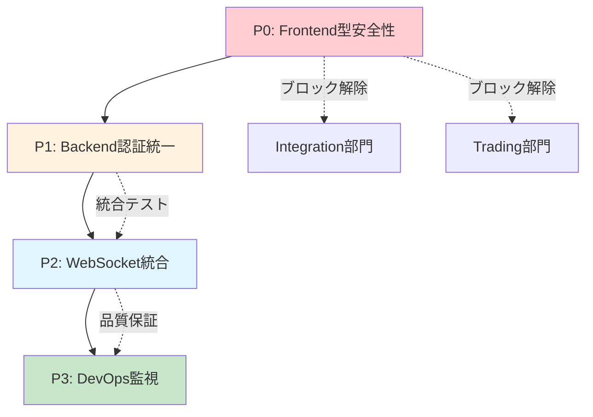

# 🎯 Director Coordinator 緊急タスク実行計画

## 📊 MVPリリース向け統合調整タスク

**作成日時**: 2025-06-27 12:00  
**作成者**: director-coordinator  
**総合実装完了度**: 80% → **95%目標**

---

## 🚨 緊急実行順序

### **Phase 1: 基盤安定化（今週完了必須）**

#### 1. 【P0】Frontend型安全性問題解決
```bash
# 実行コマンド
"tasks/directors/frontend/task-001-typescript-errors.md を緊急実行してください。
TypeScriptエラー25件（admin:11件, hedge-system:14件）を即座に解決。
完了後このタスクファイルに詳細実行結果を記録"
```
**期限**: 2025-06-27 18:00  
**影響**: 全システム統合テスト・本番デプロイのブロック解除

#### 2. 【P1】Backend認証グループ統一
```bash
# 実行コマンド  
"tasks/directors/backend/task-001-auth-groups.md を実行してください。
認証グループ名統一（ADMIN/CLIENT）とパスワードポリシー修正。
Frontend修正完了を待って統合テスト実施"
```
**期限**: 2025-06-28 18:00  
**影響**: 本番デプロイメント・認証フロー安定化

### **Phase 2: 機能統合完成（来週完了）**

#### 3. 【P2】WebSocket-Trading統合
```bash
# 実行コマンド
"tasks/directors/integration/task-001-websocket-integration.md を実行してください。
Integration-Trading部門連携でWebSocket通信完全実装。
trading-directorと連携してMQL5+position-execution.ts統合完成"
```
**期限**: 2025-06-30 18:00  
**影響**: MVP核心機能（リアルタイム取引）実現

### **Phase 3: 品質保証強化（最終段階）**

#### 4. 【P3】DevOps監視強化  
```bash
# 実行コマンド
"tasks/directors/devops/task-001-monitoring-enhancement.md を実行してください。
テストカバレッジ80%監視・パフォーマンス計測・E2Eテスト実装。
Phase1,2完了後の品質保証として実施"
```
**期限**: 2025-07-03 18:00  
**影響**: MVP品質保証・継続的改善基盤

---

## 🔗 部門間連携フロー



---

## 📈 期待される成果

### **Phase 1完了後**
- TypeScriptエラー: 25件 → 0件
- 認証システム: 100%安定化
- **実装完了度**: 80% → **87%**

### **Phase 2完了後**  
- WebSocket通信: 100%実動
- MVP核心機能: 完全実現
- **実装完了度**: 87% → **92%**

### **Phase 3完了後**
- テストカバレッジ: 80%達成
- 品質保証: 自動化完成
- **実装完了度**: 92% → **95%**

---

## 🎯 実行ガイドライン

### Director向け
1. **段階的確認**: 各Phase完了後に結果確認・次Phase開始判断
2. **クロスチーム調整**: Integration-Trading連携の調整実施
3. **品質保証**: 各タスク完了時の品質チェック徹底

### Specialist向け  
1. **詳細記録**: 実行内容・結果をタスクファイルに完全記録
2. **課題報告**: 問題発生時は即座にDirectorに報告・相談
3. **品質確認**: lint・typecheck・test実行結果の記録必須

---

## ⏰ 緊急連絡・エスカレーション

**Phase 1遅延リスク**: Frontend型安全性問題が18:00までに解決されない場合、MVPリリーススケジュールに重大影響

**即座報告事項**: TypeScriptエラー解決困難・追加技術課題発見時

---

**🎯 Director Coordinator としての総括**: 
現在80%の実装完了度をPhase完了により95%まで押し上げ、MVPリリース準備を完成させます。各Director部門の連携調整により、クリティカルパス問題の完全解決を目指します。